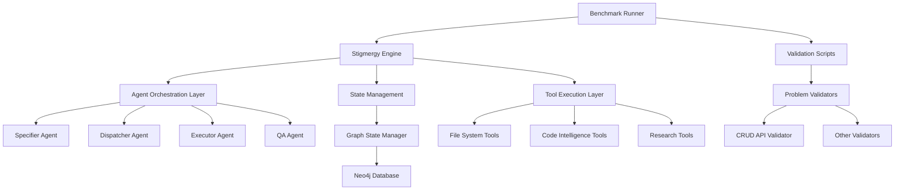
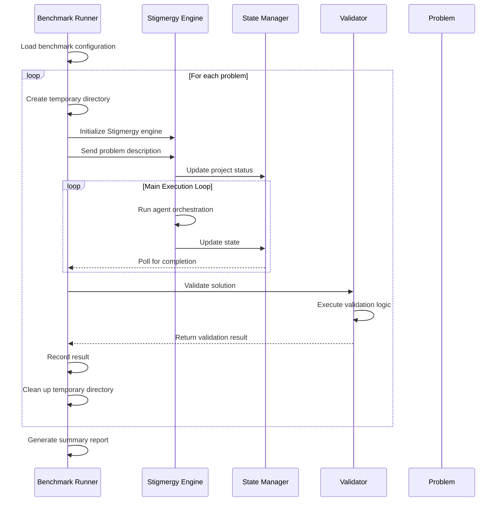

# Benchmark Execution System Design

## 1. Overview

The Benchmark Execution System is designed to validate the production readiness of the Stigmergy autonomous development system by running a comprehensive suite of benchmark tests. The system executes end-to-end validation of the high-speed execution protocol, specifically targeting the complex "Full Stack CRUD API" problem that previously represented a performance bottleneck.

### 1.1 Purpose

The primary purpose of this system is to:
- Execute the full benchmark suite to validate system capabilities
- Identify and diagnose performance bottlenecks in the execution pipeline
- Provide empirical data to prove the effectiveness of the high-speed execution protocol
- Enable autonomous generation of production-grade applications within time constraints

### 11.2 Scope

The system encompasses:
- Benchmark runner that orchestrates the execution of all test problems
- Validation scripts for each benchmark problem
- Integration with the Stigmergy engine for autonomous code generation
- Error analysis and root cause identification mechanisms
- Performance monitoring and reporting capabilities

## 2. Architecture

The benchmark execution system follows a layered architecture that integrates with the core Stigmergy engine:

### 2.1 Key Components

#### 2.1.1 Benchmark Runner
The central orchestrator that:
- Loads benchmark configurations
- Executes each problem sequentially
- Monitors execution progress and timeouts
- Collects and reports results
- Manages temporary execution environments

#### 2.1.2 Validation System
A collection of problem-specific validators that:
- Verify the correctness of generated solutions
- Check for required files and functionality
- Execute automated tests (e.g., Jest for CRUD API)
- Report pass/fail status with detailed output

#### 2.1.3 Stigmergy Engine Integration
The benchmark system interfaces with the core engine to:
- Initialize autonomous development processes
- Send problem descriptions to the system
- Monitor execution state through the state manager
- Trigger validation upon completion

## 3. Benchmark Execution Flow

### 3.1 Execution Process

1. **Initialization Phase**
   - Load benchmark configuration from `benchmark.json`
   - Create temporary directory for isolated execution
   - Initialize Stigmergy engine in the temporary environment

2. **Problem Execution Phase**
   - Send problem description to the engine via HTTP API
   - Monitor execution state through periodic polling
   - Wait for completion status or timeout

3. **Validation Phase**
   - Copy validation script to solution directory
   - Execute problem-specific validation logic
   - Determine pass/fail status based on validation results

4. **Cleanup Phase**
   - Terminate engine processes
   - Remove temporary directories
   - Record execution results

## 4. Data Models

### 4.1 Benchmark Configuration

| Field | Type | Description |
|-------|------|-------------|
| name | string | Name of the benchmark suite |
| version | string | Version identifier |
| description | string | Description of the benchmark |
| problems | array | Collection of benchmark problems |
| execution | object | Execution configuration |

### 4.2 Problem Definition

| Field | Type | Description |
|-------|------|-------------|
| id | string | Unique identifier for the problem |
| title | string | Human-readable title |
| description | string | Detailed problem description |
| expected_files | array | List of files that should be generated |
| success_criteria | array | Criteria for successful completion |
| validation_script | string | Script to validate the solution |
| difficulty | string | Difficulty level (easy/medium/hard) |

### 4.3 Execution Results

| Field | Type | Description |
|-------|------|-------------|
| problemId | string | Identifier of the problem |
| title | string | Title of the problem |
| success | boolean | Whether the problem passed validation |
| duration | number | Execution time in milliseconds |
| error | string | Error message if execution failed |
| output | string | Output from the execution |

## 5. Business Logic Layer

### 5.1 Problem Execution Logic

The benchmark runner implements the following logic for each problem:

1. **Environment Setup**
   - Create isolated temporary directory
   - Initialize Stigmergy engine with `npx stigmergy init`
   - Start engine server on designated port

2. **Execution Monitoring**
   - Send initial problem request via HTTP POST to `/api/chat`
   - Poll state file for completion status
   - Enforce timeout constraints (default: 300 seconds)

3. **Completion Detection**
   - Monitor for `EXECUTION_COMPLETE` status
   - Handle error states (`HUMAN_INPUT_NEEDED`, `ERROR`)
   - Terminate on timeout

### 5.2 Validation Logic

Each problem has a dedicated validation script that:

1. **Verifies File Presence**
   - Checks for all expected files in the solution
   - Reports missing files as validation failures

2. **Executes Functional Tests**
   - Installs required dependencies
   - Starts generated servers if applicable
   - Runs automated test suites (e.g., Jest)
   - Terminates processes after testing

3. **Determines Success**
   - Evaluates exit codes and test results
   - Returns structured success/failure status

### 5.3 Error Handling and Diagnostics

When benchmark execution fails, the system provides diagnostic capabilities:

1. **Log Analysis**
   - Capture engine STDOUT and STDERR
   - Collect state transitions and agent decisions
   - Record tool execution results

2. **Root Cause Identification**
   - Analyze failure points in the execution pipeline
   - Identify agent-specific issues (specifier, dispatcher, executor, QA)
   - Correlate errors with system state

## 6. Performance Considerations

### 6.1 Execution Time Management

- **Timeout Configuration**: Each problem has a maximum execution time (default: 300 seconds)
- **Polling Intervals**: State is polled every 5 seconds to minimize overhead
- **Process Management**: Engine processes are properly terminated after each problem

### 6.2 Resource Isolation

- **Temporary Directories**: Each problem executes in an isolated environment
- **Port Management**: Engine servers use different ports to avoid conflicts
- **Process Isolation**: Engine processes are spawned as detached processes

### 6.3 Memory Management

- **State Cleanup**: Temporary directories are removed after each problem
- **Process Termination**: Engine processes are killed after execution
- **Resource Monitoring**: System resources are monitored during execution

## 7. Testing Strategy

### 7.1 Unit Testing

Individual components of the benchmark system are tested in isolation:

- Benchmark runner initialization and configuration loading
- Problem execution orchestration
- Validation script execution and result processing
- Error handling and diagnostics

### 7.2 Integration Testing

The benchmark system is tested as an integrated component:

- End-to-end execution of sample problems
- Integration with the Stigmergy engine
- Validation of generated solutions
- Performance and timeout handling

### 7.3 Benchmark Testing

The benchmark system validates itself through execution of predefined problems:

- Simple file creation tasks
- API endpoint implementation
- React component development
- Database integration tasks
- Testing implementation
- Full Stack CRUD API (primary validation target)