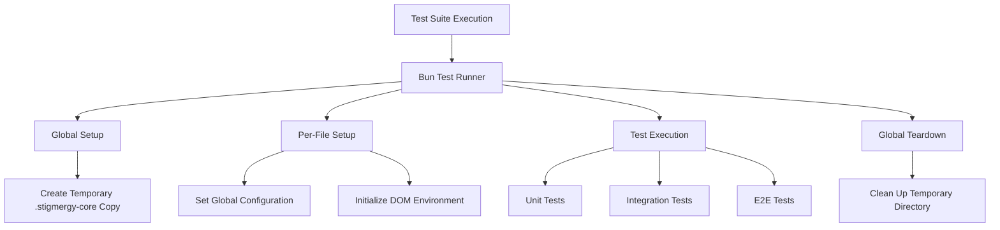
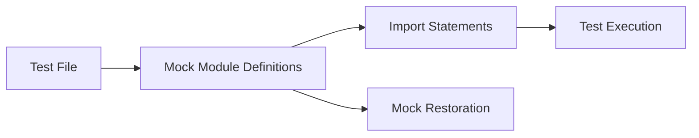

# Complete Test Suite Migration from Node.js to Bun

## 1. Overview

This document outlines the strategy and implementation plan to complete the migration of the Stigmergy project's test suite from Node.js/Jest to Bun. The primary objective is to ensure all tests pass consistently in the Bun environment while maintaining the same test coverage and quality standards.

The migration focuses on addressing compatibility issues between Jest and Bun test runners, updating mocking strategies, and ensuring all test files follow Bun's explicit module mocking approach.

## 2. Architecture

The test suite architecture in Bun follows a similar structure to the previous Node.js/Jest setup but with key differences in module mocking and test execution:



### 2.1 Core Components

1. **Bun Test Runner**: Uses Bun's native `bun:test` module instead of Jest
2. **Master Configuration (`bunfig.toml`)**: Defines test runner behavior
3. **Global Setup Script (`setup.js`)**: Creates isolated test environment before all tests
4. **Global Teardown Script (`teardown.js`)**: Cleans up test environment after all tests
5. **Per-File Setup Scripts**: Configure environment for each test file execution
6. **Test Categories**: Organized into unit, integration, and E2E tests

### 2.2 Key Differences from Node.js/Jest

| Aspect | Node.js/Jest | Bun |
|--------|--------------|-----|
| Test Runner | Jest | Bun's native test runner |
| Module Mocking | Automatic and implicit | Explicit and manual |
| Import System | CommonJS/ESM hybrid | Native ESM |
| Execution Speed | Slower | Faster |
| Mocking API | `jest.mock()` | `mock.module()` |

## 3. Testing Strategy

### 3.1 Bun-Native Testing Approach

All tests use Bun's built-in testing framework with these characteristics:

- Import test functions directly from `"bun:test"` module
- Use explicit `mock.module()` for module mocking before imports
- Structure tests with `describe` and `it`/`test` blocks for clear organization
- Leverage Bun's fast execution for rapid feedback

### 3.2 Test Organization

The test suite maintains the same organization as before:

| Category | Purpose | Location | Execution Order |
|----------|---------|----------|----------------|
| Unit Tests | Test individual functions and components in isolation | `tests/unit/` | First |
| Integration Tests | Test interactions between components and services | `tests/integration/` | Second |
| E2E Tests | Test complete user workflows and system behavior | `tests/e2e/` | Last |

### 3.3 Mocking Strategy

Bun's explicit mocking approach requires a different pattern than Jest:



1. **Pre-import Mocking**: All module mocks must be defined before importing the module under test
2. **Mock Restoration**: Mocks are automatically restored between tests
3. **Dynamic Imports**: Use dynamic imports for accessing mocked modules within tests

## 4. Implementation Plan

### 4.1 Phase 1: Identify and Fix Test Failures

#### 4.1.1 Current Test Status Assessment
- Run the complete test suite to identify failing tests
- Categorize failures by type:
  - Module import issues
  - Mocking incompatibilities (using `jest.fn()` instead of `mock()`)
  - API differences between Jest and Bun
  - Environment setup problems

#### 4.1.1.1 Specific Issues Identified
Based on analysis of current test files, the following specific issues need to be addressed:

1. **Incorrect Mock Function Usage**: Test files are importing both `mock` and `jest` from `bun:test` but still using `jest.fn()` instead of `mock()`
2. **Mock Cleanup**: Using `jest.clearAllMocks()` instead of `mock.restore()`
3. **Mixed Import Patterns**: Some files use `import { jest, describe, test, expect } from 'bun:test'` which is incorrect
4. **Inconsistent Mocking API**: Using `jest.fn().mockResolvedValue()` instead of `mock().mockResolvedValue()`

#### 4.1.1.2 Priority Fix List
Based on the analysis, the following files need immediate attention:

1. **High Priority** (Direct `jest.fn()` usage):
   - `tests/unit/tools/shell.test.js`
   - `tests/unit/tools/qa_tools.test.js`
   - `tests/unit/tools/core_tools.test.js`
   - `tests/unit/tools/file_system.test.js`

2. **Medium Priority** (Mixed imports):
   - `tests/unit/tools/chat_interface.test.js`
   - `tests/unit/tools/business_verification.test.js`
   - `tests/integration/services/code_intelligence_service.test.js`

3. **Low Priority** (Correctly using Bun patterns):
   - `tests/unit/tools/swarm_intelligence_tools.test.js`
   - `tests/integration/tool_executor.test.js`
   - `tests/integration/server.api.test.js`

#### 4.1.2 Dependency Verification
- Ensure all required development dependencies are installed
- Verify compatibility of testing libraries with Bun
- Update any incompatible packages

### 4.2 Phase 2: Update Test Files for Bun Compatibility

#### 4.2.1 Update Import Statements
Convert all test files to use Bun's testing imports:
```javascript
// Before (Jest)
import { jest, describe, test, expect } from '@jest/globals';

// After (Bun)
import { mock, describe, test, expect } from 'bun:test';
```

#### 4.2.1.1 Correct Import Patterns
Ensure test files use the correct import patterns for Bun:
```javascript
// Correct import pattern
import { mock, describe, test, expect, beforeEach, afterEach } from 'bun:test';

// Incorrect patterns to avoid
import { jest, describe, test, expect } from 'bun:test'; // Don't import 'jest'
import * as jest from 'bun:test'; // Don't import all as 'jest'
```

#### 4.2.2 Update Mocking Patterns
Replace Jest mocking with Bun's explicit mocking:
```javascript
// Before (Jest)
jest.mock('fs-extra', () => {
  return {
    // mock implementation
  };
});

// After (Bun)
mock.module('fs-extra', () => {
  return {
    // mock implementation
  };
});
```

#### 4.2.3 Replace Jest Mock Functions with Bun Mock Functions
Replace all instances of `jest.fn()` with Bun's `mock()` function:
```javascript
// Before (using Jest)
const mockFunction = jest.fn().mockResolvedValue({ stdout: "mocked output" });

// After (using Bun)
const mockFunction = mock().mockResolvedValue({ stdout: "mocked output" });
```

#### 4.2.3.1 Specific Examples from Current Codebase

**Example 1: Shell Tool Test (`tests/unit/tools/shell.test.js`)**
```javascript
// Before
import { jest, describe, test, expect } from 'bun:test';
const mockExecPromise = jest.fn().mockResolvedValue({ stdout: "mocked output", stderr: "" });

// After
import { mock, describe, test, expect } from 'bun:test';
const mockExecPromise = mock().mockResolvedValue({ stdout: "mocked output", stderr: "" });
```

**Example 2: QA Tools Test (`tests/unit/tools/qa_tools.test.js`)**
```javascript
// Before
import { mock, jest, describe, test, expect, beforeEach } from 'bun:test';
mock.module("../../../ai/providers.js", () => ({
    getModelForTier: jest.fn(),
}));
beforeEach(() => {
    jest.clearAllMocks();
});

// After
import { mock, describe, test, expect, beforeEach } from 'bun:test';
mock.module("../../../ai/providers.js", () => ({
    getModelForTier: mock(),
}));
beforeEach(() => {
    mock.restore();
});
```

#### 4.2.4 Automation Script for Common Replacements
Create a script to automate common replacements across test files:

```bash
# Replace jest.fn() with mock()
find tests/ -name "*.test.js" -exec sed -i '' 's/jest\.fn()/mock()/g' {} \;

# Replace jest.clearAllMocks() with mock.restore()
find tests/ -name "*.test.js" -exec sed -i '' 's/jest\.clearAllMocks()/mock.restore()/g' {} \;

# Update import statements (be careful with this one - may need manual review)
# sed -i '' 's/import { mock, jest/import { mock/' tests/*/tools/*.test.js
```

#### 4.2.4 Update Test Execution Commands
Ensure all test scripts in `package.json` use Bun:
```json
{
  "scripts": {
    "test": "bun test",
    "test:watch": "bun test --watch"
  }
}
```

### 4.3 Phase 3: Fix Common Compatibility Issues

#### 4.3.1 Module Resolution Issues
- Update import paths to be fully compatible with ESM
- Fix any circular dependency issues that Bun is stricter about
- Ensure all files have proper `.js` extensions in imports

#### 4.3.2 Asynchronous Test Handling
- Update any tests that rely on Jest's specific async handling
- Ensure proper use of `async/await` in test functions
- Fix promise resolution patterns
- Replace `jest.clearAllMocks()` with `mock.restore()`
- Update mock function calls from `jest.fn()` to `mock()`

#### 4.3.2.1 Specific Fixes for Shell Tool Test
The `tests/unit/tools/shell.test.js` file requires the following specific fixes:

1. Update import statement:
```javascript
// Before
import { jest, describe, test, expect } from 'bun:test';

// After
import { mock, describe, test, expect } from 'bun:test';
```

2. Replace all `jest.fn()` calls with `mock()`:
```javascript
// Before
const mockExecPromise = jest.fn().mockResolvedValue({ stdout: "mocked output", stderr: "" });

// After
const mockExecPromise = mock().mockResolvedValue({ stdout: "mocked output", stderr: "" });
```

#### 4.3.2.2 Specific Fixes for QA Tools Test
The `tests/unit/tools/qa_tools.test.js` file requires the following specific fixes:

1. Update import statement:
```javascript
// Before
import { mock, jest, describe, test, expect, beforeEach } from 'bun:test';

// After
import { mock, describe, test, expect, beforeEach } from 'bun:test';
```

2. Replace `jest.fn()` with `mock()` in module mocks:
```javascript
// Before
mock.module("../../../ai/providers.js", () => ({
    getModelForTier: jest.fn(),
}));
mock.module("ai", () => ({
  generateObject: jest.fn(),
}));

// After
mock.module("../../../ai/providers.js", () => ({
    getModelForTier: mock(),
}));
mock.module("ai", () => ({
  generateObject: mock(),
}));
```

3. Replace `jest.clearAllMocks()` with `mock.restore()`:
```javascript
// Before
beforeEach(() => {
    jest.clearAllMocks();
});

// After
beforeEach(() => {
    mock.restore();
});
```

4. Update all mock function calls:
```javascript
// Before
const mockExecPromise = jest.fn().mockResolvedValue({ stdout: "test output" });

// After
const mockExecPromise = mock().mockResolvedValue({ stdout: "test output" });
```

#### 4.3.3 Environment Setup
- Verify global setup scripts work correctly with Bun
- Ensure DOM environment initialization works with `@happy-dom/global-registrator`
- Check that temporary directory creation and cleanup functions properly

### 4.4 Phase 4: Validation and Optimization

#### 4.4.1 Full Test Suite Execution
- Run all tests to ensure they pass
- Verify test coverage remains consistent
- Check for any performance improvements or regressions

##### 4.4.1.1 Validation Steps
1. Run individual test files to verify fixes:
   ```bash
   bun test tests/unit/tools/shell.test.js
   bun test tests/unit/tools/qa_tools.test.js
   ```
2. Run category-specific tests:
   ```bash
   bun test tests/unit/
   bun test tests/integration/
   ```
3. Run the complete test suite:
   ```bash
   bun test
   ```
4. Verify no errors related to `jest.fn()` or import issues

##### 4.4.1.2 Verification Commands
Use these commands to verify the fixes:

```bash
# Check for remaining jest.fn() usage
grep -r "jest\.fn()" tests/

# Check for incorrect import patterns
grep -r "import {.*jest.*} from 'bun:test'" tests/

# Check for jest.clearAllMocks() usage
grep -r "jest\.clearAllMocks()" tests/

# Run specific test files to verify they pass
bun test tests/unit/tools/shell.test.js
bun test tests/unit/tools/qa_tools.test.js
```

#### 4.4.2 Cross-Platform Compatibility
- Test on different operating systems if needed
- Ensure file path handling works correctly across platforms
- Verify environment variable handling

#### 4.4.3 Documentation Updates
- Update any documentation that references Jest-specific commands
- Document Bun-specific testing patterns for future reference
- Update README with new testing instructions

## 5. Data Models

### 5.1 Test Configuration Model

| Field | Type | Description | Value |
|-------|------|-------------|-------|
| preload | string[] | Scripts to run before each test file | `["./tests/setup-globals.js", "./tests/setup-dom.js"]` |
| setup | string | Script to run once before all tests | `"./tests/setup.js"` |
| teardown | string | Script to run once after all tests | `"./tests/teardown.js"` |

### 5.2 Global Configuration Model

| Field | Type | Description | Test Value |
|-------|------|-------------|------------|
| core_path | string | Path to temporary core directory | `".stigmergy-core-test-temp"` |
| paths.root | string | Root path for test resources | `".stigmergy-core-test-temp"` |
| paths.agents | string | Agents directory path | `".stigmergy-core-test-temp/agents"` |
| paths.system_docs | string | System documentation path | `".stigmergy-core-test-temp/system_docs"` |

## 6. Business Logic

### 6.1 Test Environment Initialization

The initialization process ensures a clean, isolated environment for each test run:

1. **Pre-execution Validation**:
   - Check for existing temporary directory
   - Validate permissions for directory operations

2. **Directory Setup**:
   - Remove any existing temporary directory
   - Create fresh temporary directory
   - Copy `.stigmergy-core` contents to temporary location

3. **Environment Configuration**:
   - Set global configuration variables
   - Initialize DOM simulation for browser tests
   - Configure module resolution paths

### 6.2 Test Execution Flow

Each test file follows this execution flow:

1. **Pre-file Setup**:
   - Execute `setup-globals.js` to configure paths
   - Execute `setup-dom.js` to initialize browser environment

2. **Test Execution**:
   - Import module under test (after any required mocks)
   - Execute test cases with assertions
   - Automatic mock restoration between tests

3. **Post-execution Cleanup**:
   - Automatic cleanup of test-specific resources
   - Preparation for next test file

### 6.3 Mocking Implementation

Module mocking follows this pattern:

1. **Mock Definition**:
   The test framework provides mechanisms to replace modules with mock implementations before the module under test is imported.

2. **Import After Mock**:
   After defining mocks, the actual module under test is imported to use the mocked dependencies.

3. **Test Execution**:
   - Use mocked module in test assertions
   - Validate behavior with mocked dependencies

## 7. Testing Framework

### 7.1 Test Functions

The test framework provides these core functions from `bun:test`:

| Function | Purpose | Usage |
|----------|---------|-------|
| `describe` | Group related tests | `describe('Feature', () => { ... })` |
| `it`/`test` | Define individual test cases | `it('should work', () => { ... })` |
| `expect` | Make assertions about values | `expect(value).toBe(expected)` |
| `mock` | Create and manage mocks | `mock.module('fs', mockFs)` |
| `beforeEach` | Setup before each test | `beforeEach(() => { ... })` |
| `afterEach` | Cleanup after each test | `afterEach(() => { ... })` |

### 7.2 Assertion Methods

Common assertion methods available through `expect`:

| Method | Purpose | Example |
|--------|---------|---------|
| `toBe` | Exact equality | `expect(a).toBe(b)` |
| `toEqual` | Deep equality | `expect(obj).toEqual(expected)` |
| `toHaveBeenCalled` | Mock function call validation | `expect(fn).toHaveBeenCalled()` |
| `toHaveBeenCalledWith` | Mock function argument validation | `expect(fn).toHaveBeenCalledWith(arg)` |

### 7.3 Mocking Capabilities

Bun's mocking system provides:

| Capability | Description | Example |
|------------|-------------|---------|
| Module Mocking | Replace entire modules | `mock.module('fs', mockFs)` |
| Function Mocking | Create mock functions | `const fn = mock()` |
| Mock Restoration | Reset mocks between tests | Automatic |
| Mock Implementation | Define mock behavior | `mock().mockReturnValue(value)` |

## 8. Security Considerations

### 8.1 Isolated Test Environment

The test suite implements security measures to prevent tests from affecting the production environment:

1. **Temporary Directory Isolation**:
   - All tests operate on temporary copies of critical directories
   - Production `.stigmergy-core` directory remains untouched
   - Automatic cleanup prevents resource accumulation

2. **Module Mocking Security**:
   - Explicit mocking prevents accidental modification of real modules
   - Controlled access to file system and network resources
   - Isolated execution context for each test run

### 8.2 Protected Asset Handling

Critical system components are protected through:

1. **Read-Only Core Directory**:
   - `.stigmergy-core` is treated as read-only in production
   - Tests use temporary copies for all operations
   - No direct modification of core assets during testing

2. **Access Control**:
   - Global configuration ensures tests use isolated paths
   - Environment variables are properly managed
   - Resource access is limited to test-specific directories

## 9. Performance Optimization

### 9.1 Test Execution Speed

Bun's native test runner provides performance benefits:

1. **Fast Startup**:
   - Reduced overhead compared to Jest
   - Optimized module loading
   - Efficient test discovery

2. **Parallel Execution**:
   - Tests run in parallel by default
   - Resource sharing optimization
   - Isolated execution contexts

### 9.2 Resource Management

Efficient resource handling ensures optimal performance:

1. **Memory Management**:
   - Automatic cleanup of test artifacts
   - Efficient mock restoration
   - Proper garbage collection

2. **File System Optimization**:
   - Temporary directory reuse patterns
   - Minimal file operations
   - Efficient copying mechanisms

## 10. Conclusion

The migration from Node.js/Jest to Bun testing framework requires careful attention to mock function usage and import patterns. By systematically addressing the identified issues with `jest.fn()` usage and import statement corrections, the test suite will be fully compatible with Bun's testing philosophy.

The key to success is:

1. **Consistent Mock Usage**: Replace all `jest.fn()` calls with `mock()`
2. **Correct Import Patterns**: Use only `mock` from `bun:test`, not `jest`
3. **Proper Cleanup**: Use `mock.restore()` instead of `jest.clearAllMocks()`
4. **Validation**: Run tests frequently to catch issues early

Once completed, the test suite will benefit from Bun's faster execution while maintaining the same test coverage and quality assurance standards.