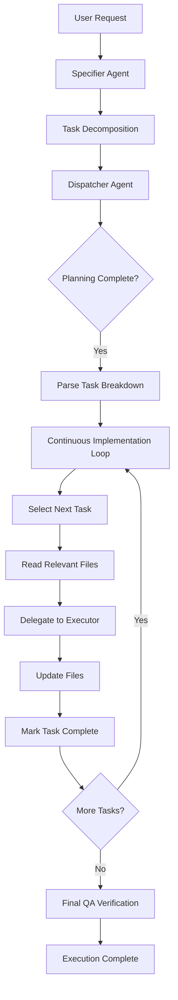
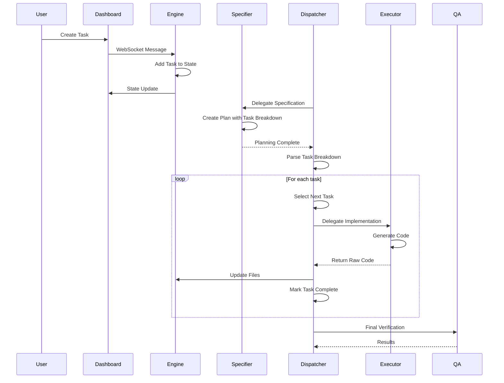

# Stigmergy System Enhancement: From Advanced Validation to High-Speed Execution

## Overview

This design document outlines the implementation of a series of enhancements to the Stigmergy system, progressing through multiple quests that build upon each other to create a more robust, performant, and user-friendly autonomous development system. The enhancements include:

1. Advanced E2E validation with complex benchmark problems
2. Strategic task decomposition for better planning
3. Interactive dashboard components for enhanced user experience
4. High-speed execution protocol for improved performance
5. Re-validation of the enhanced system

These enhancements work together to transform Stigmergy from a functional autonomous development system into a production-ready platform with advanced capabilities.

## Architecture

The system enhancements involve modifications to several key architectural components:

### 1. Benchmark and Validation System
- **Evaluation Framework**: Enhanced with complex, multi-file, full-stack problems
- **Validator Scripts**: Robust validation scripts that test complete implementations
- **Benchmark Runner**: Orchestrates the execution and validation of benchmark problems

### 2. Agent System
- **Specifier Agent**: Enhanced with strategic task decomposition capabilities
- **Dispatcher Agent**: Modified to execute decomposed plans in dependency order
- **New Executor Agent**: Specialized agent for high-speed code implementation

### 3. Dashboard System
- **Task Management Component**: Interactive UI for creating and managing tasks
- **Cost Monitor Component**: Real-time cost tracking and visualization
- **WebSocket Integration**: Real-time communication between frontend and backend

### 4. Engine System
- **Server Component**: Enhanced with user task creation handling
- **API Endpoints**: New endpoints for cost monitoring
- **Error Handling**: Improved error handling with specific API key detection

### 5. High-Speed Execution Protocol
- **Continuous Implementation Loop**: Optimized execution workflow
- **Focused Executor**: Specialized agent for direct code implementation
- **Performance Optimization**: Reduced overhead and faster execution



## Component Design

### 1. Advanced Benchmark System

#### Problem Definition
A new complex problem is added to the benchmark suite:
- **Title**: Full Stack CRUD API
- **Description**: Create a complete, in-memory CRUD API for a 'notes' resource using Node.js and Express
- **Requirements**: 
  - Routes for create, read, update, and delete notes
  - Each note has id, title, and content
  - Server runs on port 3001
  - Jest tests to verify all endpoints

#### Validator Implementation
The `validate_crud_api.js` validator implements a robust validation process:
1. **Dependency Installation**: Uses `child_process.exec` to run `npm install express jest supertest`
2. **Server Startup**: Uses `child_process.spawn` to start the generated `server.js`
3. **Test Execution**: Uses `child_process.exec` to run the generated `notes.test.js` file using Jest
4. **Process Management**: Ensures the server process is killed gracefully after the test run

### 2. Strategic Task Decomposition

#### Enhanced PLAN_GENERATION_PROTOCOL
The specifier agent's protocol is enhanced to include a machine-readable task breakdown:
- **Task Breakdown Section**: A `## Task Breakdown` section in `plan.md`
- **YAML Format**: Machine-readable YAML list of sub-tasks
- **Task Fields**: Each task includes `id`, `description`, `files_to_create_or_modify`, and `dependencies`

#### Example Task Breakdown
```yaml
- id: setup-server
  description: "Create the main server.js file with Express, but with no routes."
  files_to_create_or_modify: ["server.js"]
  dependencies: []
- id: create-note-service
  description: "Create a service file to handle the in-memory notes array and CRUD logic."
  files_to_create_or_modify: ["services/notes.js"]
  dependencies: []
- id: create-api-routes
  description: "Create the Express router for /api/notes and wire it to the note service."
  files_to_create_or_modify: ["routes/notes.js"]
  dependencies: ["create-note-service"]
- id: integrate-routes
  description: "Integrate the notes router into the main server.js file."
  files_to_create_or_modify: ["server.js"]
  dependencies: ["setup-server", "create-api-routes"]
- id: write-tests
  description: "Create the notes.test.js file with Jest and Supertest to verify all API endpoints."
  files_to_create_or_modify: ["notes.test.js"]
  dependencies: ["integrate-routes"]
```

### 3. Enhanced Dispatcher Agent

#### STATE_DRIVEN_ORCHESTRATION_PROTOCOL Enhancement
The dispatcher agent is enhanced with smarter execution logic:
- **Task Parsing**: Reads and parses the `## Task Breakdown` YAML from `plan.md`
- **Task Population**: Populates `project_manifest.tasks` with decomposed sub-tasks
- **Dependency-Aware Execution**: Finds `PENDING` tasks whose `dependencies` are all marked as `COMPLETED`

### 4. Interactive Dashboard Components

#### Task Management Component
The TaskManagement.js component is enhanced with:
- **Live Data Display**: Uses the `useWebSocket` hook to display live task data from `state.project_manifest.tasks`
- **Task Creation**: "Create Task" button sends a WebSocket message to the engine with `{ type: 'user_create_task', payload: { ... } }`
- **Real-time Updates**: Task list updates in real-time as the system state changes

#### Cost Monitor Component
The CostMonitor.js component is enhanced with:
- **Live API Integration**: Removes mock data and implements `fetch` to make `GET` requests to the `/api/cost` endpoint
- **Data Polling**: Implements polling with `setInterval` to keep cost data up-to-date
- **Visualizations**: Uses Recharts to display cost trends and provider breakdowns

### 5. Enhanced Error Handling

#### ErrorHandler Enhancement
The ErrorHandler.js utility is enhanced with:
- **API Key Detection**: New check for errors containing `API key`
- **Configuration Error Type**: Sets error type to `CONFIGURATION` for API key issues
- **Remediation Steps**: Provides specific remediation like "Check that the required API key (e.g., GOOGLE_API_KEY) is correctly set in your .env file."

### 6. High-Speed Execution Protocol

#### New @executor Agent
A new specialized agent is created:
- **Role**: Hyper-focused code generation agent
- **Functionality**: Takes a single task and current codebase state, outputs new complete state of modified files
- **Output**: Raw code only, no explanations or conversational text
- **Tools**: Direct access to `file_system.*` tools

#### Continuous Implementation Protocol
The dispatcher agent implements a new continuous implementation loop:
1. Manages a loop that continues as long as there are `PENDING` tasks
2. Finds the next task whose `dependencies` are `COMPLETED`
3. Reads current content of all files relevant to the *entire plan*
4. Delegates to the new `@executor` agent with task description and file contents
5. Uses raw code output from `@executor` to update files using `file_system.writeFile`
6. Marks the current task as `COMPLETED`
7. Repeats until all tasks are `COMPLETED`
8. Delegates to `@qa` agent for final verification

## Data Flow

### 1. Benchmark Execution Flow
1. **Problem Definition**: Complex problem added to `evaluation/benchmark.json`
2. **Validator Creation**: Robust validation script created at `evaluation/validators/validate_crud_api.js`
3. **Benchmark Execution**: `npm run test:benchmark` runs all problems including the new complex one
4. **Validation**: System validates that all success criteria are met

### 2. Task Decomposition Flow
1. **Specification Creation**: `@specifier` agent creates detailed specification
2. **Plan Generation**: Implementation plan with `## Task Breakdown` section
3. **Task Parsing**: `@dispatcher` parses YAML task list from `plan.md`
4. **Task Queue Initialization**: Tasks added to `project_manifest.tasks` with dependencies

### 3. Interactive Dashboard Flow
1. **WebSocket Connection**: Dashboard connects to engine via WebSocket
2. **State Broadcasting**: Engine broadcasts state updates to all connected clients
3. **User Interaction**: User creates tasks via UI, which sends messages to engine
4. **Task Processing**: Engine processes user tasks and updates system state
5. **Cost Monitoring**: Dashboard fetches cost data from API endpoint periodically

### 4. High-Speed Execution Flow
1. **Task Selection**: Dispatcher finds next executable task based on dependencies
2. **Context Gathering**: Reads relevant file contents for the entire plan
3. **Delegation**: Sends task and context to `@executor` agent
4. **Implementation**: `@executor` generates raw code implementation
5. **File Update**: Dispatcher uses code to update files via `file_system.writeFile`
6. **Task Completion**: Marks task as completed and repeats for next task
7. **Final Verification**: `@qa` agent performs comprehensive validation



## State Management

### 1. Task State Transitions
- **PENDING**: Task is waiting for execution
- **IN_PROGRESS**: Task is being processed (transient state)
- **COMPLETED**: Task has been successfully executed
- **FAILED**: Task execution failed

### 2. System State Transitions
- `PLANNING_COMPLETE` → `EXECUTION_IN_PROGRESS` (when task parsing is complete)
- `EXECUTION_IN_PROGRESS` → `EXECUTION_COMPLETE` (when all tasks are completed)
- `EXECUTION_COMPLETE` → Final verification by `@qa` agent

### 3. Dependency Management
Tasks include explicit dependency definitions that ensure proper execution order:
- Tasks only become eligible for execution when all their dependencies are marked as `COMPLETED`
- Circular dependencies are prevented through careful task design

## Performance Optimization

### 1. Reduced Agent Overhead
- Eliminates complex agent coordination during implementation
- Streamlined workflow with specialized executor agent
- Reduced context switching between agents

### 2. Focused Implementation
- `@executor` agent optimized for pure code generation
- Direct output without explanations or conversational text
- Context-aware implementation with relevant file contents

### 3. Batch File Operations
- Reads all relevant files once per task rather than multiple times
- Efficient file updating through direct `file_system.writeFile` calls
- Minimized I/O operations during execution

### 4. Continuous Loop Optimization
- Minimizes state transitions and decision-making overhead
- Maintains execution context between tasks
- Reduces initialization overhead for each task

## Integration Points

### 1. File System Integration
- Uses `file_system.writeFile` tool for direct file updates
- Reads relevant files for context before delegation
- No intermediate file processing steps

### 2. WebSocket Integration
- Real-time communication between dashboard and engine
- State broadcasting to all connected clients
- User task creation via WebSocket messages

### 3. API Integration
- `/api/cost` endpoint for cost monitoring
- Periodic polling for live data updates
- Error handling for API failures

### 4. Error Handling Integration
- Inherits existing error handling mechanisms
- Maintains constitutional compliance
- Preserves existing remediation pathways
- Enhanced API key error detection

## Testing Strategy

### 1. Unit Testing
- Test `@executor` agent protocol compliance
- Verify continuous implementation loop logic
- Validate task dependency resolution
- Test error handling scenarios

### 2. Integration Testing
- End-to-end task decomposition and execution
- File system integration verification
- Performance benchmarking
- Stress testing with complex task graphs

### 3. Validation Testing
- Benchmark performance against existing implementation
- Verify constitutional compliance
- Test edge cases in task dependency management
- Validate final QA verification integration

### 4. Dashboard Testing
- Interactive task creation and management
- Real-time state updates
- Cost monitoring accuracy
- Error handling in UI components

### 5. Benchmark Testing
- Complex problem validation
- Validator script robustness
- Success criteria verification
- Performance under load