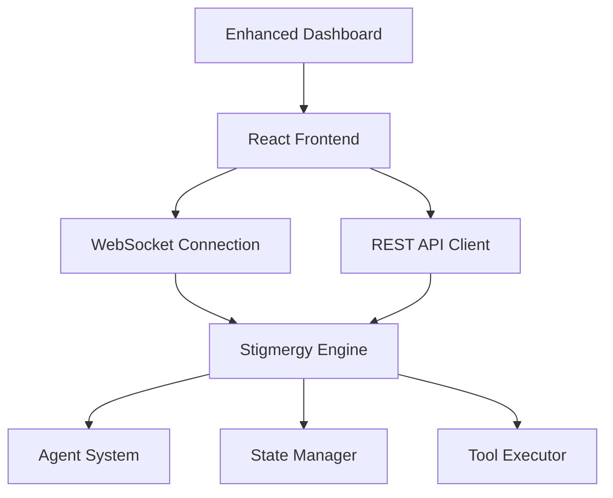
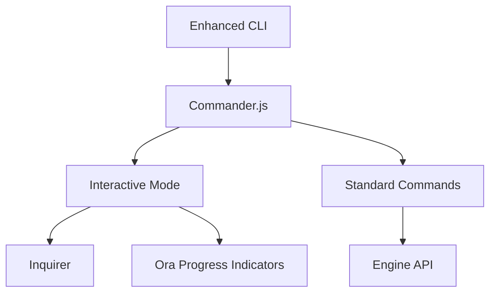
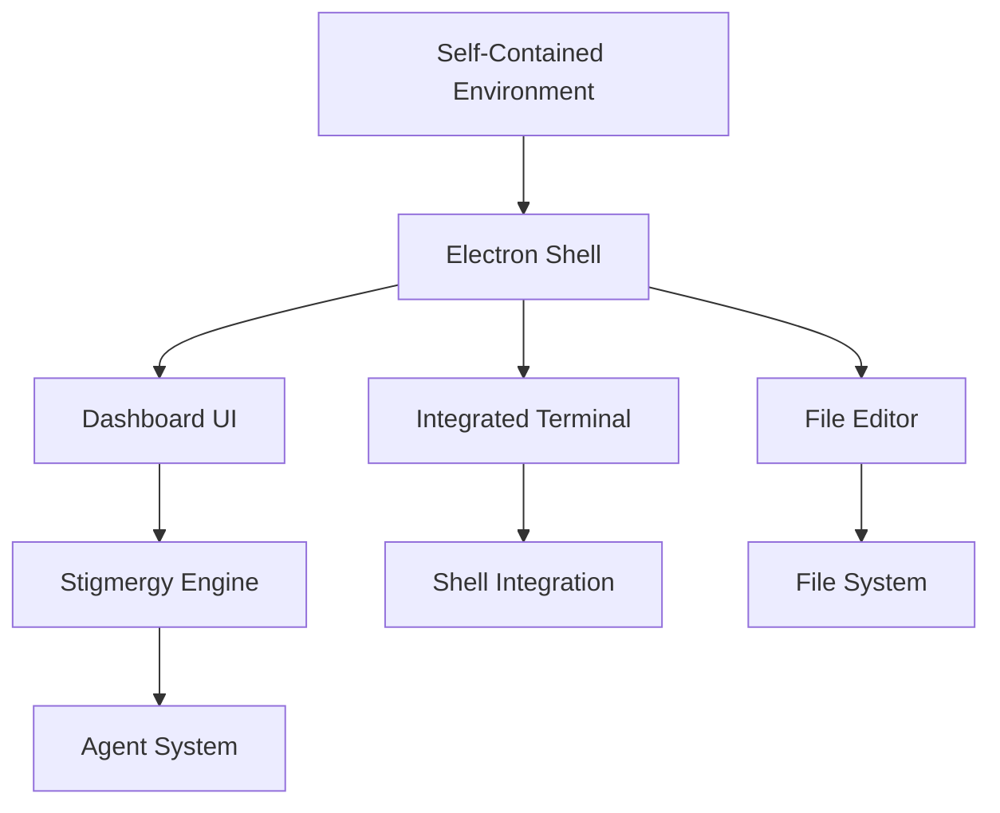

# Stigmergy Independence Enhancement Plan

## 1. Overview

This document outlines a comprehensive plan to enhance the independence of the Stigmergy system, making it less reliant on external integrations while expanding its standalone capabilities. The plan focuses on three key areas:

1. Enhanced Standalone Dashboard
2. Improved CLI Experience
3. Self-Contained Development Environment

These enhancements will build upon Stigmergy's existing capabilities, which already include:
- Multi-IDE support through MCP protocol
- Standalone operation via CLI, chat interface, and API
- Reduced dependencies through DeepWiki integration

## 2. Current State Analysis

### 2.1 Multi-IDE Support
Stigmergy currently supports any IDE that implements the Model Context Protocol (MCP):
- VS Code (with Continue extension)
- Cursor
- Windsurf
- Any other MCP-compatible IDE

The MCP server (`mcp-server.js`) exposes tools for:
- Natural language command processing
- Code search and symbol lookup
- CodeRAG initialization
- Lightweight Archon queries
- DeepWiki documentation access

### 2.2 Standalone Operation
Stigmergy can function completely independently through:
- CLI commands (`npx stigmergy start`)
- Chat interface
- Programmatic API usage

The system architecture includes:
- Express.js server with WebSocket support
- Agent-based orchestration system
- Neo4j graph database for state management
- Dashboard for monitoring and visualization

### 2.3 Reduced Dependencies
DeepWiki integration provides direct access to official documentation, reducing reliance on external research tools.

## 3. Enhancement Areas

### 3.1 Enhanced Standalone Dashboard

#### 3.1.1 Current Dashboard Capabilities
The existing dashboard (`dashboard/public/index.html`) provides:
- Project status visualization
- Task progress tracking
- Agent activity log

#### 3.1.2 Proposed Enhancements
To make the dashboard more comprehensive, we will add:

1. **Visual Agent Orchestration**
   - Interactive agent workflow visualization
   - Real-time agent status monitoring
   - Manual agent triggering capabilities

2. **Enhanced State Management Interface**
   - Graph-based state visualization
   - Direct state manipulation tools
   - History and rollback capabilities

3. **Task Management Interface**
   - Task creation and editing
   - Priority management
   - Dependency visualization

4. **Code Browsing and Editing**
   - Integrated file browser
   - Basic code editor
   - Diff visualization

#### 3.1.3 Implementation Plan
```
[Dashboard Enhancement Implementation]
1. Create React-based dashboard (replacing static HTML)
2. Implement WebSocket connection for real-time updates
3. Add agent orchestration visualization component
4. Develop state management interface
5. Build task management UI
6. Integrate code browsing capabilities
7. Add authentication and authorization
```

### 3.2 Improved CLI Experience

#### 3.2.1 Current CLI Capabilities
The CLI (`cli/index.js`) currently supports:
- `start` command for launching the engine
- `install` command for core file installation
- `restore` command for backup restoration
- `validate` command for system health checks
- `build` command for web agent bundles
- `mcp` command for IDE integration setup

#### 3.2.2 Proposed Enhancements
To enhance the CLI experience, we will add:

1. **Interactive Mode**
   - REPL-style command interface
   - Visual progress indicators
   - Context-aware suggestions

2. **Enhanced Command Structure**
   - Better command organization
   - Improved help system
   - Auto-completion support

3. **Rich Output Formatting**
   - Color-coded output
   - Progress bars and spinners
   - Structured result display

#### 3.2.3 Implementation Plan
```
[CLI Enhancement Implementation]
1. Implement interactive mode with inquirer
2. Add visual elements using chalk and ora
3. Enhance command suggestions and auto-completion
4. Improve help system with examples
5. Add progress indicators for long-running operations
6. Implement structured output formatting
```

### 3.3 Self-Contained Development Environment

#### 3.3.1 Current Capabilities
Stigmergy currently operates as a headless engine that integrates with IDEs.

#### 3.3.2 Proposed Enhancements
To create a self-contained development environment, we will:

1. **Integrated Terminal**
   - Built-in terminal for command execution
   - Shell command integration
   - Process management

2. **Agent Visualization Tools**
   - Real-time agent activity monitoring
   - Performance metrics dashboard
   - Debugging interface

3. **Lightweight IDE Features**
   - Basic file editing capabilities
   - Syntax highlighting
   - File management

#### 3.3.3 Implementation Plan
```
[Self-Contained Environment Implementation]
1. Integrate terminal emulator (e.g., xterm.js)
2. Implement process management system
3. Add agent visualization dashboard
4. Create lightweight file editor
5. Implement syntax highlighting
6. Add file management capabilities
```

## 4. Technical Architecture

### 4.1 Dashboard Enhancement Architecture


### 4.2 CLI Enhancement Architecture


### 4.3 Self-Contained Environment Architecture


## 5. Implementation Roadmap

### Phase 1: Dashboard Enhancement (Weeks 1-3)
1. Replace static HTML dashboard with React application
2. Implement WebSocket connection for real-time updates
3. Add agent orchestration visualization
4. Develop state management interface

### Phase 2: CLI Enhancement (Weeks 4-5)
1. Implement interactive mode with visual elements
2. Enhance command structure and help system
3. Add progress indicators and rich output formatting

### Phase 3: Self-Contained Environment (Weeks 6-8)
1. Create Electron-based application shell
2. Integrate terminal emulator
3. Implement file editor and browser
4. Package as standalone application

## 6. Dependencies and Requirements

### 6.1 New Dependencies
- React and ReactDOM for dashboard enhancement
- Electron for self-contained environment
- Xterm.js for integrated terminal
- Monaco Editor for code editing capabilities

### 6.2 System Requirements
- Node.js 18+
- npm 8+
- Neo4j 5.x (for existing functionality)

### 6.3 Development Tools
- Webpack for bundling
- Babel for transpilation
- ESLint for code quality
- Jest for testing

## 7. Testing Strategy

### 7.1 Dashboard Testing
- Unit tests for React components
- Integration tests for WebSocket connections
- End-to-end tests for user interactions

### 7.2 CLI Testing
- Unit tests for command parsing
- Integration tests for command execution
- CLI interaction tests

### 7.3 Self-Contained Environment Testing
- Application startup tests
- Feature integration tests
- Cross-platform compatibility tests

## 8. Deployment and Distribution

### 8.1 Dashboard Deployment
- Serve React app from Express server
- Bundle with existing Stigmergy distribution

### 8.2 CLI Distribution
- Include in existing npm package
- Maintain backward compatibility

### 8.3 Self-Contained Environment Distribution
- Package as Electron application
- Provide installers for Windows, macOS, and Linux
- Distribute via GitHub releases

## 9. Success Metrics

### 9.1 Dashboard Metrics
- User engagement with enhanced features
- Reduction in IDE dependency for basic tasks
- Performance benchmarks for real-time updates

### 9.2 CLI Metrics
- Adoption rate of interactive mode
- User satisfaction with command suggestions
- Reduction in command execution errors

### 9.3 Self-Contained Environment Metrics
- Download and installation rates
- User retention in standalone mode
- Feature usage statistics