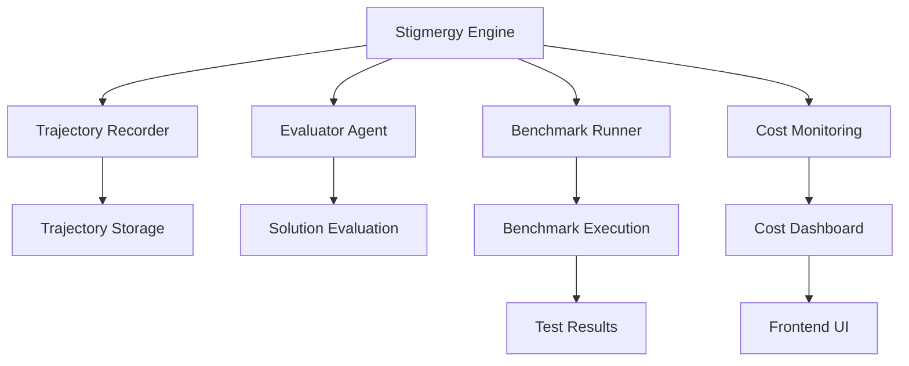
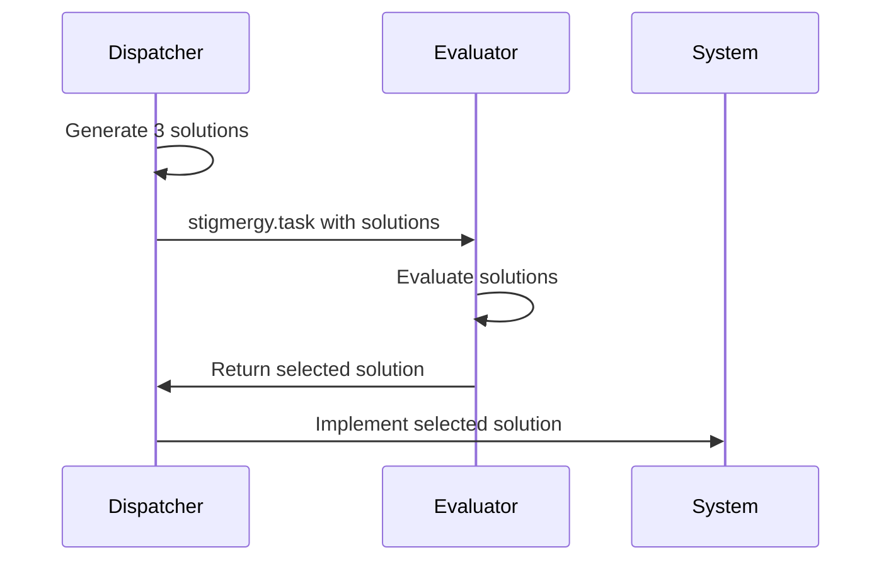
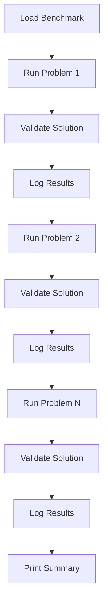
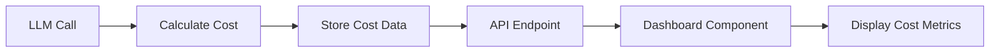

# Stigmergy Feature Integration Design Document

## 1. Overview

This document outlines the design and implementation plan for integrating advanced features into the Stigmergy codebase to enhance observability, agent quality, and formal evaluation capabilities. The features to be integrated include:

1. **Trajectory Recording Service** - Enhanced LLM interaction tracking
2. **Evaluator Agent** - Solution selection among alternatives
3. **Benchmark Runner** - Performance testing system
4. **Cost Monitoring Dashboard** - Real-time LLM usage tracking

These features will mature the system's capabilities, bringing it closer to its goal of becoming a fully autonomous and adaptive development system.

## 2. Architecture



## 3. Feature Implementation Details

### 3.1 Trajectory Recording Service Integration

#### 3.1.1 Current Implementation Analysis
The Stigmergy codebase already has a basic `trajectory_recorder.js` service that:
- Records LLM interactions
- Logs tool calls
- Tracks state changes
- Saves recordings to JSON files

Upon analyzing the existing implementation, we found that the trajectory recording is already partially integrated into the system. The `triggerAgent` function in `engine/server.js` already starts and finalizes recordings, and `engine/tool_executor.js` already logs tool calls.

#### 3.1.2 Enhancement Plan
Based on the Trae Agent's trajectory recording implementation, we'll enhance the existing service to:

1. **In `engine/server.js`**:
   - Ensure comprehensive LLM interaction logging including full prompts and responses
   - Add more detailed event logging for different types of agent activities

2. **In `engine/tool_executor.js`**:
   - Enhance tool execution logging with more detailed results
   - Add error logging for failed tool executions

#### 3.1.3 Integration Points
- **File**: `engine/server.js`
  - Already imports `trajectoryRecorder` from `services/trajectory_recorder.js`
  - Enhance LLM interaction logging in `triggerAgent` function
  - Ensure proper recording finalization

- **File**: `engine/tool_executor.js`
  - Already imports recorder and logs tool execution
  - Enhance success and failure outcome logging

#### 3.1.4 Data Structure
```json
{
  "id": "uuid",
  "taskId": "agent_dispatcher",
  "startTime": "2023-05-01T10:00:00.000Z",
  "endTime": "2023-05-01T10:00:30.000Z",
  "events": [
    {
      "id": "uuid",
      "timestamp": "2023-05-01T10:00:01.000Z",
      "type": "llm_interaction",
      "data": {
        "prompt": "User request...",
        "response": "LLM response...",
        "model": "gpt-4"
      }
    },
    {
      "id": "uuid",
      "timestamp": "2023-05-01T10:00:05.000Z",
      "type": "tool_call",
      "data": {
        "toolName": "file_system.write",
        "args": {"path": "test.js", "content": "console.log('Hello')"},
        "result": "Success"
      }
    }
  ],
  "context": {},
  "finalState": {}
}
```

### 3.2 Evaluator Agent Integration

#### 3.2.1 Current Implementation Analysis
The Stigmergy codebase already has:
- A dispatcher agent with `STATE_DRIVEN_ORCHESTRATION_PROTOCOL`
- An evaluator agent with `ENSEMBLE_EVALUATION_PROTOCOL`

Upon analyzing the existing implementation, we found that the dispatcher agent already has an `ENSEMBLE_DECISION_MAKING_PROTOCOL` that generates three different solutions and delegates to the `@evaluator` agent. However, we need to ensure this workflow is properly implemented.

#### 3.2.2 Enhancement Plan
Verify and enhance the dispatcher agent's ensemble decision-making workflow:

1. Ensure when status is `GRAND_BLUEPRINT_PHASE`, three distinct solutions are generated
2. Confirm proper delegation to `@evaluator` agent via `stigmergy.task` tool with all solutions
3. Ensure the dispatcher waits for evaluator's response and proceeds with selected solution

#### 3.2.3 Integration Points
- **File**: `.stigmergy-core/agents/dispatcher.md`
  - Verify `STATE_DRIVEN_ORCHESTRATION_PROTOCOL` implementation
  - Confirm `ENSEMBLE_DECISION_MAKING_PROTOCOL` is correctly implemented
  - Test three-solution generation for creative/planning tasks
  - Verify delegation to `@evaluator` agent for solution selection

#### 3.2.4 Workflow


### 3.3 Benchmark Runner Implementation

#### 3.3.1 Current Implementation Analysis
The codebase has:
- A basic `benchmark_runner.js` script
- A `benchmark.json` file with test problems

Upon analyzing the existing implementation, we found that the benchmark runner already has a basic structure but needs enhancement to fully implement the requirements.

#### 3.3.2 Enhancement Plan
Enhance the benchmark runner to:
1. Read and parse `evaluation/benchmark.json`
2. Execute Stigmergy system via child process for each problem
3. Verify success criteria against generated files
4. Log results and print summary

#### 3.3.3 Integration Points
- **File**: `evaluation/runners/benchmark_runner.js`
  - Enhance problem execution and validation
  - Improve result logging and summary reporting

- **File**: `package.json`
  - Verify `"test:benchmark"` script correctly executes the runner

#### 3.3.4 Workflow


### 3.4 Cost Monitoring Dashboard Integration

#### 3.4.1 Current Implementation Analysis
The codebase has:
- Basic cost tracking in `engine/llm_adapter.js`
- A CostMonitor React component with mock data

Upon analyzing the existing implementation, we found that the cost tracking is already partially implemented but needs enhancement to fully support real-time monitoring.

#### 3.4.2 Enhancement Plan
Enhance real-time cost monitoring:
1. Enhance pricing map for different models in `llm_adapter.js`
2. Improve cost calculation and storage after each LLM call
3. Expose cost data via new API endpoint
4. Update CostMonitor component to fetch real data

#### 3.4.3 Integration Points
- **File**: `engine/llm_adapter.js`
  - Enhance cost calculation logic
  - Improve pricing map for models
  - Enhance cost tracking in module-level variables

- **File**: `dashboard/src/pages/Dashboard.js`
  - Update CostMonitor component to fetch real data
  - Replace mock data with API endpoint data

#### 3.4.4 Data Flow


## 4. API Endpoints

### 4.1 New Endpoints
| Endpoint | Method | Description |
|----------|--------|-------------|
| `/api/cost` | GET | Retrieve current cost monitoring data |

### 4.2 Existing Endpoints
| Endpoint | Method | Description |
|----------|--------|-------------|
| `/api/chat` | POST | Chat with agents |
| `/api/state` | GET | Get current system state |

## 5. Data Models

### 5.1 Trajectory Recording
```javascript
class TrajectoryRecording {
  id: string;
  taskId: string;
  startTime: Date;
  endTime: Date;
  events: TrajectoryEvent[];
  context: object;
  finalState: object;
}
```

### 5.2 Cost Tracking
```javascript
class CostData {
  totalCost: number;
  dailyCost: number;
  providerCosts: Map<string, number>;
  chartData: { date: string, cost: number }[];
}
```

## 6. Testing Strategy

### 6.1 Unit Tests
- Test trajectory recording functionality
- Test cost calculation logic
- Test benchmark problem validation

### 6.2 Integration Tests
- Test trajectory recording integration with server and tool executor
- Test evaluator agent workflow
- Test benchmark runner execution

### 6.3 Test Files to Create
- `tests/integration/services/trajectory_recorder.test.js`
- `tests/integration/agents/evaluator.test.js`
- `tests/integration/evaluation/benchmark_runner.test.js`

## 7. Implementation Plan

### 7.1 Phase 1: Trajectory Recording Service
1. Review existing `services/trajectory_recorder.js` implementation and enhance with additional logging capabilities
2. Verify `engine/server.js` integration of recording in `triggerAgent` function
3. Verify `engine/tool_executor.js` logging of tool execution results
4. Create integration test `tests/integration/services/trajectory_recorder.test.js` for trajectory recording

### 7.2 Phase 2: Evaluator Agent
1. Review `.stigmergy-core/agents/dispatcher.md` protocol implementation
2. Verify ensemble decision-making workflow for generating three solutions
3. Test delegation to `@evaluator` agent via `stigmergy.task` tool
4. Create integration test `tests/integration/agents/evaluator.test.js` for evaluator agent

### 7.3 Phase 3: Benchmark Runner
1. Enhance `evaluation/runners/benchmark_runner.js` implementation to properly execute problems and validate results
2. Verify `package.json` test script `"test:benchmark"` correctly executes the runner
3. Run benchmark suite and verify functionality
4. Create integration test `tests/integration/evaluation/benchmark_runner.test.js` for benchmark runner

### 7.4 Phase 4: Cost Monitoring Dashboard
1. Enhance cost calculation in `engine/llm_adapter.js` with improved pricing model
2. Add `/api/cost` endpoint to expose cost data
3. Update `CostMonitor.js` to fetch real data from the API endpoint
4. Test dashboard cost display functionality

## 8. Risk Assessment

### 8.1 Technical Risks
1. **Performance Impact**: Trajectory recording may slow down system
   - Mitigation: Asynchronous recording and batch saving

2. **Storage Growth**: Trajectory files may consume significant disk space
   - Mitigation: Implement retention policy and compression

3. **API Compatibility**: Cost monitoring may not work with all LLM providers
   - Mitigation: Implement fallback pricing and error handling

### 8.2 Implementation Risks
1. **Complex Integration**: Multiple file modifications required
   - Mitigation: Follow existing code patterns and maintain consistency

2. **Testing Coverage**: New features may not be fully tested
   - Mitigation: Implement comprehensive unit and integration tests

## 9. Success Criteria

### 9.1 Functional Requirements
- [ ] Trajectory recording captures LLM interactions and tool calls
- [ ] Evaluator agent successfully selects best solution from alternatives
- [ ] Benchmark runner executes all test problems and validates results
- [ ] Cost monitoring dashboard displays real-time LLM usage costs

### 9.2 Quality Requirements
- [ ] All new code follows existing coding standards
- [ ] Unit tests achieve >80% coverage for new functionality
- [ ] Integration tests pass without errors
- [ ] Documentation updated to reflect new features
- [ ] All integration tests (`npm test:integration`) pass
- [ ] Linter passes with no errors (`npm run lint:fix`)
- [ ] Benchmark tests pass (`npm run test:benchmark`)

### 9.3 Performance Requirements
- [ ] Trajectory recording adds <10% overhead to agent execution
- [ ] Benchmark runner completes execution within timeout limits
- [ ] Cost monitoring updates in real-time with minimal latency

## 9.4 Final Verification
- [ ] Run the full standard test suite (`npm test`) and ensure all tests pass
- [ ] Run the new benchmark suite (`npm run test:benchmark`) and confirm that it executes without errors
- [ ] Verify all new features work as expected in an end-to-end test

## 10. Documentation Updates

### 10.1 Files to Update
1. `README.md` - Mention new Trajectory Recording, Agent Evaluation, and Benchmark features
2. `docs/observability.md` - Explain how to use and interpret Trajectory Recorder output
3. `docs/evaluation.md` - Explain how to run the new benchmark suite

### 10.2 New Documentation Files
1. `docs/observability.md` - Trajectory recording usage guide
2. `docs/evaluation.md` - Benchmark suite usage guide

## 11. Code Cleanup and Refactoring

### 11.1 Redundant Files to Delete
The following redundant files will be removed from the project root:
- `response.json`
- `test-vscode-connection.js`
- `test_roo_code_connection.js`
- `VERIFY_FIXES.js`

### 11.2 Code Quality Improvements
- Run linter (`npm run lint:fix`) to ensure all new and modified files adhere to the project's coding standards
- Ensure all new code is commented and easy to understand
- Maintain existing coding style and architectural patterns of the Stigmergy project
