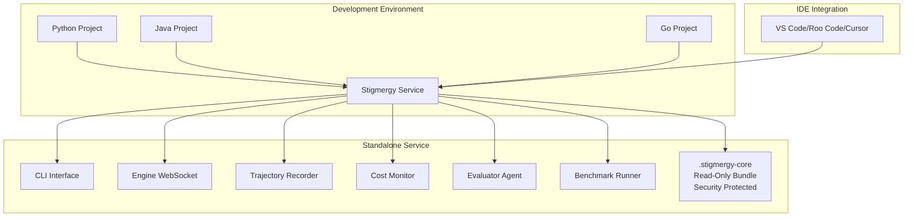
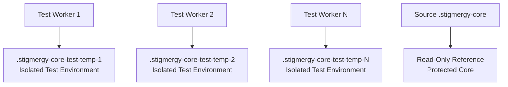
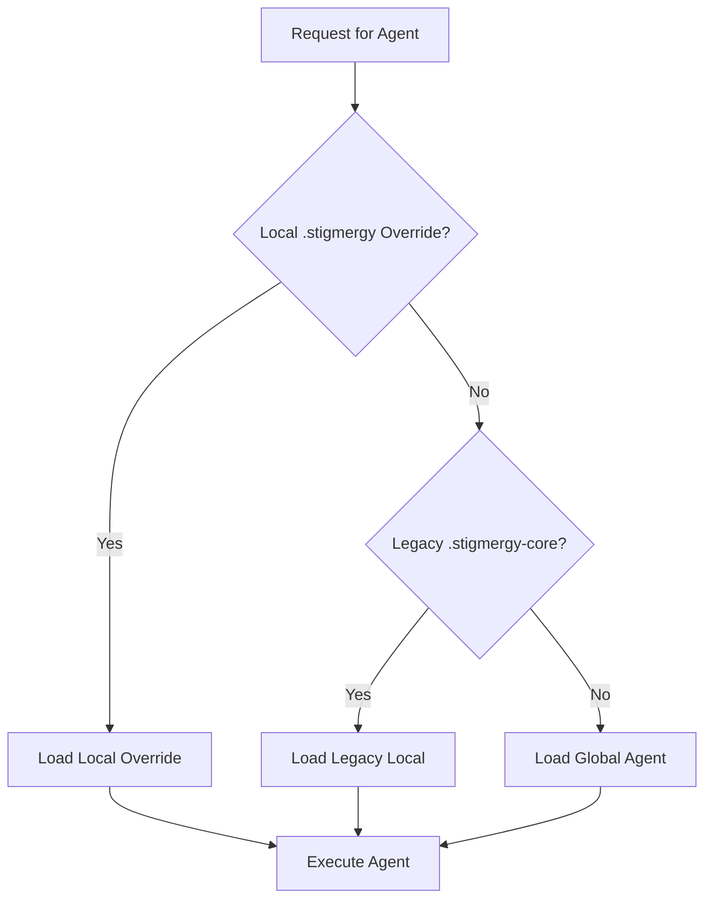

# Stigmergy Production-Ready Refactoring Design Document

## 1. Overview

This document outlines the comprehensive refactoring of the Stigmergy system to achieve production-ready stability, security, and reliability. The refactoring focuses on three main phases:

1. **Critical Stabilization**: Isolate and repair the test framework to ensure it never touches the source `.stigmergy-core` directory
2. **Architectural Hardening**: Secure the core by transitioning to a standalone service model where `.stigmergy-core` is treated as a read-only, distributed asset
3. **Finalization and Verification**: Clean up the codebase and update documentation to reflect the new, robust architecture

### 1.1 Critical Security Requirement

The most important requirement is to keep `.stigmergy-core` secure from any deletion or modification. Before any testing begins, we must ensure that the test framework properly investigates and keeps `.stigmergy-core` always in place. We may replace the name of `.stigmergy-core` that will be installed in project level or test to other name such as `.stigmergy` to avoid any issue, but we must also replace any reference in all related files if we choose to change the name.

This security requirement is addressed through multiple layers of protection:
- **Test Framework Isolation**: Tests use temporary directories instead of the source `.stigmergy-core`
- **Read-Only Core Bundle**: The `.stigmergy-core` is bundled with the NPM package as a read-only asset
- **Path Validation**: Multiple validation checks prevent accidental deletion of core directories
- **Hierarchical Agent Loading**: Local overrides take precedence over global agents, protecting the core

The security of the `.stigmergy-core` directory is the highest priority in this refactoring effort. Multiple layers of protection ensure that:
- Tests cannot accidentally modify or delete the source directory
- Runtime processes cannot compromise the integrity of the core assets
- The bundled core remains immutable in production installations

## 2. Architecture

### 2.1 Current Architecture

The current Stigmergy system has a monolithic structure where the `.stigmergy-core` directory containing agent definitions is part of the repository. This creates several issues:

1. **Test Framework Vulnerability**: Tests can accidentally modify or delete the core directory
2. **Security Concerns**: The shell tool uses Node.js `vm` module which has known escape vulnerabilities
3. **Deployment Complexity**: Each project requires a full copy of the system

### 2.2 Proposed Architecture

The refactored architecture implements a standalone service model while ensuring the security of the core `.stigmergy-core` directory:



Key architectural changes:
1. **Isolated Test Environment**: Tests use temporary directories instead of the source `.stigmergy-core`
2. **Read-Only Core Bundle**: The `.stigmergy-core` is bundled with the NPM package as a read-only asset
3. **Prioritized Agent Loading**: Local overrides take precedence over global agents
4. **Enhanced Security**: Replace `vm` module with `isolated-vm` for the shell tool
5. **Core Protection**: Multiple layers of protection ensure `.stigmergy-core` cannot be accidentally deleted or modified

The security of the `.stigmergy-core` directory is the highest priority in this refactoring effort. Multiple layers of protection ensure that:
- Tests cannot accidentally modify or delete the source directory
- Runtime processes cannot compromise the integrity of the core assets
- The bundled core remains immutable in production installations

This multi-layered approach to core protection is implemented throughout all phases of the refactoring.

## 3. Test Framework Refactoring

The test framework refactoring is the most critical part of this refactoring effort. It ensures that no test can accidentally modify or delete the source `.stigmergy-core` directory, which contains essential agent definitions.

To address the critical security requirement of keeping `.stigmergy-core` secure, we will implement multiple layers of protection in the test framework.

### 3.1 Isolated Test Environment

#### 3.1.1 Test Setup (`tests/setup.js`)
- Create temporary, isolated directory for each test worker (e.g., `.stigmergy-core-test-temp-1`)
- Copy contents of `tests/fixtures/test-core` into this temporary directory
- Set global test configuration to point exclusively to this temporary path
- Ensure the temporary directory name contains a unique identifier to prevent accidental deletion of the source `.stigmergy-core`

#### 3.1.2 Test Teardown (`tests/teardown.js`)
- Only delete the temporary directory created during setup
- Add safety check to ensure the path being deleted contains `.stigmergy-core-test-temp` and matches the current worker ID
- Implement multiple validation checks to prevent accidental deletion of the source `.stigmergy-core` directory

### 3.2 Test Fixes

#### 3.2.1 Lightweight Archon Tests (`tests/unit/services/lightweight_archon.test.js`)
- Fix incorrect mocking of dependencies like `axios`
- Ensure proper mock implementations for `DeepWikiMCP` class
- Correctly implement Jest mock functions for class constructors
- Validate that tests don't interfere with the source `.stigmergy-core` directory

#### 3.2.2 State Manager Tests (`tests/unit/engine/state_manager.test.js`)
- Correctly mock `EventEmitter` methods since `GraphStateManager` extends `EventEmitter`
- Fix `emit` function mocking to match Node.js `EventEmitter` interface
- Ensure proper mock setup for `GraphStateManager` singleton
- Validate that tests don't interfere with the source `.stigmergy-core` directory

#### 3.2.3 Shell Tool Tests (`tests/unit/tools/shell.test.js`)
- Update tests to reflect new `isolated-vm` implementation
- Ensure proper testing of security constraints
- Validate memory and CPU limit enforcement
- Confirm tests don't attempt to access or modify the source `.stigmergy-core` directory

## 4. Core Security and Architecture Hardening

The core security and architecture hardening focuses on making the `.stigmergy-core` directory immutable in production while still allowing for local customization when needed.

To ensure the security of the `.stigmergy-core` directory, we will implement a read-only bundle distribution model.

### 4.1 NPM Package Bundling

#### 4.1.1 .npmignore Modification
- Remove the line that excludes `.stigmergy-core/` from the published package
- This ensures agent definitions are distributed with the application as read-only assets
- The bundled `.stigmergy-core` directory will be treated as immutable in the installed package

### 4.2 Init Command Refactoring

#### 4.2.1 CLI Command Changes (`cli/commands/init.js`)
- Refactor the `init` command to no longer copy the `.stigmergy-core` directory
- Only create the local `.stigmergy/` configuration directory
- Maintain creation of `trajectories`, `evaluations`, and `state` subdirectories
- Keep the interactive part that sets up the `.env` file
- Ensure no references to copying or modifying the global `.stigmergy-core` directory

### 4.3 Agent Loading Prioritization

#### 4.3.1 Engine Server Modification (`engine/server.js`)
- Modify the `getAgent(agentId)` function to implement a prioritized loading approach:
  1. **Local Override First**: Check for `.stigmergy/agents/${agentId}.md` in the current working directory (project-specific customization)
  2. **Legacy Local Override**: Check for `.stigmergy-core/agents/${agentId}.md` in the current working directory (backward compatibility)
  3. **Global Fallback**: Resolve path to globally installed, read-only `.stigmergy-core` in `node_modules`
- This approach ensures that project-specific agent customizations take precedence while maintaining backward compatibility

### 4.4 Security Sandbox Implementation

#### 4.4.1 Shell Tool Refactoring (`tools/shell.js`)
- Replace the `vm` module with `isolated-vm` for enhanced security
- Implement strict memory (e.g., 16MB) and CPU time limits
- Maintain existing security checks for permitted commands
- Ensure all execution is contained within the isolated environment

#### 4.4.2 Package Dependencies (`package.json`)
- Add `isolated-vm` as a dependency
- Update related test files to correctly test the new implementation
- Ensure compatibility with existing Node.js version requirements (v18+)

## 5. Data Models and State Management

### 5.1 Test Environment Isolation
The refactored test framework ensures complete isolation of test environments while protecting the core `.stigmergy-core` directory. Each test worker operates in its own temporary directory, ensuring that tests cannot accidentally modify or delete the source `.stigmergy-core`:



### 5.2 Agent Loading Hierarchy
The new agent loading mechanism implements a clear hierarchy:



## 6. Business Logic and Core Components

### 6.1 Test Framework Security
- **Isolation**: Each test worker operates in its own temporary directory
- **Safety Checks**: Path validation ensures only test directories are deleted
- **Fixture Management**: Standardized fixture structure for consistent testing
- **Multiple Validation Layers**: Implement multiple checks to prevent accidental deletion of core directories
- **Core Directory Protection**: Ensure source `.stigmergy-core` directory is never accessed or modified by tests

### 6.2 Core Distribution Model
- **Bundled Assets**: Core agent definitions distributed as part of the NPM package
- **Read-Only Access**: Global core assets are treated as immutable
- **Local Customization**: Projects can override agents locally without affecting the global installation
- **Backward Compatibility**: Legacy `.stigmergy-core` support maintained for existing projects
- **Core Protection**: The bundled `.stigmergy-core` remains protected as a read-only asset in the installed package

### 6.3 Security Enhancements
- **Sandboxing**: `isolated-vm` provides stronger isolation than Node.js `vm` module
- **Resource Limits**: Memory and CPU constraints prevent resource exhaustion
- **Command Restrictions**: Existing permission system maintained for command validation
- **Path Restrictions**: File system access limited to project directory for security
- **Core Protection**: Multiple security layers ensure `.stigmergy-core` cannot be accidentally deleted or modified

## 7. API Endpoints and Integration

### 7.1 Agent Loading API
The refactored `getAgent(agentId)` function provides a clear API for agent loading while ensuring the security of the core `.stigmergy-core` directory. This hierarchical loading approach ensures that the bundled core remains protected while allowing for local customization:

```javascript
// Priority 1: Check for new .stigmergy local override (project-specific customization)
const localOverridePath = path.join(process.cwd(), '.stigmergy', 'agents', `${agentId}.md`);

// Priority 2: Check for legacy .stigmergy-core local override (backward compatibility)
const legacyLocalPath = path.join(process.cwd(), '.stigmergy-core', 'agents', `${agentId}.md`);

// Priority 3: Fall back to global installation (read-only bundled core)
const globalAgentPath = path.join(__dirname, '..', '.stigmergy-core', 'agents', `${agentId}.md`);
```

### 7.2 Shell Tool API
The enhanced shell tool maintains the same interface while improving security and ensuring the protection of the core system:

```javascript
// Security validation maintained
const permitted = (agentConfig.permitted_shell_commands || []).some((p) =>
  new RegExp("^" + p.replace(/\*/g, ".*") + "$").test(command)
);

// Enhanced execution with isolated-vm
const isolate = new ivm.Isolate({ memoryLimit: 16 });

// Path restriction to project directory
const projectDir = process.cwd();
```

## 8. Testing Strategy

### 8.1 Unit Testing
- **Shell Tool Tests**: Validate new `isolated-vm` implementation
- **State Manager Tests**: Correctly mock `EventEmitter` functionality
- **Service Tests**: Fix mocking for external dependencies
- **Security Tests**: Validate all security constraints are properly enforced

### 8.2 Integration Testing
- **Agent Loading**: Verify local override precedence works correctly
- **Test Isolation**: Confirm tests don't affect source `.stigmergy-core`
- **Security Validation**: Ensure sandbox escape protection is effective
- **Path Resolution**: Validate correct agent loading hierarchy

### 8.3 End-to-End Testing
- **Comprehensive Validation**: Execute full system validation script (`npm run validate:comprehensive`)
- **CLI Functionality**: Verify `init` command behavior
- **Agent Execution**: Confirm agents load correctly in new architecture
- **Test Framework**: Run full test suite to ensure all tests pass with new isolation
- **Core Protection Verification**: Confirm that the source `.stigmergy-core` directory remains untouched after all tests

### 8.4 Security Testing
- **Sandbox Escape Attempts**: Verify `isolated-vm` protection against known escape techniques
- **Resource Limit Testing**: Confirm memory and CPU limits are properly enforced
- **Command Injection Tests**: Validate command permission system effectiveness
- **Core Directory Protection**: Verify that no process can accidentally delete or modify the source `.stigmergy-core` directory

## 9. Deployment and Documentation

### 9.1 Codebase Cleanup
- **Obsolete Files**: Remove `scripts/restore-backup.js` as it's redundant with `core_backup.js`
- This reduces code duplication and potential confusion in the backup/restore process

### 9.2 Documentation Updates
- **README.md**: Emphasize `npm install -g` and `stigmergy init` workflow
- **Integration Guides**: Remove references to local project dependency installation
- **MCP Documentation**: Update to reflect global service architecture
- **Installation Instructions**: Clearly document the new standalone service model
- **Migration Guide**: Provide clear instructions for transitioning existing projects

### 9.3 Migration Path
- **Backward Compatibility**: Existing projects continue to work without changes
- **New Projects**: Use lightweight initialization with `stigmergy init`
- **Transition Guidance**: Clear instructions for migrating existing installations
- **Legacy Support**: Maintain support for `.stigmergy-core` in project directories for backward compatibility
- **Core Protection**: Ensure that during migration, the source `.stigmergy-core` directory remains protected

## 10. Security Considerations

### 10.1 Test Environment Security
- **Path Isolation**: Temporary test directories prevent accidental core modification
- **Cleanup Validation**: Safety checks ensure only test artifacts are removed
- **Multiple Validation Layers**: Implement multiple checks to prevent accidental deletion of the source `.stigmergy-core` directory
- **Core Directory Protection**: Ensure source `.stigmergy-core` directory is never accessed or modified by tests

### 10.2 Runtime Security
- **Sandboxing**: `isolated-vm` provides stronger protection against code execution exploits
- **Resource Constraints**: Memory and CPU limits prevent denial of service attacks
- **Command Validation**: Existing permission system prevents unauthorized command execution
- **Core Protection**: Multiple layers of protection ensure `.stigmergy-core` cannot be accidentally deleted or modified during runtime

### 10.3 Distribution Security
- **Immutable Core**: Bundled `.stigmergy-core` assets are read-only
- **Integrity Protection**: Package verification ensures core assets aren't tampered with
- **Backup Protection**: The core backup service provides an additional layer of protection against accidental loss
- **Core Protection**: Multiple layers of protection ensure `.stigmergy-core` cannot be accidentally deleted or modified during distribution

## 11. Performance Considerations

### 11.1 Agent Loading Performance
- **Caching**: Local agent overrides can be cached for faster access
- **Path Resolution**: Optimized path resolution for global agent loading
- **Hierarchical Loading**: Priority-based loading minimizes file system operations
- **Core Protection**: Efficient loading hierarchy ensures the bundled `.stigmergy-core` remains protected

### 11.2 Test Execution Performance
- **Parallel Testing**: Isolated test environments enable safe parallel execution
- **Resource Management**: Memory limits prevent test resource exhaustion
- **Fixture Optimization**: Standardized test fixtures reduce setup overhead
- **Core Protection**: Parallel test execution doesn't compromise the security of the source `.stigmergy-core` directory

### 11.3 Runtime Performance
- **Memory Constraints**: Sandboxed execution prevents memory leaks
- **CPU Limits**: Time limits ensure responsive system behavior
- **Efficient Isolation**: `isolated-vm` provides better performance than traditional VM approaches
- **Core Protection**: Runtime performance optimizations don't compromise the security of the `.stigmergy-core` directory

## 12. Rollback and Recovery

### 12.1 Test Framework Rollback
- **Isolated Changes**: Test environment changes don't affect production systems
- **Automatic Cleanup**: Test directories automatically removed after execution
- **Safety Validation**: Multiple validation checks prevent accidental deletion of core directories
- **Core Protection**: Ensure source `.stigmergy-core` directory remains untouched during test execution and cleanup

### 12.2 Core System Rollback
- **Version Pinning**: NPM package versioning enables rollback to previous versions
- **Configuration Preservation**: Local configurations preserved during updates
- **Core Integrity**: The bundled `.stigmergy-core` remains immutable and can be restored from NPM
- **Core Protection**: Ensure that rollback processes don't accidentally modify or delete the source `.stigmergy-core` directory

### 12.3 Security Rollback
- **Module Replacement**: `isolated-vm` can be reverted to `vm` if issues arise
- **Permission System**: Existing command validation provides fallback security
- **Backup System**: Core backup service provides recovery mechanism for local customizations
- **Core Protection**: Multiple layers of protection ensure `.stigmergy-core` cannot be accidentally deleted or modified