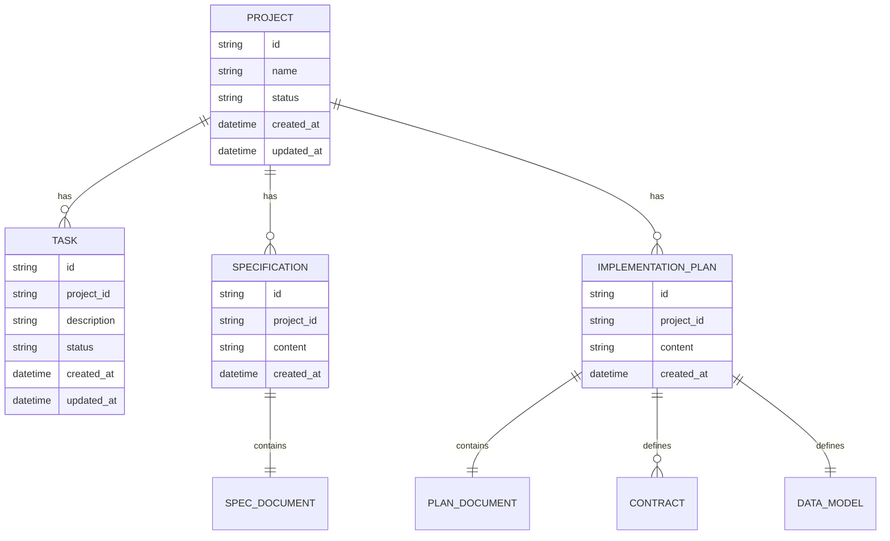

# Stigmergy System Enhancement: Integrating Specification-Driven Development and Advanced Document Intelligence

## 1. Overview

This design document outlines the integration of core concepts from the github-spec-kit and hkuds-deepcode repositories into the existing Stigmergy system. The goal is to evolve Stigmergy into a more robust, reliable, and user-friendly autonomous development platform by natively integrating Specification-Driven Development (SDD) and advanced document intelligence capabilities.

### 1.1 Objectives

- **Native Integration**: Rather than simply adding external dependencies, core concepts will be re-implemented natively within Stigmergy's existing JavaScript/Node.js architecture
- **Preserve Architecture**: All changes will respect and extend Stigmergy's existing multi-agent swarm and MCP-based architecture
- **Unified User Experience**: New capabilities will be seamlessly integrated into the Stigmergy chat interface
- **JavaScript First**: All new core logic will be implemented in JavaScript/Node.js
- **Test Everything**: Every new or modified workflow will be accompanied by integration tests
- **Document as You Go**: Documentation will be updated to reflect new capabilities

### 1.2 Key Integration Areas

1. **Specification-Driven Development (SDD)** from github-spec-kit
2. **Advanced Document Intelligence** from hkuds-deepcode
3. **Concise Memory Execution Strategy** from hkuds-deepcode

## 2. Architecture

### 2.1 System Overview

The enhanced Stigmergy system will maintain its core multi-agent architecture while adding new capabilities:

```
graph TB
    User[🧑 User] --> System[🎯 @system]
    System --> Chat[💬 Chat Interface]
    System --> Specifier[📝 @specifier]
    System --> RefArch[📚 @reference-architect]
    System --> Unified[🎯 @unified-executor]
    
    Specifier --> SpecWorkflow[📋 SDD Workflow]
    SpecWorkflow --> SpecFile[📄 specs/spec.md]
    SpecWorkflow --> PlanFile[📄 specs/plan.md]
    
    RefArch --> DocIntel[📄 Document Intelligence]
    RefArch --> PatternSearch[🔍 Pattern Search]
    RefArch --> Brief[📋 Implementation Brief]
    
    Unified --> InternalDev[🔧 @enhanced-dev]
    Unified --> GeminiCLI[⚡ @gemini-executor]
    Unified --> QwenCLI[🧮 @qwen-executor]
    
    InternalDev --> QA[🛡️ @qa]
    GeminiCLI --> QA
    QwenCLI --> QA
    
    QA --> TDD[✅ TDD Enforcement]
    QA --> Static[🔍 Static Analysis]
    QA --> Coverage[📊 Coverage Check]
    
    subgraph "Data Layer"
        Neo4j[(🗃️ Neo4j)]
        Patterns[(📚 Pattern Library)]
        GitHub[(🐙 GitHub Repos)]
    end
    
    DocIntel --> Patterns
    PatternSearch --> GitHub
    InternalDev --> Neo4j
    
    classDef agent fill:#4a90e2,stroke:#333,color:white;
    classDef data fill:#7dbcea,stroke:#333,color:white;
    classDef component fill:#50e3c2,stroke:#333,color:black;
    
    class User,System agent
    class Neo4j,Patterns,GitHub data
    class Specifier,RefArch,Unified,InternalDev,GeminiCLI,QwenCLI,QA component
```

### 2.2 Core Components

1. **@specifier Agent**: New agent responsible for SDD workflow
2. **Enhanced Document Intelligence**: Improved processing of technical documents
3. **Concise Memory Strategy**: Memory management to prevent context overflow
4. **Specification Repository**: Structured storage for specs and plans

## 3. Specification-Driven Development Integration

### 3.1 System Constitution Enhancement

The existing Stigmergy constitution will be enhanced with principles from github-spec-kit:

#### 3.1.1 Current Constitution
Located at `.stigmergy-core/governance/constitution.md`

#### 3.1.2 Enhanced Constitution Principles
- **Test-First Imperative**: Explicitly reference @qa agent and qa.run_tests_and_check_coverage tool
- **Specification-Driven Workflow**: Formalize the specification → plan → implementation workflow
- **Constitutional Compliance**: Ensure all agents reference and comply with constitutional principles

### 3.2 @specifier Agent

A new agent will be created to handle the SDD workflow:

#### 3.2.1 Agent Definition
File: `.stigmergy-core/agents/specifier.md`

Persona: "Specification and Planning Specialist"

#### 3.2.2 Core Responsibilities
1. Take high-level goals from @dispatcher
2. Use templates from github-spec-kit for structured output
3. Generate spec.md files in specs/ directory
4. Interact with users to resolve ambiguities using [NEEDS CLARIFICATION] methodology
5. Generate comprehensive plan.md files with technical stack, data models, API contracts

#### 3.2.3 Workflow
1. Receive high-level goal from @dispatcher
2. Create specification document using spec-template.md
3. Engage user for clarification of ambiguities
4. Generate implementation plan using plan-template.md
5. Hand off to @dispatcher for execution phase

### 3.3 @dispatcher Workflow Enhancement

The @dispatcher agent will be modified to integrate with the new @specifier agent:

#### 3.3.1 Enhanced STATE_DRIVEN_ORCHESTRATION_PROTOCOL
- When a new complex development goal is initiated, delegate to @specifier first
- Update project status to SPECIFICATION_PHASE
- Proceed to EXECUTION_IN_PROGRESS only after @specifier produces complete plan

#### 3.3.2 Status Flow
```
NEEDS_INITIALIZATION → SPECIFICATION_PHASE → PLANNING_COMPLETE → EXECUTION_IN_PROGRESS → EXECUTION_COMPLETE
```

## 4. Advanced Document Intelligence Enhancement

### 4.1 document_intelligence.js Enhancement

The existing document_intelligence.js tool will be upgraded with capabilities from hkuds-deepcode:

#### 4.1.1 Semantic Segmentation
- Add new step after text extraction to "semantically segment" content
- Ensure algorithms, code blocks, and explanatory text are kept together
- Inspired by workflows/agents/document_segmentation_agent.py from hkuds-deepcode

#### 4.1.2 Expanded Format Support
- Add support for .docx files
- Use Python subprocess to handle conversion (leveraging tools/pdf_converter.py as reference)
- Maintain core system in JS while leveraging Python libraries when necessary

### 4.2 Intelligent Document Processing Workflow

```
graph TD
    A[Document Input] --> B[Format Detection]
    B --> C{Format Type}
    C -->|PDF| D[PDF Processing]
    C -->|DOCX| E[DOCX Processing]
    C -->|HTML| F[HTML Processing]
    C -->|MD| G[Markdown Processing]
    C -->|TXT| H[Text Processing]
    D --> I[Semantic Segmentation]
    E --> I
    F --> I
    G --> I
    H --> I
    I --> J[Enhanced Output]
    J --> K[Segmented Content]
    J --> L[Technical Brief]
    
    style I fill:#50e3c2,stroke:#333
    style J fill:#7dbcea,stroke:#333
```

## 5. Concise Memory Execution Strategy

### 5.1 Memory Management Enhancement

Implementation of the "Concise Memory" strategy from hkuds-deepcode to improve reliability:

#### 5.1.1 Core Strategy
After tool_executor successfully executes a file_system.writeFile tool call:
1. Trigger "context summarization" step
2. Use LLM to summarize work completed and current project state
3. Replace long conversation history with concise summary for next iteration

#### 5.1.2 Benefits
- Prevent conversation history from growing indefinitely
- Make agent work more focused
- Reduce errors from context overload

### 5.2 Implementation in Engine

#### 5.2.1 server.js Modification
- Refactor agent interaction loop to implement memory management strategy
- Add context summarization after writeFile operations

#### 5.2.2 Tool Executor Enhancement
- Track writeFile operations
- Trigger summarization workflow after successful writes

## 6. Data Models

### 6.1 Specification Repository Structure

```
specs/
├── 001-feature-name/
│   ├── spec.md
│   ├── plan.md
│   ├── data-model.md
│   ├── contracts/
│   │   ├── api-spec.json
│   │   └── signalr-spec.md
│   ├── research.md
│   └── quickstart.md
└── 002-another-feature/
    └── ...
```

### 6.2 Agent State Model



## 7. Business Logic Layer

### 7.1 Specification-Driven Workflow

#### 7.1.1 Phase 1: Specification Creation
1. User provides high-level goal
2. @specifier creates spec.md using template
3. Ambiguities marked with [NEEDS CLARIFICATION]
4. User interaction to resolve ambiguities

#### 7.1.2 Phase 2: Plan Generation
1. @specifier generates plan.md with:
   - Technical stack
   - Data models
   - API contracts
   - Implementation approach
2. Plan validation and refinement

#### 7.1.3 Phase 3: Execution
1. @dispatcher moves to execution phase
2. Tasks generated from plan
3. Implementation by executor agents

### 7.2 Document Intelligence Workflow

#### 7.2.1 Document Processing
1. Format detection
2. Content extraction
3. Semantic segmentation
4. Technical pattern extraction

#### 7.2.2 Pattern Analysis
1. Code pattern identification
2. Implementation brief generation
3. Reference pattern matching

### 7.3 Memory Management Workflow

#### 7.3.1 Context Summarization
1. Detect writeFile operations
2. Trigger summarization process
3. Generate concise project state summary
4. Replace conversation history

#### 7.3.2 Memory Optimization
1. Track implemented files
2. Create code summaries
3. Maintain essential context only

## 8. API Endpoints Reference

### 8.1 Specification Management

#### 8.1.1 Create Specification
```
POST /api/specs
Content-Type: application/json

{
  "projectId": "project-123",
  "content": "High-level feature description"
}

Response:
{
  "id": "spec-456",
  "status": "created",
  "specPath": "specs/project-123/spec.md"
}
```

#### 8.1.2 Get Specification
```
GET /api/specs/{specId}

Response:
{
  "id": "spec-456",
  "projectId": "project-123",
  "content": "Full specification content",
  "status": "complete"
}
```

### 8.2 Plan Management

#### 8.2.1 Create Implementation Plan
```
POST /api/plans
Content-Type: application/json

{
  "specId": "spec-456",
  "techStack": "Node.js, Express, React",
  "dataModel": "{...}"
}

Response:
{
  "id": "plan-789",
  "status": "created",
  "planPath": "specs/project-123/plan.md"
}
```

### 8.3 Document Processing

#### 8.3.1 Process Document
```
POST /api/documents/process
Content-Type: multipart/form-data

{
  "file": "document.pdf",
  "options": {
    "enableSemanticSegmentation": true,
    "preserveCodeBlocks": true
  }
}

Response:
{
  "success": true,
  "outputPath": "docs/analysis/document_processed.md",
  "segmentCount": 12
}
```

## 9. Middleware & Interceptors

### 9.1 Specification Validation Middleware

Middleware to validate specification completeness before plan generation:

```javascript
function validateSpecification(req, res, next) {
  const spec = req.body;
  
  // Check for [NEEDS CLARIFICATION] markers
  if (spec.content.includes('[NEEDS CLARIFICATION]')) {
    return res.status(400).json({
      error: 'Specification contains unresolved ambiguities',
      details: 'All [NEEDS CLARIFICATION] markers must be resolved'
    });
  }
  
  next();
}
```

### 9.2 Memory Management Interceptor

Interceptor to handle context summarization:

```javascript
function memoryManagementInterceptor(req, res, next) {
  const toolCall = req.body;
  
  // After writeFile operations
  if (toolCall.tool === 'file_system.writeFile') {
    // Trigger context summarization
    summarizeContext(toolCall.args.file_path)
      .then(summary => {
        // Store summary for next iteration
        req.contextSummary = summary;
        next();
      })
      .catch(next);
  } else {
    next();
  }
}
```

## 10. Testing Strategy

### 10.1 Unit Tests

#### 10.1.1 @specifier Agent Tests
- Specification generation from templates
- Ambiguity detection and marking
- Plan generation with proper structure

#### 10.1.2 Document Intelligence Tests
- Format detection accuracy
- Semantic segmentation quality
- Pattern extraction correctness

#### 10.1.3 Memory Management Tests
- Context summarization accuracy
- Conversation history replacement
- File implementation tracking

### 10.2 Integration Tests

#### 10.2.1 SDD Workflow Test
```javascript
test('SDD workflow integration', async () => {
  // Simulate user giving high-level goal
  const goal = 'Create a REST API for managing todos';
  
  // Assert @dispatcher calls @specifier
  const dispatcherCall = await mockDispatcher(goal);
  expect(dispatcherCall.agent).toBe('@specifier');
  
  // Provide mock outputs for spec.md and plan.md
  const spec = await mockSpecifier.createSpec(goal);
  const plan = await mockSpecifier.createPlan(spec);
  
  // Assert system moves to execution phase
  const executionPhase = await mockSystem.getStatus();
  expect(executionPhase).toBe('EXECUTION_IN_PROGRESS');
});
```

#### 10.2.2 Concise Memory Strategy Test
```javascript
test('Concise memory strategy', async () => {
  // Simulate file write operation
  const writeFileOp = await mockToolExecutor.writeFile('test.js', code);
  
  // Assert context summarization is triggered
  const summaryCall = await mockMemoryAgent.getLastCall();
  expect(summaryCall.method).toBe('createSummary');
  
  // Assert conversation history is shortened
  const historyLength = await mockAgent.getHistoryLength();
  expect(historyLength).toBeLessThan(threshold);
});
```

### 10.3 End-to-End Tests

#### 10.3.1 Complete Feature Development Flow
1. User provides feature request
2. System generates specification
3. User clarifies ambiguities
4. System generates implementation plan
5. System implements feature
6. QA validates implementation

## 11. Deployment & Configuration

### 11.1 Environment Variables

New environment variables for enhanced functionality:

```env
# SDD Configuration
SDD_ENABLED=true
SDD_TEMPLATES_PATH=.stigmergy-core/templates

# Document Intelligence
DOC_INTEL_SEMANTIC_SEGMENTATION=true
DOC_INTEL_PYTHON_PATH=/usr/bin/python3

# Memory Management
MEMORY_CONCISE_SUMMARIZATION=true
MEMORY_SUMMARY_THRESHOLD=10000
```

### 11.2 Configuration Files

#### 11.2.1 stigmergy.config.js Enhancement
```javascript
module.exports = {
  // Existing configuration...
  
  features: {
    // Existing features...
    sdd: {
      enabled: true,
      templatesPath: '.stigmergy-core/templates',
      specDirectory: 'specs'
    },
    documentIntelligence: {
      semanticSegmentation: true,
      supportedFormats: ['pdf', 'docx', 'html', 'md', 'txt'],
      pythonPath: '/usr/bin/python3'
    },
    memoryManagement: {
      conciseSummarization: true,
      summaryThreshold: 10000
    }
  }
};
```

## 12. Monitoring & Observability

### 12.1 Metrics Collection

#### 12.1.1 SDD Workflow Metrics
- Specification creation time
- Ambiguity resolution count
- Plan generation time
- Specification completeness score

#### 12.1.2 Document Intelligence Metrics
- Document processing time
- Segmentation quality score
- Pattern extraction accuracy
- Format support success rate

#### 12.1.3 Memory Management Metrics
- Context summarization frequency
- History reduction ratio
- Summary accuracy score
- Memory optimization effectiveness

### 12.2 Logging Enhancements

#### 12.2.1 Structured Logging
```javascript
logger.info({
  event: 'specification_created',
  specId: 'spec-123',
  projectId: 'project-456',
  ambiguitiesFound: 3,
  processingTimeMs: 1250
});
```

#### 12.2.2 Memory Management Logs
```javascript
logger.info({
  event: 'context_summarized',
  fileId: 'implementation.js',
  historyLengthBefore: 150,
  historyLengthAfter: 12,
  summaryLength: 250
});
```

