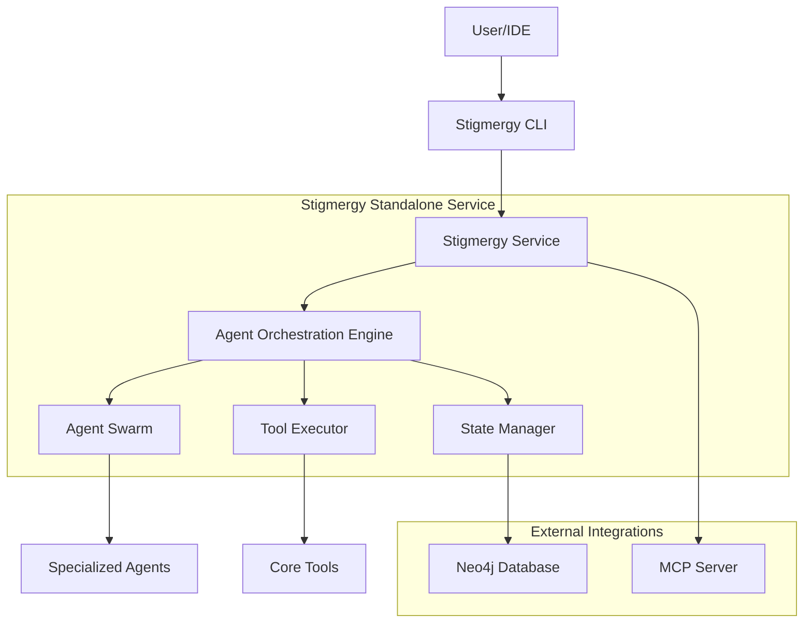
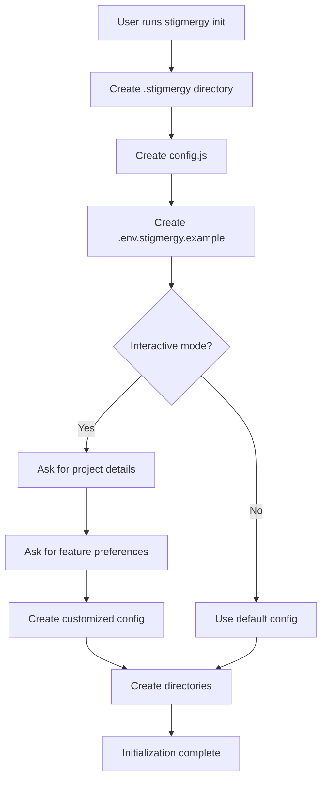

# System Architecture Refinement Design Document

## 1. Overview

This document outlines the design for refining the Stigmergy system to fully embrace a standalone service architecture, improve user experience, enhance agent effectiveness, and clean up the codebase. The refinement focuses on five key areas:

1. Solidifying the standalone service architecture by removing legacy installation logic
2. Enhancing the first-time user experience with interactive initialization
3. Refining the system's "brain" (.stigmergy-core) by updating agent definitions
4. Overhauling web IDE agent team performance
5. Cleaning up codebase and documentation

## 2. Architecture

The Stigmergy system follows a standalone service architecture that enables global installation and cross-language project support. The key architectural components include:



### 2.1 Key Architectural Principles

1. **Global Installation**: Install once, use everywhere approach
2. **Lightweight Project Initialization**: Projects only contain configuration and state
3. **Centralized Agent Management**: All agents run in the global service
4. **Cross-Language Support**: Works with any programming language
5. **Backward Compatibility**: Existing projects continue to work

## 3. Quest Implementations

### Quest 1: Solidify Standalone Service Architecture

#### 3.1 Legacy Installation File Removal

**Files to be deleted:**
- `cli/commands/install.js`
- `cli/commands/install_helpers.js`

#### 3.2 CLI Entrypoint Modification

**File:** `cli/index.js`

**Action:** Remove the `.command("install")` block completely.

#### 3.3 Package.json Update

**File:** `package.json`

**Action:** Remove the `"install-core": "node cli/index.js install"` script from the scripts section.

#### 3.4 README.md Update

**File:** `README.md`

**Actions:**
- Remove sections/commands related to `npx @randy888chan/stigmergy install`
- Update "Quick Start" section to prioritize global installation and `stigmergy init` workflow
- Ensure all examples point to using `stigmergy start-service` instead of `npm run stigmergy:start` within a project

### Quest 2: Enhance First-Time User Experience

#### 2.1 Interactive Initialization Enhancement

**File:** `cli/commands/init.js`

**Enhancements to `interactiveInit` function:**

1. After creating the `.stigmergy` directory and `.env.stigmergy.example` file, ask:
   ```
   "Would you like to configure your API keys now? (Y/n)"
   ```

2. If "Yes":
   - Read the `.env.stigmergy.example` file
   - Find all variables that end with `_KEY=`
   - For each key, prompt interactively:
     ```
     "Please enter your [KEY_NAME] (you can get one at [link-to-provider]):"
     ```
   - Write user input into a new `.stigmergy/.env` file

3. Add similar interactive loop for other essential services like Neo4j credentials

### Quest 3: Refine System's "Brain" (.stigmergy-core)

#### 3.1 Obsolete Agent Deletion

**Files to be deleted:**
- `.stigmergy-core/agents/test-agent.md`
- `tests/fixtures/test-core/.stigmergy-core/agents/test-agent.md`

#### 3.2 Agent Manifest Update

**File:** `.stigmergy-core/system_docs/02_Agent_Manifest.md`

**Action:** Programmatically read the list of `.md` files in the `.stigmergy-core/agents/` directory and update the manifest to accurately reflect all available agents, ensuring agents like `orion.md` are included.

#### 3.3 Agent Prompting Improvement

**File:** `.stigmergy-core/agents/dispatcher.md`

**Action:** Add the following protocol to the `core_protocols` section:

```yaml
- "RESPONSE_FORMAT_PROTOCOL: My final output MUST be a single, valid JSON object. For delegation, the JSON must strictly conform to the tool call schema, for example: {\"tool\":\"stigmergy.task\",\"args\":{\"subagent_type\":\"@evaluator\",\"description\":\"Evaluate these three solutions...\"}}. I will not include any explanatory text outside of the JSON object."
```

### Quest 4: Overhaul Web IDE Agent Team Performance

#### 4.1 Web Bundle Meta-Prompt Modification

**File:** `cli/commands/build.js`

**Action:** Replace the `WEB_BUNDLE_HEADER` constant with:

```javascript
const WEB_BUNDLE_HEADER = `CRITICAL: You are an AI agent orchestrator. The following content is a bundle of specialized AI agent personas. Your primary goal is to fulfill the user's request by adopting the MOST appropriate persona for each specific step of the task.

- **DO NOT** act as all agents at once.
- **ALWAYS** announce which agent persona you are adopting before you begin a task (e.g., "Now acting as @design-architect...").
- **USE** the protocols of your chosen agent persona to guide your response.
- **SWITCH** personas as the conversation requires. For example, after planning as @business_planner, you might switch to @design-architect for technical details.

Interpret this bundle to fulfill the user's high-level goal.\n\n`;
```

#### 4.2 README.md Guidance Update

**File:** `README.md`

**Action:** Add a new subsection explaining how to effectively use the web bundles, emphasizing:
- Use of smaller, specialized teams (`team-web-planners.yml`, `team-execution.yml`)
- Importance of iterative, multi-step prompting

### Quest 5: Codebase & Documentation Cleanup

#### 5.1 Redundant Test/Utility Script Deletion

**Files to be deleted:**
- `tests/test_roo_code_connection.js`
- `tests/test_mcp_integration.js`
- `tests/verify_fix.js`

#### 5.2 Documentation Update

**Files to be updated:**
- `docs/roo-code-integration.md`
- `docs/mcp-server-setup.md`

**Action:** Rewrite to reflect the new streamlined workflow:
1. Install Stigmergy globally (`npm install -g @randy888chan/stigmergy`)
2. Start the service (`stigmergy start-service`)
3. Configure IDE's MCP server to connect to the global service

The new `mcp-server.js` is now part of the global installation, not a file to be copied into each project. Configuration should be simple and universal.

## 4. Data Models

### 4.1 Configuration Model

```javascript
// .stigmergy/config.js
{
  projectName: "example-project",
  features: {
    neo4j: "auto", // Options: 'required', 'auto', 'memory'
    automation_mode: "autonomous", // Options: 'autonomous', 'approval_required', 'hybrid'
    provider_isolation: true,
    deepcode_integration: true
  }
}
```

### 4.2 Environment Variables Model

```env
# Core AI Providers
GOOGLE_API_KEY=your_google_api_key
GITHUB_TOKEN=your_github_token

# Database (Optional)
NEO4J_URI=bolt://localhost:7687
NEO4J_USER=neo4j
NEO4J_PASSWORD=your_password

# Alternative Providers (Optional)
OPENROUTER_API_KEY=your_openrouter_key
```

## 5. Business Logic Layer

### 5.1 Initialization Workflow



### 5.2 Agent Orchestration

The dispatcher agent orchestrates the system using several key protocols:
1. STATE_DRIVEN_ORCHESTRATION_PROTOCOL
2. ENSEMBLE_DECISION_MAKING_PROTOCOL
3. CONTEXTUAL_INTERPRETATION_PROTOCOL
4. SPECIFICATION_DRIVEN_WORKFLOW_PROTOCOL
5. CONSTITUTIONAL_COMPLIANCE_PROTOCOL
6. RESPONSE_FORMAT_PROTOCOL (new)

### 5.3 Web Bundle Generation

The build process creates optimized agent bundles for web-based AI assistants:
1. Reads team configurations from `.stigmergy-core/agent-teams/`
2. Includes specified agents and templates
3. Applies web-specific header instructions
4. Outputs bundles to `dist/` directory

## 6. API Endpoints

### 6.1 CLI Commands

| Command | Description |
|---------|-------------|
| `stigmergy init` | Initialize Stigmergy in current project |
| `stigmergy start-service` | Start global Stigmergy service |
| `stigmergy stop-service` | Stop global Stigmergy service |
| `stigmergy service-status` | Check global service status |
| `stigmergy build` | Build web agent bundles |
| `stigmergy mcp` | Setup MCP server for IDE integration |

### 6.2 MCP Server Endpoints

The MCP server provides integration with IDEs through standardized endpoints:
- Chat interface for natural language commands
- Tool execution endpoints
- State management APIs

## 7. Testing

### 7.1 Unit Tests

Unit tests cover:
- CLI command parsing and execution
- Configuration file generation
- Environment variable handling
- Agent manifest validation

### 7.2 Integration Tests

Integration tests cover:
- End-to-end initialization workflow
- Service start/stop functionality
- Agent orchestration
- IDE integration

### 7.3 Validation Commands

After implementation, the following commands should be run for validation:
```bash
npm install
npm test
stigmergy start-service
mkdir /tmp/test-project && cd /tmp/test-project
stigmergy init
```