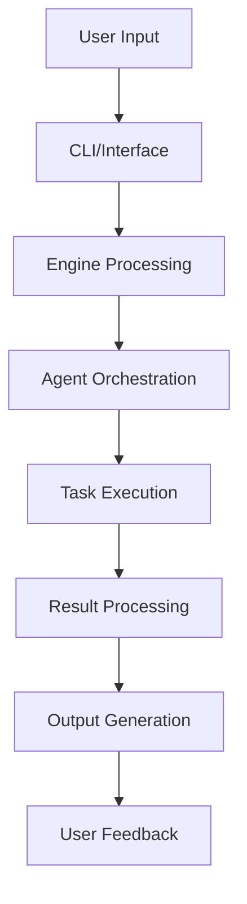

# System Refinement and Optimization Design Document

## 1. Overview

This document outlines the design for refining and optimizing the Stigmergy system to finalize its transition to a fully independent service. The project focuses on three main areas:

1. Finalizing codebase and documentation cleanup
2. System-wide agent prompt hardening
3. Perfecting the web IDE experience

The goal is to ensure the system is clean, modern, reliable, and provides an excellent user experience across both CLI and web IDEs.

## 2. Architecture

### 2.1 System Components

The Stigmergy system consists of several key components:

- **CLI Interface**: Command-line interface for system management
- **Engine**: Core processing engine with WebSocket communication
- **Agent System**: Multi-agent architecture with specialized roles
- **Web Dashboard**: Browser-based interface for monitoring and control
- **MCP Server**: Model Context Protocol server for IDE integration
- **Documentation**: Comprehensive documentation system

### 2.2 Data Flow

## 3. Feature Implementation

### 3.1 Codebase and Documentation Cleanup

#### 3.1.1 Remove Legacy Install Command

**Objective**: Remove the obsolete install command from the CLI interface

**Implementation**:
- Locate and remove the entire install command block from the CLI interface
- Update command suggestions and validation logic to exclude the install command
- Ensure backward compatibility for existing projects

#### 3.1.2 Delete Obsolete Install-Core Script

**Objective**: Remove the obsolete install-core script from package configuration

**Implementation**:
- Remove the install-core script entry from package configuration
- Update related documentation and references

#### 3.1.3 Update README Documentation

**Objective**: Reflect the standalone model in the main documentation

**Implementation**:
- Remove all mentions of the legacy install command
- Update Quick Start section to emphasize the init command as the primary setup method
- Update Development Setup section to use the init command instead of the legacy approach
- Ensure all CLI command references are current

#### 3.1.4 Update IDE Integration Documentation

**Objective**: Rewrite setup instructions to reflect the new simplified process

**Implementation**:
- Update IDE integration documentation with new global installation process
- Update MCP server setup documentation with simplified configuration
- Emphasize that the MCP server is part of the global installation
- Provide example paths for different operating systems

### 3.2 Agent Prompt Hardening

#### 3.2.1 Identify Interface Agents

**Objective**: Identify all agents that serve as user interfaces

**Implementation**:
- Scan all agent files in the agents directory
- Create a list of agents that serve as user interfaces
- Identified interface agents include system controller, dispatcher, analyst, and developer agents

#### 3.2.2 Apply Strict Response Format Protocol

**Objective**: Add strict response format protocol to all interface agents

**Implementation**:
- For each identified interface agent, add the strict response format protocol to core protocols
- Ensure all interface agents follow the same response format standard

#### 3.2.3 Update Agent Manifest

**Objective**: Ensure the agent manifest contains a complete list of all agents

**Implementation**:
- Read all agent file names in the agents directory
- Update the agent manifest in system documentation to include all agent IDs

### 3.3 Web IDE Experience Enhancement

#### 3.3.1 Modify Web Bundle Meta-Prompt

**Objective**: Ensure agents provide conversational responses in web IDEs

**Implementation**:
- Modify the web bundle header in the build commands
- Add conversational response instruction before the final interpretation line

## 4. Testing Strategy

### 4.1 Unit Testing

- Validate CLI command removal does not break existing functionality
- Ensure agent protocol updates are correctly applied
- Verify documentation updates are accurate and complete

### 4.2 Integration Testing

- Run full test suite to ensure no regressions were introduced
- Validate agent manifest changes using the validation script
- Test global service startup and operation

### 4.3 End-to-End Testing

- Verify the complete workflow from installation to operation
- Test IDE integration with updated documentation
- Confirm web bundle generation produces correct output

## 5. Deployment Plan

### 5.1 Pre-deployment

1. Backup current system state
2. Run comprehensive validation tests
3. Verify all documentation is updated

### 5.2 Deployment Steps

1. Remove legacy install command from CLI
2. Delete obsolete install-core script
3. Update README documentation
4. Update IDE integration documentation
5. Apply strict response format protocol to interface agents
6. Update agent manifest
7. Modify web bundle meta-prompt
8. Run validation tests

### 5.3 Post-deployment

1. Run full test suite
2. Validate agent manifest changes
3. Start global service and confirm operation
4. Verify IDE integration works as expected

## 6. Rollback Plan

In case of issues, the following rollback steps will be taken:

1. Restore CLI interface from backup
2. Restore package configuration from backup
3. Restore documentation files from backup
4. Restore agent files from backup
5. Restore build commands from backup
6. Validate system functionality

## 7. Success Criteria

- All legacy code and documentation removed
- All interface agents have strict response format protocol
- Agent manifest is complete and accurate
- Web IDE experience provides conversational responses
- All tests pass without regressions
- Global service operates correctly
- IDE integration works with updated documentation
