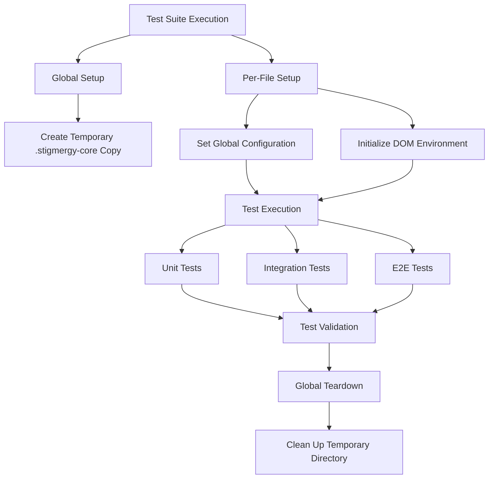
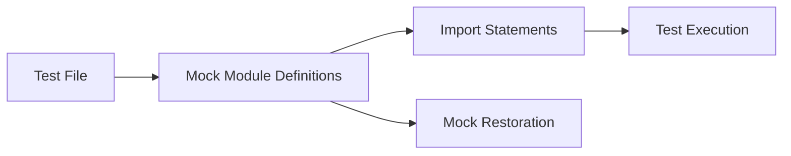

# Test Suite Setup Design for Stigmergy Project

## 1. Overview

This document outlines the design for stabilizing and migrating the Stigmergy project's test suite to the Bun and Hono frameworks. The primary objective is to establish a stable, reliable, and fully passing test suite by systematically rebuilding the testing foundation using Bun's native tools and porting existing test logic to this new environment.

The migration addresses fundamental conflicts between the previous Jest-based testing approach and the new ESM-native Bun runtime by adopting Bun's explicit testing philosophy with proper module mocking and isolated test environments.

## 2. Architecture

The test suite architecture follows Bun's testing philosophy with a focus on explicit module mocking and isolated test environments:



### 2.1 Core Components

1. **Master Configuration (`bunfig.toml`)**: Central configuration file that defines test runner behavior
2. **Global Setup Script (`setup.js`)**: Creates isolated test environment before all tests
3. **Global Teardown Script (`teardown.js`)**: Cleans up test environment after all tests
4. **Per-File Setup Scripts**: Configure environment for each test file execution
5. **Test Categories**: Organized into unit, integration, and E2E tests

### 2.2 Test Environment Isolation

The test suite implements a robust isolation strategy to ensure tests do not interfere with each other or with the production environment:

- **Temporary Directory Creation**: A temporary copy of `.stigmergy-core` is created for each test run
- **Global Configuration**: Test-specific paths are set via global variables
- **DOM Simulation**: Browser environment is simulated for React component tests
- **Module Mocking**: Explicit module mocks prevent side effects between tests

## 3. Testing Strategy

### 3.1 Bun-Native Testing Approach

All tests will use Bun's built-in testing framework with the following characteristics:

- Import test functions directly from `"bun:test"` module
- Use explicit `mock.module()` for module mocking before imports
- Structure tests with `describe` and `it` blocks for clear organization
- Leverage Bun's fast execution for rapid feedback

### 3.2 Test Organization

The test suite is organized into three categories:

| Category | Purpose | Location | Execution Order |
|----------|---------|----------|----------------|
| Unit Tests | Test individual functions and components in isolation | `tests/unit/` | First |
| Integration Tests | Test interactions between components and services | `tests/integration/` | Second |
| E2E Tests | Test complete user workflows and system behavior | `tests/e2e/` | Last |

### 3.3 Mocking Strategy

Bun's explicit mocking approach requires a different pattern than Jest:



1. **Pre-import Mocking**: All module mocks must be defined before importing the module under test
2. **Mock Restoration**: Mocks are automatically restored between tests
3. **Dynamic Imports**: Use dynamic imports for accessing mocked modules within tests

## 4. Implementation Plan

### 4.1 Phase 1: Reset and Establish Foundation

#### 4.1.1 Directory Structure Reset
- Delete existing `tests` directory
- Create new empty `tests` directory with proper structure:
  ```
  tests/
  ├── setup.js
  ├── teardown.js
  ├── setup-globals.js
  ├── setup-dom.js
  ├── unit/
  ├── integration/
  └── e2e/
  ```

#### 4.1.2 Master Configuration (`bunfig.toml`)
Create configuration file with:
```toml
[test]
preload = ["./tests/setup-globals.js", "./tests/setup-dom.js"]
setup = "./tests/setup.js"
teardown = "./tests/teardown.js"
```

#### 4.1.3 Global Setup Script (`setup.js`)
- Create temporary copy of `.stigmergy-core` directory
- Ensure directory is clean and isolated
- Log setup completion

#### 4.1.4 Global Teardown Script (`teardown.js`)
- Remove temporary directory created during setup
- Clean up any test artifacts
- Log teardown completion

#### 4.1.5 Per-File Setup Scripts
- `setup-globals.js`: Set global configuration variables pointing to temporary directory
- `setup-dom.js`: Initialize DOM environment for React tests using `@happy-dom/global-registrator`

### 4.2 Phase 2: Canary Test Implementation

#### 4.2.1 Test Selection
Select a simple utility for the first test implementation:
- File: `utils/localization.js`
- Test: `tests/unit/utils/localization.test.js`

#### 4.2.2 Test Implementation
- Port existing test logic to Bun syntax
- Use proper imports from `bun:test`
- Ensure no complex mocking is required
- Validate test execution with `bun test`

### 4.3 Phase 3: Systematic Test Suite Porting

#### 4.3.1 Unit Test Porting
Process each file in `tests/unit`:
1. Create new test file with Bun syntax
2. Convert Jest imports to `bun:test` imports
3. Implement explicit module mocking where needed
4. Validate test passes before moving to next file

#### 4.3.2 Integration Test Porting
Process each file in `tests/integration`:
1. Identify service dependencies requiring mocking
2. Implement pre-import module mocks for services like `fs-extra`
3. Convert test assertions to Bun-compatible syntax
4. Validate complex integration scenarios

### 4.4 Phase 4: Final Validation and Cleanup

#### 4.4.1 Full Suite Execution
- Run complete test suite with `bun test`
- Verify all tests pass consistently
- Address any remaining failures

#### 4.4.2 Cleanup
- Remove any legacy test files or configurations
- Ensure only `bunfig.toml` contains test configuration
- Validate no remnants of Jest-based testing remain

## 5. Data Models

### 5.1 Test Configuration Model

| Field | Type | Description | Default Value |
|-------|------|-------------|---------------|
| preload | string[] | Scripts to run before each test file | `["./tests/setup-globals.js", "./tests/setup-dom.js"]` |
| setup | string | Script to run once before all tests | `"./tests/setup.js"` |
| teardown | string | Script to run once after all tests | `"./tests/teardown.js"` |

### 5.2 Global Configuration Model

| Field | Type | Description | Test Value |
|-------|------|-------------|------------|
| core_path | string | Path to temporary core directory | `".stigmergy-core-test-temp"` |
| paths.root | string | Root path for test resources | `".stigmergy-core-test-temp"` |
| paths.agents | string | Agents directory path | `".stigmergy-core-test-temp/agents"` |
| paths.system_docs | string | System documentation path | `".stigmergy-core-test-temp/system_docs"` |

## 6. Business Logic

### 6.1 Test Environment Initialization

The initialization process ensures a clean, isolated environment for each test run:

1. **Pre-execution Validation**:
   - Check for existing temporary directory
   - Validate permissions for directory operations

2. **Directory Setup**:
   - Remove any existing temporary directory
   - Create fresh temporary directory
   - Copy `.stigmergy-core` contents to temporary location

3. **Environment Configuration**:
   - Set global configuration variables
   - Initialize DOM simulation for browser tests
   - Configure module resolution paths

### 6.2 Test Execution Flow

Each test file follows this execution flow:

1. **Pre-file Setup**:
   - Execute `setup-globals.js` to configure paths
   - Execute `setup-dom.js` to initialize browser environment

2. **Test Execution**:
   - Import module under test (after any required mocks)
   - Execute test cases with assertions
   - Automatic mock restoration between tests

3. **Post-execution Cleanup**:
   - Automatic cleanup of test-specific resources
   - Preparation for next test file

### 6.3 Mocking Implementation

Module mocking follows this pattern:

1. **Mock Definition**:
   The test framework provides mechanisms to replace modules with mock implementations before the module under test is imported.

2. **Import After Mock**:
   After defining mocks, the actual module under test is imported to use the mocked dependencies.

3. **Test Execution**:
   - Use mocked module in test assertions
   - Validate behavior with mocked dependencies

## 7. Testing Framework

### 7.1 Test Functions

The test framework provides these core functions from `bun:test`:

| Function | Purpose | Usage |
|----------|---------|-------|
| `describe` | Group related tests | `describe('Feature', () => { ... })` |
| `it`/`test` | Define individual test cases | `it('should work', () => { ... })` |
| `expect` | Make assertions about values | `expect(value).toBe(expected)` |
| `mock` | Create and manage mocks | `mock.module('fs', mockFs)` |
| `beforeEach` | Setup before each test | `beforeEach(() => { ... })` |
| `afterEach` | Cleanup after each test | `afterEach(() => { ... })` |

### 7.2 Assertion Methods

Common assertion methods available through `expect`:

| Method | Purpose | Example |
|--------|---------|---------|
| `toBe` | Exact equality | `expect(a).toBe(b)` |
| `toEqual` | Deep equality | `expect(obj).toEqual(expected)` |
| `toHaveBeenCalled` | Mock function call validation | `expect(fn).toHaveBeenCalled()` |
| `toHaveBeenCalledWith` | Mock function argument validation | `expect(fn).toHaveBeenCalledWith(arg)` |

### 7.3 Mocking Capabilities

Bun's mocking system provides:

| Capability | Description | Example |
|------------|-------------|---------|
| Module Mocking | Replace entire modules | `mock.module('fs', mockFs)` |
| Function Mocking | Create mock functions | `const fn = mock()` |
| Mock Restoration | Reset mocks between tests | Automatic |
| Mock Implementation | Define mock behavior | `mock().mockReturnValue(value)` |

## 8. Security Considerations

### 8.1 Isolated Test Environment

The test suite implements security measures to prevent tests from affecting the production environment:

1. **Temporary Directory Isolation**:
   - All tests operate on temporary copies of critical directories
   - Production `.stigmergy-core` directory remains untouched
   - Automatic cleanup prevents resource accumulation

2. **Module Mocking Security**:
   - Explicit mocking prevents accidental modification of real modules
   - Controlled access to file system and network resources
   - Isolated execution context for each test run

### 8.2 Protected Asset Handling

Critical system components are protected through:

1. **Read-Only Core Directory**:
   - `.stigmergy-core` is treated as read-only in production
   - Tests use temporary copies for all operations
   - No direct modification of core assets during testing

2. **Access Control**:
   - Global configuration ensures tests use isolated paths
   - Environment variables are properly managed
   - Resource access is limited to test-specific directories

## 9. Performance Optimization

### 9.1 Test Execution Speed

Bun's native test runner provides performance benefits:

1. **Fast Startup**:
   - Reduced overhead compared to Jest
   - Optimized module loading
   - Efficient test discovery

2. **Parallel Execution**:
   - Tests run in parallel by default
   - Resource sharing optimization
   - Isolated execution contexts

### 9.2 Resource Management

Efficient resource handling ensures optimal performance:

1. **Memory Management**:
   - Automatic cleanup of test artifacts
   - Efficient mock restoration
   - Proper garbage collection

2. **File System Optimization**:
   - Temporary directory reuse patterns
   - Minimal file operations
   - Efficient copying mechanisms