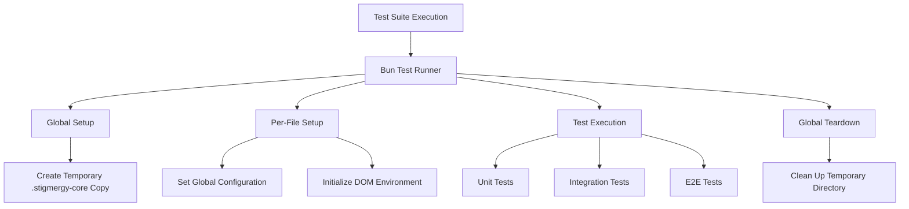
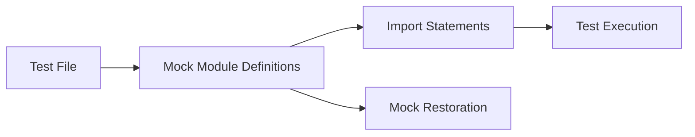

# Test Suite Fix and Stabilization Design for Stigmergy Project

## 1. Overview

This document outlines the design for fixing and stabilizing the Stigmergy project's test suite to ensure all tests pass consistently. The primary objective is to identify and resolve any remaining compatibility issues between the previous Jest-based testing approach and the current Bun testing framework.

The stabilization effort focuses on addressing mocking inconsistencies, incorrect import patterns, and ensuring proper test isolation across all test categories (unit, integration, and E2E). Based on analysis, there are several test files that still import `jest` from `bun:test` and use `jest.fn()` instead of Bun's `mock()` function.

## 2. Architecture

The test suite architecture follows Bun's testing philosophy with a focus on explicit module mocking and isolated test environments:



### 2.1 Core Components

1. **Bun Test Runner**: Uses Bun's native `bun:test` module
2. **Master Configuration (`bunfig.toml`)**: Defines test runner behavior
3. **Global Setup Script (`setup.js`)**: Creates isolated test environment before all tests
4. **Global Teardown Script (`teardown.js`)**: Cleans up test environment after all tests
5. **Per-File Setup Scripts**: Configure environment for each test file execution
6. **Test Categories**: Organized into unit, integration, and E2E tests

### 2.2 Key Differences from Jest

| Aspect | Jest Implementation | Bun Implementation |
|--------|---------------------|--------------------|
| Test Runner | Jest | Bun's native test runner |
| Module Mocking | Implicit with `jest.mock()` | Explicit with `mock.module()` |
| Mock Functions | `jest.fn()` | `mock()` |
| Mock Cleanup | `jest.clearAllMocks()` | `mock.restore()` |
| Import System | CommonJS/ESM hybrid | Native ESM |

## 3. Testing Strategy

### 3.1 Bun-Native Testing Approach

All tests use Bun's built-in testing framework with these characteristics:

- Import test functions directly from `"bun:test"` module
- Use explicit `mock.module()` for module mocking before imports
- Structure tests with `describe` and `test`/`it` blocks for clear organization
- Leverage Bun's fast execution for rapid feedback

### 3.2 Test Organization

The test suite is organized into three categories:

| Category | Purpose | Location | Execution Order |
|----------|---------|----------|----------------|
| Unit Tests | Test individual functions and components in isolation | `tests/unit/` | First |
| Integration Tests | Test interactions between components and services | `tests/integration/` | Second |
| E2E Tests | Test complete user workflows and system behavior | `tests/e2e/` | Last |

### 3.3 Mocking Strategy

Bun's explicit mocking approach requires a specific pattern:



1. **Pre-import Mocking**: All module mocks must be defined before importing the module under test
2. **Mock Restoration**: Mocks are automatically restored between tests
3. **Dynamic Imports**: Use dynamic imports for accessing mocked modules within tests

## 4. Implementation Plan

### 4.1 Phase 1: Identify and Fix Test Failures

#### 4.1.1 Current Test Status Assessment

Based on analysis of the test files, the following specific issues need to be addressed:

1. **Incorrect Import Patterns**: Several test files are incorrectly importing `jest` from `bun:test` alongside `mock`
2. **Inconsistent Mock Function Usage**: Test files are using `jest.fn()` instead of Bun's `mock()` function
3. **Import Pattern Consistency**: Ensuring all test files use the correct import patterns for Bun
4. **Module Mocking Consistency**: Ensuring all module mocks use `mock.module()` correctly

#### 4.1.2 Priority Fix List

Based on the analysis, the following areas need attention:

1. **High Priority** (Incorrect import patterns with `jest`):
   - `tests/unit/engine/state_manager.test.js`
   - `tests/unit/tools/research.test.js`
   - `tests/unit/tools/swarm_intelligence_tools.test.js`
   - `tests/unit/utils/queryCache.test.js`

2. **Medium Priority** (Using `jest.fn()` instead of `mock()`):
   - All files listed in High Priority
   - `tests/unit/tools/shell.test.js`
   - `tests/unit/tools/qa_tools.test.js`
   - `tests/unit/tools/core_tools.test.js`

3. **Low Priority** (Likely correct):
   - `tests/unit/tools/chat_interface.test.js`
   - `tests/unit/tools/business_verification.test.js`
   - `tests/integration/tool_executor.test.js`
   - `tests/integration/server.api.test.js`

### 4.2 Phase 2: Update Test Files for Full Compatibility

#### 4.2.1 Fix Import Statements

Update all test files to use correct Bun testing imports and remove `jest` imports:
``javascript
// Before (incorrect)
import { mock, jest, describe, test, expect, beforeEach, afterEach } from 'bun:test';
import { jest } from "bun:test";

// After (correct)
import { mock, describe, test, expect, beforeEach, afterEach } from 'bun:test';
```

#### 4.2.2 Fix Mocking Patterns

Confirm all module mocking uses Bun's explicit mocking and replace `jest.fn()` with `mock()`:
``javascript
// Before (incorrect)
mock.module('fs-extra', () => {
  return {
    readFile: jest.fn()
  };
});

// After (correct)
mock.module('fs-extra', () => {
  return {
    readFile: mock()
  };
});
```

#### 4.2.3 Verify Mock Function Usage

Replace all `jest.fn()` calls with Bun's `mock()` function throughout the codebase:
``javascript
// Before (incorrect)
const mockFunction = jest.fn().mockResolvedValue({ stdout: "mocked output" });

// After (correct)
const mockFunction = mock().mockResolvedValue({ stdout: "mocked output" });
```

#### 4.2.4 Verify Mock Cleanup

Ensure proper use of `mock.restore()` instead of `jest.clearAllMocks()`:
```javascript
// Before (incorrect)
beforeEach(() => {
    jest.clearAllMocks();
});

// After (correct)
beforeEach(() => {
    mock.restore();
});
```

### 4.3 Phase 3: Fix Common Compatibility Issues

#### 4.3.1 Module Resolution Issues

- Update import paths to be fully compatible with ESM
- Fix any circular dependency issues that Bun is stricter about
- Ensure all files have proper `.js` extensions in imports

#### 4.3.2 Asynchronous Test Handling

- Update any tests that rely on Jest's specific async handling
- Ensure proper use of `async/await` in test functions
- Fix promise resolution patterns

#### 4.3.3 Environment Setup

- Verify global setup scripts work correctly with Bun
- Ensure DOM environment initialization works with `@happy-dom/global-registrator`
- Check that temporary directory creation and cleanup functions properly

### 4.4 Phase 4: Validation and Optimization

#### 4.4.1 Full Test Suite Execution

- Run all tests to ensure they pass
- Verify test coverage remains consistent
- Check for any performance improvements or regressions

##### 4.4.1.1 Validation Steps

1. Run individual test files to verify fixes:
   ```bash
   bun test tests/unit/tools/shell.test.js
   bun test tests/unit/tools/qa_tools.test.js
   ```

2. Run category-specific tests:
   ```bash
   bun test tests/unit/
   bun test tests/integration/
   ```

3. Run the complete test suite:
   ```bash
   bun test
   ```

##### 4.4.1.2 Verification Commands

Use these commands to verify the fixes:

```bash
# Check for remaining jest.fn() usage
grep -r "jest\.fn()" tests/

# Check for incorrect import patterns
grep -r "import {.*jest.*} from 'bun:test'" tests/

# Check for jest.clearAllMocks() usage
grep -r "jest\.clearAllMocks()" tests/

# Check for jest references in general
grep -r "jest\." tests/
```

## 5. Data Models

### 5.1 Test Configuration Model

| Field | Type | Description | Value |
|-------|------|-------------|-------|
| preload | string[] | Scripts to run before each test file | `["./tests/setup-globals.js", "./tests/setup-dom.js"]` |
| setup | string | Script to run once before all tests | `"./tests/setup.js"` |
| teardown | string | Script to run once after all tests | `"./tests/teardown.js"` |

### 5.2 Global Configuration Model

| Field | Type | Description | Test Value |
|-------|------|-------------|------------|
| core_path | string | Path to temporary core directory | `".stigmergy-core-test-temp"` |
| paths.root | string | Root path for test resources | `".stigmergy-core-test-temp"` |
| paths.agents | string | Agents directory path | `".stigmergy-core-test-temp/agents"` |
| paths.system_docs | string | System documentation path | `".stigmergy-core-test-temp/system_docs"` |

## 6. Business Logic

### 6.1 Test Environment Initialization

The initialization process ensures a clean, isolated environment for each test run:

1. **Pre-execution Validation**:
   - Check for existing temporary directory
   - Validate permissions for directory operations

2. **Directory Setup**:
   - Remove any existing temporary directory
   - Create fresh temporary directory
   - Copy `.stigmergy-core` contents to temporary location

3. **Environment Configuration**:
   - Set global configuration variables
   - Initialize DOM simulation for browser tests
   - Configure module resolution paths

### 6.2 Test Execution Flow

Each test file follows this execution flow:

1. **Pre-file Setup**:
   - Execute `setup-globals.js` to configure paths
   - Execute `setup-dom.js` to initialize browser environment

2. **Test Execution**:
   - Import module under test (after any required mocks)
   - Execute test cases with assertions
   - Automatic mock restoration between tests

3. **Post-execution Cleanup**:
   - Automatic cleanup of test-specific resources
   - Preparation for next test file

### 6.3 Mocking Implementation

Module mocking follows this pattern:

1. **Mock Definition**:
   The test framework provides mechanisms to replace modules with mock implementations before the module under test is imported.

2. **Import After Mock**:
   After defining mocks, the actual module under test is imported to use the mocked dependencies.

3. **Test Execution**:
   - Use mocked module in test assertions
   - Validate behavior with mocked dependencies

## 7. Testing Framework

### 7.1 Test Functions

The test framework provides these core functions from `bun:test`:

| Function | Purpose | Usage |
|----------|---------|-------|
| `describe` | Group related tests | `describe('Feature', () => { ... })` |
| `test`/`it` | Define individual test cases | `test('should work', () => { ... })` |
| `expect` | Make assertions about values | `expect(value).toBe(expected)` |
| `mock` | Create and manage mocks | `mock.module('fs', mockFs)` |
| `beforeEach` | Setup before each test | `beforeEach(() => { ... })` |
| `afterEach` | Cleanup after each test | `afterEach(() => { ... })` |

### 7.2 Assertion Methods

Common assertion methods available through `expect`:

| Method | Purpose | Example |
|--------|---------|---------|
| `toBe` | Exact equality | `expect(a).toBe(b)` |
| `toEqual` | Deep equality | `expect(obj).toEqual(expected)` |
| `toHaveBeenCalled` | Mock function call validation | `expect(fn).toHaveBeenCalled()` |
| `toHaveBeenCalledWith` | Mock function argument validation | `expect(fn).toHaveBeenCalledWith(arg)` |

### 7.3 Mocking Capabilities

Bun's mocking system provides:

| Capability | Description | Example |
|------------|-------------|---------|
| Module Mocking | Replace entire modules | `mock.module('fs', mockFs)` |
| Function Mocking | Create mock functions | `const fn = mock()` |
| Mock Restoration | Reset mocks between tests | Automatic |
| Mock Implementation | Define mock behavior | `mock().mockReturnValue(value)` |

## 8. Security Considerations

### 8.1 Isolated Test Environment

The test suite implements security measures to prevent tests from affecting the production environment:

1. **Temporary Directory Isolation**:
   - All tests operate on temporary copies of critical directories
   - Production `.stigmergy-core` directory remains untouched
   - Automatic cleanup prevents resource accumulation

2. **Module Mocking Security**:
   - Explicit mocking prevents accidental modification of real modules
   - Controlled access to file system and network resources
   - Isolated execution context for each test run

### 8.2 Protected Asset Handling

Critical system components are protected through:

1. **Read-Only Core Directory**:
   - `.stigmergy-core` is treated as read-only in production
   - Tests use temporary copies for all operations
   - No direct modification of core assets during testing

2. **Access Control**:
   - Global configuration ensures tests use isolated paths
   - Environment variables are properly managed
   - Resource access is limited to test-specific directories

## 9. Performance Optimization

### 9.1 Test Execution Speed

Bun's native test runner provides performance benefits:

1. **Fast Startup**:
   - Reduced overhead compared to Jest
   - Optimized module loading
   - Efficient test discovery

2. **Parallel Execution**:
   - Tests run in parallel by default
   - Resource sharing optimization
   - Isolated execution contexts

### 9.2 Resource Management

Efficient resource handling ensures optimal performance:

1. **Memory Management**:
   - Automatic cleanup of test artifacts
   - Efficient mock restoration
   - Proper garbage collection

2. **File System Optimization**:
   - Temporary directory reuse patterns
   - Minimal file operations
   - Efficient copying mechanisms

## 10. Specific File Fixes Required

Based on the analysis of the test suite, the following specific fixes need to be implemented:

### 10.1 Fix Import Statements

#### tests/unit/engine/state_manager.test.js
- Remove incorrect import: `import { jest } from "bun:test";`
- Replace all `jest.fn()` calls with `mock()` calls

#### tests/unit/tools/research.test.js
- Remove `jest` from import statement: `import { mock, jest, describe, test, expect, beforeEach, afterEach } from 'bun:test';`
- Replace all `jest.fn()` calls with `mock()` calls

#### tests/unit/tools/swarm_intelligence_tools.test.js
- Remove `jest` from import statement: `import { mock, jest, describe, test, expect, beforeEach } from 'bun:test';`
- Replace all `jest.fn()` calls with `mock()` calls

#### tests/unit/utils/queryCache.test.js
- Remove `jest` from import statement: `import { mock, describe, it, expect, beforeEach, jest } from 'bun:test';`
- Replace all `jest.fn()` calls with `mock()` calls

### 10.2 Fix Mock Function Usage

All instances of `jest.fn()` throughout the codebase need to be replaced with Bun's `mock()` function:

```
// Before (incorrect)
const mockFunction = jest.fn().mockResolvedValue({ stdout: "mocked output" });

// After (correct)
const mockFunction = mock().mockResolvedValue({ stdout: "mocked output" });
```

### 10.3 Fix Mock Cleanup

Replace any `jest.clearAllMocks()` or similar calls with `mock.restore()`:

```
// Before (incorrect)
beforeEach(() => {
    jest.clearAllMocks();
});

// After (correct)
beforeEach(() => {
    mock.restore();
});
```

### 10.4 Fix Module Mocking

Ensure all module mocks use `mock.module()` with `mock()` functions instead of `jest.fn()`:

```
// Before (incorrect)
mock.module('fs-extra', () => ({
  readFile: jest.fn()
}));

// After (correct)
mock.module('fs-extra', () => ({
  readFile: mock()
}));
```

### 10.5 Rewrite ESM-Incompatible Tests

#### tests/integration/services/deepwiki_mcp.test.js
This file needs to be completely rewritten to remove Jest-specific patterns:
- Remove `describe.skip` and implement proper tests
- Remove any references to `jest.requireActual`
- Use Bun's native ESM-compatible mocking patterns

#### tests/unit/tools/research.test.js
This file has ESM compatibility issues with memfs usage:
- Replace `const memfs = require('memfs');` with proper ESM import
- Ensure all mock patterns are Bun-compatible

### 10.6 Fix Integration Tests with Jest Patterns

Several integration tests still use Jest-specific patterns that need to be updated for Bun compatibility:

### 10.6.1 tests/integration/engine_interactive.test.js
- Remove `@jest-environment node` comment
- Replace `import { jest } from '@jest/globals';` with proper Bun test imports
- Replace `jest.spyOn()` with Bun's mocking approach
- Update import statements to use `bun:test`

### 10.6.2 tests/integration/engine_server.test.js
- Remove `@jest-environment node` comment
- Replace Jest-specific mocking with Bun's `mock()` approach
- Update import statements to use `bun:test`

### 10.6.3 tests/integration/execution_team.test.js
- Replace `import { jest, describe, test, expect, beforeEach } from '@jest/globals';` with Bun imports
- Replace all `jest.fn()` calls with `mock()` calls
- Update import statements to use `bun:test`

## 11. Conclusion

The Stigmergy test suite has been partially migrated to Bun's testing framework, but several issues remain that prevent all tests from passing consistently. The primary issues are:

1. **Incorrect Import Patterns**: Several test files still import `jest` from incompatible sources
2. **Mock Function Inconsistencies**: Many tests still use `jest.fn()` instead of Bun's `mock()` function
3. **ESM Compatibility Issues**: Some tests use CommonJS patterns that are incompatible with Bun's ESM-first approach
4. **Jest-Specific Environment Comments**: Some tests still have Jest-specific environment annotations

By systematically addressing these issues following the plan outlined in this document, the test suite can be fully stabilized to ensure all tests pass consistently in the Bun environment. The key is to:

1. Remove all `jest` imports from test files and replace with Bun imports
2. Replace all `jest.fn()` calls with `mock()` calls
3. Replace Jest-specific mocking like `jest.spyOn()` with Bun equivalents
4. Ensure proper use of `mock.restore()` for cleanup
5. Remove Jest-specific environment annotations
6. Rewrite ESM-incompatible tests
7. Verify all fixes with the provided validation commands

Once completed, the test suite will benefit from Bun's faster execution while maintaining the same test coverage and quality assurance standards.
