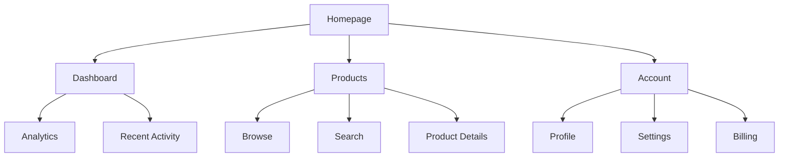
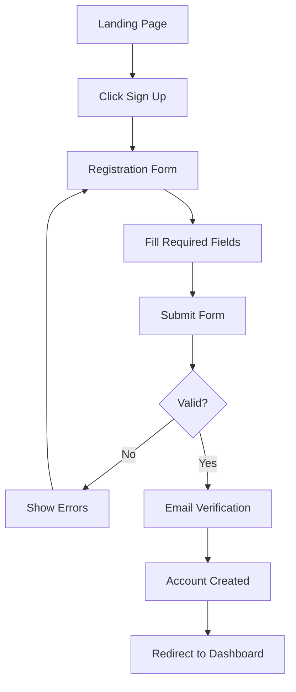

# {{Project Name}} UI/UX Specification

## Introduction

This document defines the user experience goals, information architecture, user flows, and visual design specifications for {{Project Name}}'s user interface. It serves as the foundation for visual design and frontend development, ensuring a cohesive and user-centered experience.

### Overall UX Goals & Principles

### Target User Personas

{{persona_descriptions}}

@{example: personas}

- **Power User:** Technical professionals who need advanced features and efficiency
- **Casual User:** Occasional users who prioritize ease of use and clear guidance
- **Administrator:** System managers who need control and oversight capabilities
  @{/example}

### Usability Goals

{{usability_goals}}

@{example: usability_goals}

- Ease of learning: New users can complete core tasks within 5 minutes
- Efficiency of use: Power users can complete frequent tasks with minimal clicks
- Error prevention: Clear validation and confirmation for destructive actions
- Memorability: Infrequent users can return without relearning
  @{/example}

### Design Principles

{{design_principles}}

@{example: design_principles}

1. **Clarity over cleverness** - Prioritize clear communication over aesthetic innovation
2. **Progressive disclosure** - Show only what's needed, when it's needed
3. **Consistent patterns** - Use familiar UI patterns throughout the application
4. **Immediate feedback** - Every action should have a clear, immediate response
5. **Accessible by default** - Design for all users from the start
   @{/example}

### Change Log

| Date | Version | Description | Author |
| :--- | :------ | :---------- | :----- |

## Information Architecture (IA)

### Site Map / Screen Inventory

```mermaid
{{sitemap_diagram}}
```

@{example: sitemap}



@{/example}

### Navigation Structure

**Primary Navigation:** {{primary_nav_description}}

**Secondary Navigation:** {{secondary_nav_description}}

**Breadcrumb Strategy:** {{breadcrumb_strategy}}

## User Flows

<<REPEAT: user_flow>>

### {{flow_name}}

**User Goal:** {{flow_goal}}

**Entry Points:** {{entry_points}}

**Success Criteria:** {{success_criteria}}

#### Flow Diagram

```mermaid
{{flow_diagram}}
```

**Edge Cases & Error Handling:**

- {{edge_case_1}}
- {{edge_case_2}}

**Notes:** {{flow_notes}}
<</REPEAT>>

@{example: user_flow}

### User Registration

**User Goal:** Create a new account to access the platform

**Entry Points:** Homepage CTA, Login page link, Marketing landing pages

**Success Criteria:** User successfully creates account and reaches dashboard

#### Flow Diagram



**Edge Cases & Error Handling:**

- Duplicate email: Show inline error with password recovery option
- Weak password: Real-time feedback on password strength
- Network error: Preserve form data and show retry option
  @{/example}

## Wireframes & Mockups

**Primary Design Files:** {{design_tool_link}}

### Key Screen Layouts

<<REPEAT: screen_layout>>

#### {{screen_name}}

**Purpose:** {{screen_purpose}}

**Key Elements:**

- {{element_1}}
- {{element_2}}
- {{element_3}}

**Interaction Notes:** {{interaction_notes}}

**Design File Reference:** {{specific_frame_link}}
<</REPEAT>>

## Component Library / Design System

**Design System Approach:** {{design_system_approach}}

### Core Components

<<REPEAT: component>>

#### {{component_name}}

**Purpose:** {{component_purpose}}

**Variants:** {{component_variants}}

**States:** {{component_states}}

**Usage Guidelines:** {{usage_guidelines}}
<</REPEAT>>

@{example: component}

#### Button

**Purpose:** Primary interaction element for user actions

**Variants:** Primary, Secondary, Tertiary, Destructive

**States:** Default, Hover, Active, Disabled, Loading

**Usage Guidelines:**

- Use Primary for main CTAs (one per view)
- Secondary for supporting actions
- Destructive only for permanent deletions with confirmation
  @{/example}

## Branding & Style Guide

### Visual Identity

**Brand Guidelines:** {{brand_guidelines_link}}

### Color Palette

| Color Type    | Hex Code            | Usage                            |
| :------------ | :------------------ | :------------------------------- |
| **Primary**   | {{primary_color}}   | {{primary_usage}}                |
| **Secondary** | {{secondary_color}} | {{secondary_usage}}              |
| **Accent**    | {{accent_color}}    | {{accent_usage}}                 |
| **Success**   | {{success_color}}   | Positive feedback, confirmations |
| **Warning**   | {{warning_color}}   | Cautions, important notices      |
| **Error**     | {{error_color}}     | Errors, destructive actions      |
| **Neutral**   | {{neutral_colors}}  | Text, borders, backgrounds       |

### Typography

**Font Families:**

- **Primary:** {{primary_font}}
- **Secondary:** {{secondary_font}}
- **Monospace:** {{mono_font}}

**Type Scale:**
| Element | Size | Weight | Line Height |
|:--------|:-----|:-------|:------------|
| H1 | {{h1_size}} | {{h1_weight}} | {{h1_line}} |
| H2 | {{h2_size}} | {{h2_weight}} | {{h2_line}} |
| H3 | {{h3_size}} | {{h3_weight}} | {{h3_line}} |
| Body | {{body_size}} | {{body_weight}} | {{body_line}} |
| Small | {{small_size}} | {{small_weight}} | {{small_line}} |

### Iconography

**Icon Library:** {{icon_library}}

**Usage Guidelines:** {{icon_guidelines}}

### Spacing & Layout

**Grid System:** {{grid_system}}

**Spacing Scale:** {{spacing_scale}}

## Accessibility Requirements

### Compliance Target

**Standard:** {{compliance_standard}}

### Key Requirements

**Visual:**

- Color contrast ratios: {{contrast_requirements}}
- Focus indicators: {{focus_requirements}}
- Text sizing: {{text_requirements}}

**Interaction:**

- Keyboard navigation: {{keyboard_requirements}}
- Screen reader support: {{screen_reader_requirements}}
- Touch targets: {{touch_requirements}}

**Content:**

- Alternative text: {{alt_text_requirements}}
- Heading structure: {{heading_requirements}}
- Form labels: {{form_requirements}}

### Testing Strategy

{{accessibility_testing}}

## Responsiveness Strategy

### Breakpoints

| Breakpoint | Min Width       | Max Width       | Target Devices      |
| :--------- | :-------------- | :-------------- | :------------------ |
| Mobile     | {{mobile_min}}  | {{mobile_max}}  | {{mobile_devices}}  |
| Tablet     | {{tablet_min}}  | {{tablet_max}}  | {{tablet_devices}}  |
| Desktop    | {{desktop_min}} | {{desktop_max}} | {{desktop_devices}} |
| Wide       | {{wide_min}}    | -               | {{wide_devices}}    |

### Adaptation Patterns

**Layout Changes:** {{layout_adaptations}}

**Navigation Changes:** {{nav_adaptations}}

**Content Priority:** {{content_adaptations}}

**Interaction Changes:** {{interaction_adaptations}}

## Animation & Micro-interactions

### Motion Principles

{{motion_principles}}

### Key Animations

<<REPEAT: animation>>

- **{{animation_name}}:** {{animation_description}} (Duration: {{duration}}, Easing: {{easing}})
  <</REPEAT>>

## Performance Considerations

### Performance Goals

- **Page Load:** {{load_time_goal}}
- **Interaction Response:** {{interaction_goal}}
- **Animation FPS:** {{animation_goal}}

### Design Strategies

{{performance_strategies}}

## Next Steps

### Immediate Actions

1. {{next_step_1}}
2. {{next_step_2}}
3. {{next_step_3}}

### Design Handoff Checklist

- [ ] All user flows documented
- [ ] Component inventory complete
- [ ] Accessibility requirements defined
- [ ] Responsive strategy clear
- [ ] Brand guidelines incorporated
- [ ] Performance goals established

## Checklist Results
