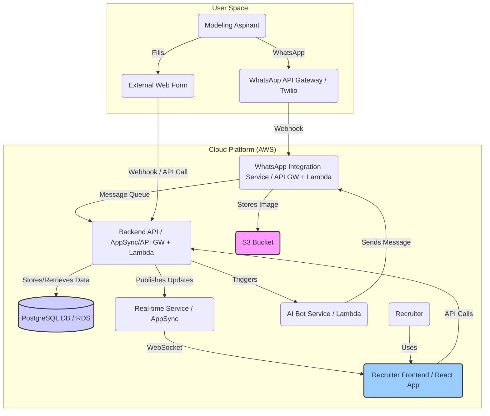

# Architecture Specification: WasaPrecruit MVP

## 1. Introduction

This document outlines the technical architecture for the WasaPrecruit Minimum Viable Product (MVP). The primary goal is to create a scalable, real-time web platform enabling agency recruiters to efficiently manage initial WhatsApp communications with modeling aspirants, integrating an automated bot, web form data, and features designed to build aspirant confidence.

**Key Architectural Drivers:**

*   **High Scalability:** Must handle significant growth in users and message volume cost-effectively from day one.
*   **Real-time Communication:** Recruiters require immediate updates for incoming messages and data changes.
*   **Reliability & Maintainability:** Cloud-native design for robustness and ease of updates.
*   **Agent-Optimized Development:** Structure promoting modularity and clear separation of concerns (detailed in `project-structure.md`).
*   **MVP Scope:** Includes core chat, AI bot (welcome, form link, photo request, affirmation), web form integration (with shift preferences), photo storage, and recruiter interface.

## 2. Architectural Overview

The system follows a microservices-inspired, event-driven architecture deployed on a cloud platform (AWS preferred for this design) to meet the scalability and real-time requirements.

**Core Components:**

1.  **Recruiter Frontend (`FE`):** A React-based Single Page Application (SPA) providing the recruiter chat interface, aspirant data display, and interaction tools. Connects via WebSockets for real-time updates and HTTPS for API calls.
2.  **Backend API (`B`):** Core business logic, data access, and orchestration. Likely implemented using AWS AppSync (GraphQL for real-time/data fetching) and AWS Lambda functions (Node.js/TypeScript) triggered via API Gateway or AppSync resolvers. Handles data validation, storage, and coordination with other services.
3.  **WhatsApp Integration Service (`WI`):** Handles incoming webhooks from the WhatsApp API provider (e.g., Twilio). Parses messages/events, potentially stores incoming images directly to S3, places messages onto a queue (e.g., SQS) for asynchronous processing by the Backend API, and sends outgoing messages via the WhatsApp provider API. Implemented possibly via API Gateway + Lambda.
4.  **AI Bot Service (`AI`):** A dedicated service (likely Lambda) responsible for the automated interaction flow: initial greeting, form link sending, photo request, sending affirmation messages. Triggered by events from the Backend API (e.g., new conversation detected).
5.  **Real-time Service (`RT`):** Manages WebSocket connections with the Frontend. Pushes updates (new messages, data changes) to connected clients. AWS AppSync provides this functionality out-of-the-box for GraphQL subscriptions.
6.  **Database (`DB`):** Persistent storage for aspirant profiles, conversation history, form data (including shift preferences), photo references, etc. Managed PostgreSQL (AWS RDS) is chosen for its relational capabilities, ACID compliance, and scalability options.
7.  **Object Storage (`S3`):** Stores binary files, specifically the photos submitted by aspirants via WhatsApp. Provides durable, scalable storage accessible via URLs stored in the Database.
8.  **External Services:**
    *   **WhatsApp API Gateway:** Interface to the WhatsApp network (e.g., Twilio API for WhatsApp).
    *   **External Web Form:** Assumed pre-existing service/tool with an API/webhook for submitting data.

## 3. Key Design Decisions & Rationale

*   **Technology Stack:** (See `docs/tech-stack.md` for full details)
    *   **Frontend:** React (User preference, large ecosystem).
    *   **Backend:** Node.js/TypeScript with AWS Lambda & AppSync/API Gateway (Scalable, event-driven, good for real-time, strong AWS integration).
    *   **Database:** PostgreSQL (Relational integrity, scalable managed service via RDS).
    *   **Messaging:** WhatsApp (Requirement).
    *   **Image Storage:** AWS S3 (Standard, scalable, cost-effective object storage).
    *   **Real-time:** AWS AppSync Subscriptions (Managed WebSocket solution integrated with backend).
*   **Architecture Style:** Microservices-inspired / Event-Driven.
    *   **Rationale:** Promotes loose coupling, independent scaling of components, resilience. Using message queues (SQS implicitly via Lambda triggers or explicitly) between WI and B decouples message ingestion from processing.
*   **Cloud Platform:** AWS.
    *   **Rationale:** Mandated cloud-native approach. AWS offers mature managed services (Lambda, RDS, S3, AppSync, API Gateway, SQS) that directly address scalability, real-time, and operational requirements, reducing infrastructure management overhead.
*   **Image Handling:** Store images in S3, reference URL in DB.
    *   **Rationale:** Keeps the database lean, leverages specialized object storage for binary data, simplifies access control and content delivery (potentially via CloudFront later). The WI service handles the initial upload upon receiving the image webhook.
*   **Real-time Mechanism:** WebSockets via AWS AppSync.
    *   **Rationale:** Efficient bi-directional communication for instant message delivery to the frontend. AppSync simplifies management compared to self-hosting WebSocket servers.
*   **AI Bot Implementation:** Separate Lambda function.
    *   **Rationale:** Isolates bot logic, allowing independent updates and scaling. Triggered by specific events (e.g., new conversation, form submitted) managed by the Backend API.

## 4. Data Flow Examples

*(To be detailed further, potentially with sequence diagrams)*

*   **Incoming WhatsApp Message:** Aspirant -> WhatsApp -> WA Gateway -> WI (Webhook -> Lambda) -> SQS Queue -> B (Lambda Trigger) -> DB (Store Message) -> RT (AppSync Publish) -> FE (Update UI).
*   **Incoming WhatsApp Image:** Aspirant -> WhatsApp -> WA Gateway -> WI (Webhook -> Lambda -> Upload to S3 -> Store S3 URL + Message in DB via B or directly if WI has DB access?) -> SQS Queue -> B (Lambda Trigger - if needed for further logic) -> RT (AppSync Publish) -> FE (Update UI with Image/Link). *(Decision: WI likely needs permissions to write metadata to DB or notify B)*.
*   **Recruiter Sends Message:** FE -> B (AppSync Mutation/API Call -> Lambda) -> DB (Store Message) -> AI (Trigger if needed?) -> WI (Lambda Call -> WA Gateway API) -> WhatsApp -> Aspirant.
*   **Bot Sends Message:** AI (Lambda Triggered by B) -> WI (Lambda Call -> WA Gateway API) -> WhatsApp -> Aspirant.
*   **Web Form Submission:** WF -> B (Webhook/API Call -> Lambda) -> DB (Store/Update Aspirant Data) -> RT (AppSync Publish) -> FE (Update Aspirant Data Panel).

## 5. Scalability & Performance Considerations

*   **Serverless Compute (Lambda):** Automatically scales based on load. Pay-per-use is cost-effective.
*   **Managed Database (RDS):** Can be scaled vertically (instance size) and horizontally (read replicas). Connection pooling is essential.
*   **Managed Real-time (AppSync):** Scales automatically to handle many concurrent WebSocket connections.
*   **Object Storage (S3):** Highly scalable and durable for images.
*   **Asynchronous Processing:** Using queues (SQS) between services prevents bottlenecks during peak message ingestion.
*   **Frontend Performance:** React with appropriate state management (e.g., Context API, Redux, Zustand) and virtualization for long chat lists will be crucial for a snappy UI. Code splitting and lazy loading.

## 6. Security Considerations

*   **Authentication:** Secure login for recruiters (e.g., AWS Cognito).
*   **Authorization:** Define permissions for API endpoints and data access (e.g., recruiters only access assigned/relevant conversations). IAM roles for AWS services.
*   **Data Encryption:** Encrypt data at rest (RDS, S3) and in transit (HTTPS, WSS).
*   **Input Validation:** Sanitize all inputs (API, webhooks) to prevent injection attacks.
*   **Secrets Management:** Use AWS Secrets Manager or Parameter Store for API keys, database credentials.
*   **WhatsApp API Security:** Secure webhook endpoints, validate incoming requests.

## 7. Deployment & Operations

*   **Infrastructure as Code (IaC):** Use AWS CDK or Terraform to define and manage cloud resources.
*   **CI/CD:** Automated pipelines for testing and deployment (e.g., GitHub Actions, AWS CodePipeline).
*   **Monitoring & Logging:** AWS CloudWatch for metrics, logs, and alarms. Centralized logging setup.
*   **Error Tracking:** Integrate services like Sentry or Datadog.

## 8. Future Considerations

*   **Advanced AI:** Integration points should allow for future replacement/enhancement of the basic AI bot with more sophisticated NLP/NLU services.
*   **Analytics:** Data structure should facilitate future analytics reporting. Event sourcing could be considered later.
*   **Multi-channel:** Architecture could be adapted by adding different integration services (SMS, FB Messenger).

*(Placeholder for specific diagrams if needed later)*
