# 🚀 Stigmergy - Autonomous AI Development System

> **The world's first truly autonomous development system with reference-first architecture and natural language chat interface**

[](https://nodejs.org/)
[](https://neo4j.com/)
[](LICENSE)
[](#testing)

Stigmergy transforms high-level product goals into production-ready code through autonomous AI agents, reference pattern discovery, and intelligent workflow orchestration. Built for developers who want to focus on vision while AI handles implementation.

## ✨ What Makes Stigmergy Unique

### 🧠 **Reference-First Architecture**
- **Document Intelligence**: Processes PDFs, DOCX, and technical specs with AI-powered semantic segmentation
- **Pattern Discovery**: Indexes GitHub repositories to find proven code patterns and best practices
- **Technical Implementation Briefs**: AI generates detailed implementation guides with real code examples
- **Quality Assurance**: Built-in TDD enforcement, static analysis, and pattern compliance verification

### 💬 **Natural Language Interface**
- **Chat Commands**: Replace complex CLI operations with simple chat - "setup neo4j", "index github repos", "create auth system"
- **Intelligent Setup**: Automated configuration of databases, APIs, and development environment
- **Contextual Suggestions**: Smart command recommendations based on your project state
- **IDE Integration**: Seamless integration with Roo Code and other IDEs

### 🤖 **Autonomous Agent Swarm**
- **@reference-architect**: Analyzes documents and creates implementation briefs
- **@unified-executor**: Intelligently routes tasks to optimal execution methods
- **@system**: Universal gateway handling all external communications
- **Enhanced QA**: Test-driven development enforcement with comprehensive quality checks

## 🚀 Quick Start (2 minutes)

### Option 1: Universal Installation (Recommended)
```bash
# Install Stigmergy with MCP integration for any project
npx @randy888chan/stigmergy install

# Or install in specific project
cd /path/to/your/project
npx @randy888chan/stigmergy install

# Start Stigmergy
npm run stigmergy:start

# Configure your IDE (Roo Code) to use: ./mcp-server.js
```

### Option 2: MCP Server Only
```bash
# If you already have Stigmergy core, just add MCP integration
npx @randy888chan/stigmergy mcp

# Or for specific project
npx @randy888chan/stigmergy mcp --project /path/to/project
```

### Option 3: Complete Setup via Chat
```bash
# 1. Install and start
npm install -g @randy888chan/stigmergy
npm run stigmergy:start

# 2. In Roo Code or any IDE, simply chat:
"help me get started"
"setup everything I need"
"index github repos for patterns"
```

### Option 4: Manual Setup (Advanced)
```bash
# 1. Install
git clone https://github.com/randy888chan/stigmergy.git
cd stigmergy
npm install

# 2. Environment Setup
cp .env.example .env
# Add your API keys: GOOGLE_API_KEY, GITHUB_TOKEN, NEO4J_PASSWORD

# 3. Initialize
npm run install-core
npm run health-check

# 4. Start the system
npm run stigmergy:start
```

## 💬 Chat Interface Commands

Replace all complex CLI operations with natural language:

### 🔧 Setup & Configuration
```
"setup neo4j"               # Configure database
"configure environment"      # Setup API keys
"install dependencies"       # Run npm install
"health check"              # System diagnostics
```

### 📚 Reference Pattern Management
```
"index github repos"        # Build reference library
"scan local codebase"       # Index current project
"update patterns"           # Refresh pattern database
"show available patterns"   # List indexed patterns
```

### 🛠️ Development Tasks
```
"create authentication system"     # Build secure auth
"implement JWT middleware"         # Specific components
"optimize database queries"       # Performance improvements
"add user registration"           # Feature additions
"create REST API for users"       # Full system components
```

### 🔍 System Management
```
"validate system"           # Check configuration
"show status"              # Current system state
"restart services"         # System restart
"what can I do?"           # Get suggestions
```

## 🔧 CLI Commands

Stigmergy provides powerful CLI commands for easy setup and management:

### Installation Commands
```bash
# Complete installation with MCP integration (default)
npx @randy888chan/stigmergy install

# Install with explicit MCP setup
npx @randy888chan/stigmergy install --with-mcp

# Install only MCP server (no core files)
npx @randy888chan/stigmergy install --mcp-only

# Setup MCP server for specific project
npx @randy888chan/stigmergy mcp --project /path/to/project

# Setup MCP server in current directory
npx @randy888chan/stigmergy mcp
```

### Management Commands
```bash
# Start Stigmergy engine
npx @randy888chan/stigmergy start

# System validation and health check
npx @randy888chan/stigmergy validate

# Restore core files from backup
npx @randy888chan/stigmergy restore

# Build web bundles
npx @randy888chan/stigmergy build
```

### Project Scripts (Added Automatically)
```bash
# These are added to your package.json by the install command
npm run stigmergy:start     # Start Stigmergy for this project
npm run stigmergy:stop      # Stop Stigmergy processes
npm run mcp:test           # Test MCP server functionality
```

## 🏗️ Reference-First Development Workflow

### 1. **Document Analysis** 📄
```bash
# Upload technical specs, requirements, or documentation
# Stigmergy automatically:
# - Extracts requirements and constraints
# - Preserves code examples and algorithms
# - Identifies key technical concepts
```

### 2. **Pattern Discovery** 🔍
```bash
# Searches indexed repositories for relevant patterns:
# - Authentication implementations
# - Database patterns
# - API design examples
# - Security best practices
```

### 3. **Implementation Brief Creation** 📋
```bash
# AI generates comprehensive technical briefs:
# - Adapted code snippets from proven repositories
# - Architecture recommendations
# - Step-by-step implementation guidance
# - Testing strategies and quality checks
```

### 4. **Intelligent Execution** ⚡
```bash
# Smart routing based on:
# - Task complexity (algorithms → Qwen CLI)
# - Standard patterns (CRUD → Gemini CLI)
# - Integration needs (complex → Enhanced Dev)
# - Quality requirements (TDD enforcement)
```

## 🎯 Key Features

### 🧩 **Multi-Executor Architecture**
- **Internal Dev**: Context-aware development with full codebase understanding
- **Gemini CLI**: Fast generation for standard patterns and boilerplate
- **Qwen CLI**: Advanced algorithms and mathematical operations
- **Intelligent Routing**: Automatic selection based on task requirements

### 🛡️ **Quality Assurance**
- **TDD Enforcement**: Tests must be written before implementation
- **Static Analysis**: ESLint integration for code quality
- **Pattern Compliance**: Verification against reference implementations
- **Coverage Analysis**: Minimum 80% test coverage requirement

### 🔗 **IDE Integration**
- **Universal MCP Server**: Works in any project directory without manual configuration
- **Roo Code**: Native integration with automatic setup via `npx stigmergy install`
- **Auto-detection**: Intelligent project context detection and port management
- **MCP Protocol**: Model-Context Protocol for seamless IDE communication
- **Structured Responses**: JSON-formatted status updates and coordination
- **File Tracking**: Real-time monitoring of modified and created files
- **Natural Language**: Use simple commands through your IDE for project coordination

### 🧠 **Code Intelligence**
- **Neo4j Knowledge Graph**: Deep codebase understanding
- **Semantic Search**: Find relevant code patterns and examples
- **Architectural Analysis**: Pattern detection and recommendations
- **Impact Analysis**: Understand change implications

## 📊 System Architecture

```mermaid
graph TB
    User[🧑 User] --> System[🎯 @system]
    System --> Chat[💬 Chat Interface]
    System --> RefArch[📚 @reference-architect]
    System --> Unified[🎯 @unified-executor]
    
    RefArch --> DocIntel[📄 Document Intelligence]
    RefArch --> PatternSearch[🔍 Pattern Search]
    RefArch --> Brief[📋 Implementation Brief]
    
    Unified --> InternalDev[🔧 @enhanced-dev]
    Unified --> GeminiCLI[⚡ @gemini-executor]
    Unified --> QwenCLI[🧮 @qwen-executor]
    
    InternalDev --> QA[🛡️ @qa]
    GeminiCLI --> QA
    QwenCLI --> QA
    
    QA --> TDD[✅ TDD Enforcement]
    QA --> Static[🔍 Static Analysis]
    QA --> Coverage[📊 Coverage Check]
    
    subgraph "Data Layer"
        Neo4j[(🗃️ Neo4j)]
        Patterns[(📚 Pattern Library)]
        GitHub[(🐙 GitHub Repos)]
    end
    
    DocIntel --> Patterns
    PatternSearch --> GitHub
    InternalDev --> Neo4j
```



## 🔧 Advanced Configuration

### Environment Variables
```bash
# Core AI Providers
GOOGLE_API_KEY=your_google_api_key          # Required for AI operations
GITHUB_TOKEN=your_github_token              # Required for pattern indexing

# Database (Optional - graceful degradation)
NEO4J_URI=bolt://localhost:7687
NEO4J_USER=neo4j
NEO4J_PASSWORD=your_password

# Alternative Providers (Optional)
OPENROUTER_API_KEY=your_openrouter_key
OPENROUTER_BASE_URL=https://openrouter.ai/api/v1
```

### Model Tiers Configuration
```javascript
// stigmergy.config.js
export default {
  model_tiers: {
    reasoning_tier: {        // Strategic planning
      model_name: "gemini-2.0-flash-thinking-exp"
    },
    execution_tier: {        // Code generation
      model_name: "gemini-1.5-flash"
    },
    utility_tier: {          // Simple tasks
      model_name: "gemini-1.5-flash-8b"
    }
  }
};
```

## 🧪 Testing

### Run All Tests
```bash
npm test                           # Full test suite
npm run test:unit                  # Unit tests only
npm run test:integration           # Integration tests
npm run coverage                   # Coverage report
```

### Test Specific Components
```bash
npm run test:reference-architecture   # Reference-first workflow
npm run test:simple-reference         # Basic pattern discovery
npm run chat:test                     # Chat interface
npm run qa:comprehensive              # Quality assurance
```

### Health Checks
```bash
npm run health-check              # Full system diagnostic
npm run validate                  # Agent validation
npm run setup:complete            # Complete setup verification
```

## 📚 Documentation

- **[System Architecture](docs/architecture.md)** - Deep dive into system design
- **[MCP Integration Guide](docs/MCP_INTEGRATION.md)** - Universal IDE integration setup
- **[Agent Development](docs/agents.md)** - Creating custom agents
- **[Tool Integration](docs/tools.md)** - Adding new tools
- **[Reference Patterns](docs/patterns.md)** - Pattern indexing and discovery
- **[Quality Assurance](docs/qa.md)** - TDD and quality standards
- **[IDE Integration](docs/ide.md)** - Roo Code and MCP setup

## 🤝 Contributing

We welcome contributions! Please see [CONTRIBUTING.md](CONTRIBUTING.md) for guidelines.

### Development Setup
```bash
git clone https://github.com/randy888chan/stigmergy.git
cd stigmergy
npm install
npm run install-core
npm run health-check
```

### Code Standards
- **TDD Required**: All new features must include tests
- **ESLint Compliance**: Code must pass static analysis
- **Pattern Documentation**: Reference implementations for new patterns
- **Chat Commands**: All CLI operations should have chat equivalents

## 📜 License

MIT License - see [LICENSE](LICENSE) for details.

## 🔮 Roadmap

- **Q1 2024**: Multi-language support (Python, Java, Go)
- **Q2 2024**: Visual design integration with Figma/Sketch
- **Q3 2024**: Team collaboration features
- **Q4 2024**: Enterprise deployment options

## 💡 Philosophy

> "The best code is not written from scratch - it's intelligently adapted from proven patterns."

Stigmergy embodies the principle that great software development should focus on:
1. **Understanding** what needs to be built
2. **Discovering** how others have solved similar problems
3. **Adapting** proven solutions to specific needs
4. **Ensuring** quality through systematic verification

---

<div align="center">
  <strong>Ready to revolutionize your development workflow?</strong><br>
  <code>npx @randy888chan/stigmergy install</code> then <code>npm run stigmergy:start</code><br>
  Configure your IDE MCP server to <code>./mcp-server.js</code> and start coordinating!
</div>