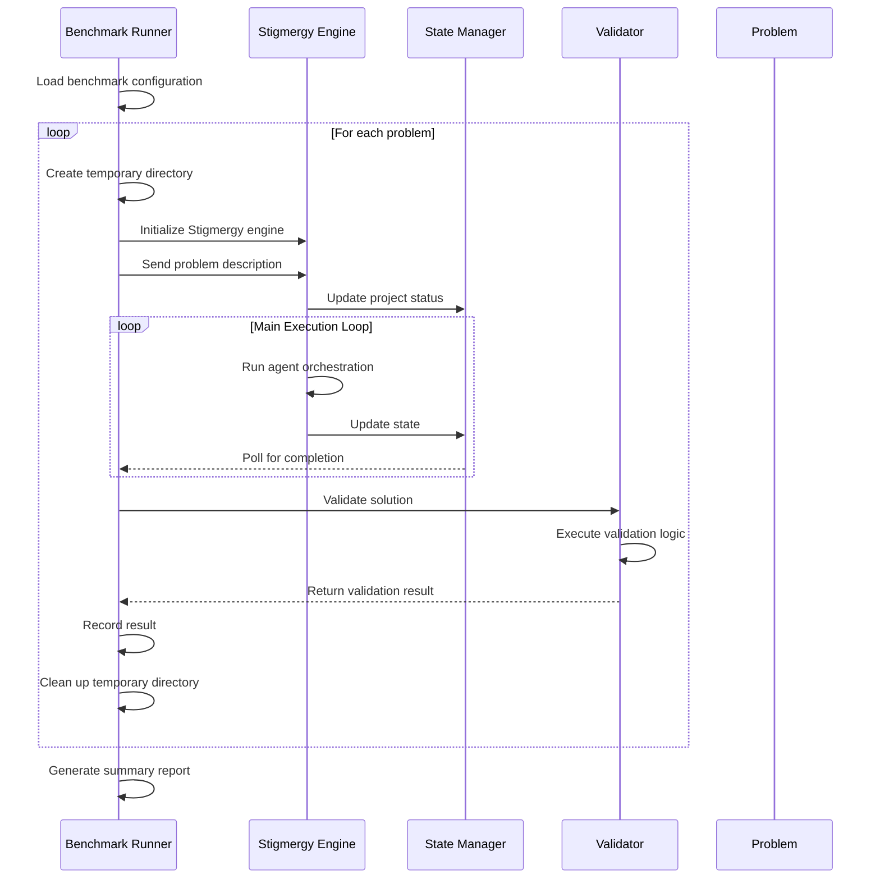

# Benchmark Execution System

## Overview

The Benchmark Execution System is designed to validate the production readiness of the Stigmergy autonomous development system by running a comprehensive suite of benchmark tests. The system executes end-to-end validation of the high-speed execution protocol, specifically targeting complex problems that represent performance bottlenecks.

## Architecture

The benchmark execution system follows a layered architecture that integrates with the core Stigmergy engine:

```mermaid
graph TD
    A[Benchmark Runner] --> B[Stigmergy Engine]
    B --> C[Agent Orchestration Layer]
    C --> D[Specifier Agent]
    C --> E[Dispatcher Agent]
    C --> F[Executor Agent]
    C --> G[QA Agent]
    B --> H[State Management]
    H --> I[Graph State Manager]
    I --> J[State Persistence]
    subgraph State Persistence
        direction LR
        J_File[File System (.json)]
        J_DB[(Neo4j DB)]
    end
    B --> K[Tool Execution Layer]
    K --> L[File System Tools]
    K --> M[Code Intelligence Tools]
    K --> N[Research Tools]
    A --> O[Validation Scripts]
    O --> P[Problem Validators]
    P --> Q[CRUD API Validator]
    P --> R[Other Validators]
```

## Key Components

### Benchmark Runner
The central orchestrator that:
- Loads benchmark configurations
- Executes each problem sequentially
- Monitors execution progress and timeouts
- Collects and reports results
- Manages temporary execution environments

### Validation System
A collection of problem-specific validators that:
- Verify the correctness of generated solutions
- Check for required files and functionality
- Execute automated tests (e.g., Jest for CRUD API)
- Report pass/fail status with detailed output

### Stigmergy Engine Integration
The benchmark system interfaces with the core engine to:
- Initialize autonomous development processes
- Send problem descriptions to the system
- Monitor execution state through the state manager
- Trigger validation upon completion

### State Management: Dual-Mode Persistence
The `GraphStateManager` is a key component. It operates in a dual mode:
- **Default (File-based):** By default, it persists the project state to a JSON file within the project's `.stigmergy/state` directory. This is the standard mode and requires no configuration.
- **Advanced (Neo4j):** If Neo4j credentials are provided in the environment configuration, the state manager will use a Neo4j database for more robust, queryable state persistence. This is an optional, advanced feature.

The benchmark system documentation primarily reflects the more complex Neo4j setup, but all tests run perfectly in the default file-based mode.

## Benchmark Execution Flow



## Execution Process

1. **Initialization Phase**
   - Load benchmark configuration from `benchmark.json`
   - Create temporary directory for isolated execution
   - Initialize Stigmergy engine in the temporary environment

2. **Problem Execution Phase**
   - Send problem description to the engine via HTTP API
   - Monitor execution state through periodic polling
   - Wait for completion status or timeout

3. **Validation Phase**
   - Copy validation script to solution directory
   - Execute problem-specific validation logic
   - Determine pass/fail status based on validation results

4. **Cleanup Phase**
   - Terminate engine processes
   - Remove temporary directories
   - Record execution results

## Data Models

### Benchmark Configuration

| Field | Type | Description |
|-------|------|-------------|
| name | string | Name of the benchmark suite |
| version | string | Version identifier |
| description | string | Description of the benchmark |
| problems | array | Collection of benchmark problems |
| execution | object | Execution configuration |

### Problem Definition

| Field | Type | Description |
|-------|------|-------------|
| id | string | Unique identifier for the problem |
| title | string | Human-readable title |
| description | string | Detailed problem description |
| expected_files | array | List of files that should be generated |
| success_criteria | array | Criteria for successful completion |
| validation_script | string | Script to validate the solution |
| difficulty | string | Difficulty level (easy/medium/hard) |

### Execution Results

| Field | Type | Description |
|-------|------|-------------|
| problemId | string | Identifier of the problem |
| title | string | Title of the problem |
| success | boolean | Whether the problem passed validation |
| duration | number | Execution time in milliseconds |
| error | string | Error message if execution failed |
| output | string | Output from the execution |

## Business Logic Layer

### Problem Execution Logic

The benchmark runner implements the following logic for each problem:

1. **Environment Setup**
   - Create isolated temporary directory
   - Start engine server on designated port

2. **Execution Monitoring**
   - Send initial problem request to the engine
   - Poll state file for completion status
   - Enforce timeout constraints (default: 300 seconds)

3. **Completion Detection**
   - Monitor for `EXECUTION_COMPLETE` status
   - Handle error states (`HUMAN_INPUT_NEEDED`, `ERROR`)
   - Terminate on timeout

### Validation Logic

Each problem has a dedicated validation script that:

1. **Verifies File Presence**
   - Checks for all expected files in the solution
   - Reports missing files as validation failures

2. **Executes Functional Tests**
   - Installs required dependencies
   - Starts generated servers if applicable
   - Runs automated test suites (e.g., Jest)
   - Terminates processes after testing

3. **Determines Success**
   - Evaluates exit codes and test results
   - Returns structured success/failure status

### Error Handling and Diagnostics

When benchmark execution fails, the system provides diagnostic capabilities:

1. **Log Analysis**
   - Capture engine STDOUT and STDERR
   - Collect state transitions and agent decisions
   - Record tool execution results

2. **Root Cause Identification**
   - Analyze failure points in the execution pipeline
   - Identify agent-specific issues (specifier, dispatcher, executor, QA)
   - Correlate errors with system state

## Performance Considerations

### Execution Time Management

- **Timeout Configuration**: Each problem has a maximum execution time (default: 300 seconds)
- **Polling Intervals**: State is polled every 5 seconds to minimize overhead
- **Process Management**: Engine processes are properly terminated after each problem

### Resource Isolation

- **Temporary Directories**: Each problem executes in an isolated environment
- **Port Management**: Engine servers use different ports to avoid conflicts
- **Process Isolation**: Engine processes are spawned as detached processes

### Memory Management

- **State Cleanup**: Temporary directories are removed after each problem
- **Process Termination**: Engine processes are killed after execution
- **Resource Monitoring**: System resources are monitored during execution

## Testing Strategy

### Unit Testing

Individual components of the benchmark system are tested in isolation:

- Benchmark runner initialization and configuration loading
- Problem execution orchestration
- Validation script execution and result processing
- Error handling and diagnostics

### Integration Testing

The benchmark system is tested as an integrated component:

- End-to-end execution of sample problems
- Integration with the Stigmergy engine
- Validation of generated solutions
- Performance and timeout handling

### Benchmark Testing

The benchmark system validates itself through execution of predefined problems:

- Simple file creation tasks
- API endpoint implementation
- React component development
- Database integration tasks
- Testing implementation
- Full Stack CRUD API (primary validation target)

 ## Usage

    The benchmark and validation system has been integrated directly into the main `bun test` command for simplicity and reliability.

    To run all tests, including the benchmark simulations and external health checks:

    ```bash
    # Ensure your .env.development file has the necessary API keys
    bun test
    ```

    The results are now part of the standard test output, providing immediate feedback on the system's core capabilities.

## Results and Reporting

The benchmark system generates several output files:

1. **Results JSON**: Contains the main benchmark results with pass/fail status and timing information
2. **Diagnostics JSON**: Contains detailed diagnostic information for troubleshooting
3. **Performance JSON**: Contains performance metrics and resource usage information

The system also prints a summary to the console with key metrics including success rate, total execution time, and individual problem results.
