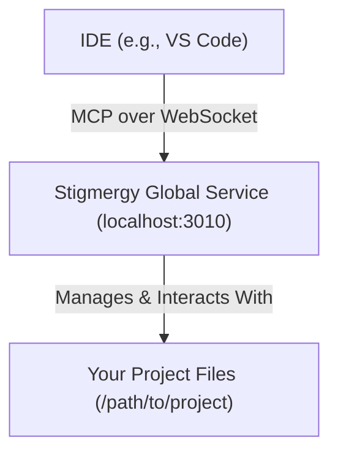

# 🤖 Stigmergy Universal IDE Integration (MCP)

Stigmergy's standalone service architecture allows it to integrate with any development environment and any programming language through the **Model-Context Protocol (MCP)**. This modern architecture means you install the Stigmergy "brain" once, and it can work with all your projects.

## Architecture Overview

The integration is simple and robust: your IDE communicates directly with the Stigmergy global service, which runs persistently in the background on your system. The IDE no longer needs to start its own server script.



## 🚀 Setup

Setup is a one-time process. Once configured, Stigmergy will work automatically with all your projects.

1.  **Install and Run Stigmergy Globally**:
    If you haven't already, install Stigmergy globally using npm and start the background service.
    ```bash
    # Install Stigmergy (one-time setup)
    npm install -g @randy888chan/stigmergy

    # Start the global service in the background
    stigmergy start-service
    ```
    You can check the status at any time with `stigmergy service-status`.

2.  **Initialize Your Project**:
    Navigate to your project's root directory (this can be a Python, Java, Go, or Node.js project) and run `init`. This creates a lightweight `.stigmergy/` folder for project-specific configurations and logs.
    ```bash
    cd /path/to/your/project
    stigmergy init
    ```


## ✅ Benefits of the New Architecture

- **Truly Universal**: Works with any project (Python, Java, Go, etc.) without any project-level installation.
- **Zero Maintenance**: When you update Stigmergy (`npm update -g @randy888chan/stigmergy`), all your projects get the latest features automatically.
- **Instant Connection**: No more waiting for a local server script to start up for each project.
- **Robust and Stable**: Runs as a persistent background service, ensuring it's always ready when you need it.
