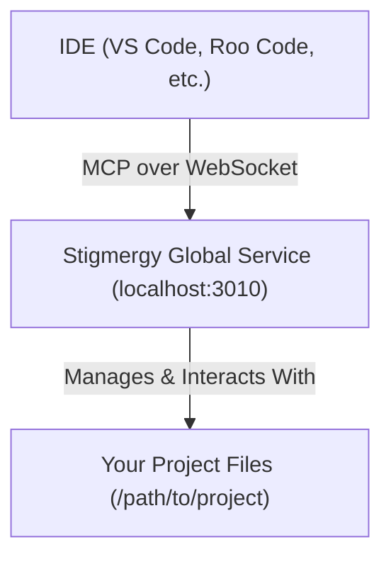

# 🤖 Stigmergy Universal IDE Integration (MCP)

Stigmergy's standalone service architecture allows it to integrate with any development environment and any programming language through the **Model-Context Protocol (MCP)**. This modern architecture means you install the Stigmergy "brain" once, and it can work with all your projects.

## Architecture Overview

The integration is simple and robust: your IDE communicates directly with the Stigmergy global service, which runs in the background on your system.



The Stigmergy service intelligently detects which project you are working on based on the file paths sent by your IDE.

## 🚀 Setup

Setup is a one-time process. Once configured, Stigmergy will work automatically with all your projects.

1.  **Install and Run Stigmergy Globally**:
    If you haven't already, install Stigmergy globally using npm and start the background service.
    ```bash
    # Install Stigmergy (one-time setup)
    npm install -g @randy888chan/stigmergy

    # Start the global service in the background
    stigmergy start-service
    ```
    You can check the status at any time with `stigmergy service-status`.

2.  **Initialize Your Project**:
    Navigate to your project's root directory (this can be a Python, Java, Go, or Node.js project) and run `init`. This creates a lightweight `.stigmergy/` folder for project-specific configurations and logs.
    ```bash
    cd /path/to/your/project
    stigmergy init
    ```

3.  **Configure Your IDE**:
    In your IDE's settings (e.g., for the Continue extension in VS Code, or the native settings in Roo Code), find the "MCP Server" or "IDE Connection" setting and point it to the Stigmergy global service URL:

    **URL:** `http://localhost:3010`

    That's it! There is no need to configure a path to a specific script file. Your IDE is now connected to the Stigmergy engine.

## Legacy Projects

If you have an older Stigmergy project that contains a local `mcp-server.js` file, you can easily migrate to the new architecture:

1.  **Delete the old script**: `rm mcp-server.js`
2.  **Run the new init command**: `stigmergy init`
3.  **Update your IDE**: Ensure your IDE is configured to point to the global URL (`http://localhost:3010`) instead of the old script path.

Your local agent overrides in `.stigmergy-core/agents/` will continue to work as expected.

## ✅ Benefits of the New Architecture

- **Truly Universal**: Works with any project (Python, Java, Go, etc.) without any project-level installation.
- **Zero Maintenance**: The connection is to the global service. When you update Stigmergy (`npm update -g @randy888chan/stigmergy`), all your projects get the latest features automatically.
- **Smart Context Detection**: The global service knows which project you're working on and manages context automatically.
- **Robust and Stable**: Runs as a persistent background service, ensuring it's always ready when you need it.