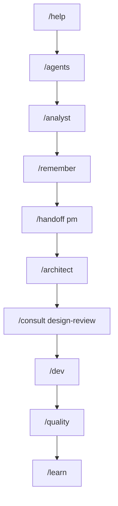

# Advanced Command Search

Find the right BMad Method command for any situation using intent-based search and smart recommendations.

!!! tip "Smart Search"
    You don't need to memorize command names. Describe what you want to do, and we'll find the right command.

## Intent-Based Search

Search by **what you want to accomplish**, not just command names.

### Project Management Intents

| What You Want To Do | Command | Why This Command |
|---------------------|---------|------------------|
| "Start a new project" | `/analyst` | Begin with requirements analysis |
| "Plan product strategy" | `/pm` | Product Manager handles strategy |
| "Define requirements" | `/analyst` | Business Analyst specializes in requirements |
| "Set up backlog" | `/po` | Product Owner manages backlog |
| "Plan sprint" | `/sm` | Scrum Master facilitates planning |

### Technical Development Intents

| What You Want To Do | Command | Why This Command |
|---------------------|---------|------------------|
| "Design system architecture" | `/architect` | Architect handles technical design |
| "Start coding" | `/dev` | Developer persona for implementation |
| "Fix bugs" | `/dev` then `/patterns` | Developer with pattern analysis |
| "Check code quality" | `/quality` | Quality Enforcer validates standards |
| "Review before deployment" | `/consult quality-assessment` | Multi-persona quality review |

### Problem Solving Intents

| What You Want To Do | Command | Why This Command |
|---------------------|---------|------------------|
| "Something is broken" | `/diagnose` | Systematic problem assessment |
| "Need help deciding" | `/suggest` | AI-powered recommendations |
| "Get team input" | `/consult {type}` | Multi-persona consultation |
| "Emergency response" | `/consult emergency-response` | Rapid response coordination |
| "Learn from mistakes" | `/patterns` | Identify anti-patterns |

### Memory & Learning Intents

| What You Want To Do | Command | Why This Command |
|---------------------|---------|------------------|
| "Remember this decision" | `/remember {content}` | Store important information |
| "What did we decide before?" | `/recall {query}` | Search past decisions |
| "Get smart suggestions" | `/insights` | Proactive recommendations |
| "See my patterns" | `/patterns` | Identify working style patterns |
| "Switch personas smoothly" | `/handoff {persona}` | Structured transition |

## Function-Based Search

Find commands by their **function or purpose** rather than exact names.

### Search Examples

#### "Switch" or "Change" Functions
```
Search: "switch to developer"
Results: /dev, /handoff dev

Search: "change persona" 
Results: /pm, /architect, /dev, /po, /sm, /analyst, /design, /quality

Search: "switch context"
Results: /handoff, /exit, /context
```

#### "Check" or "Validate" Functions
```
Search: "check quality"
Results: /quality, /patterns, /diagnose

Search: "validate decision"
Results: /consult, /consensus-check, /insights

Search: "check system"
Results: /diagnose, /core-dump, /patterns
```

#### "Remember" or "Track" Functions
```
Search: "save decision"
Results: /remember, /learn

Search: "find previous"
Results: /recall, /context, /patterns

Search: "track progress"
Results: /context, /patterns, /learn
```

#### "Help" or "Guide" Functions
```
Search: "need guidance"
Results: /help, /suggest, /insights

Search: "what to do next"
Results: /suggest, /help, /insights

Search: "get recommendations"
Results: /insights, /suggest, /patterns
```

## Smart Auto-Complete

Type partial commands or descriptions for intelligent suggestions.

### Typing Examples

#### Partial Command Names
```
Type: "/con"
Suggestions:
  /context - Display current session context
  /consult - Start multi-persona consultation
  /consensus-check - Assess agreement level
```

#### Partial Descriptions  
```
Type: "start proj"
Suggestions:
  /analyst - Begin with requirements analysis
  /help - Get oriented with available options
  /context - Check current project state
```

#### Intent-Based Typing
```
Type: "quality"
Suggestions:
  /quality - Switch to Quality Enforcer
  /patterns - Check for quality issues
  /consult quality-assessment - Comprehensive review
  /diagnose - System health check
```

#### Problem-Based Typing
```
Type: "stuck"
Suggestions:
  /suggest - Get AI-powered recommendations
  /help - Context-aware assistance
  /insights - Proactive guidance
  /patterns - Check for blockers
```

## Recently Used Commands

Your most frequently used commands, tailored to your workflow patterns.

### Personal Command History

!!! note "Personalized Recommendations"
    Based on your usage patterns, here are your most effective command sequences:

#### Your Top Commands (Example)
1. **`/context`** (used 45 times) - You always check context before switching
2. **`/dev`** (used 38 times) - You spend most time in development
3. **`/remember`** (used 32 times) - You're great at documenting decisions
4. **`/quality`** (used 28 times) - You prioritize quality validation
5. **`/recall`** (used 24 times) - You leverage past experience well

#### Your Favorite Sequences
1. **`/context → /dev → /quality`** (used 12 times)
2. **`/recall → /insights → /remember`** (used 8 times)  
3. **`/architect → /consult technical-feasibility`** (used 6 times)

### Context-Aware Suggestions

Based on your current situation and past patterns:

#### When Starting Work Sessions
```
Recommended: /context, /recall "yesterday's work", /insights
Reason: You typically review context before starting
```

#### When Switching to Development
```
Recommended: /handoff dev, /recall "architecture decisions"
Reason: You usually check technical decisions before coding
```

#### When Facing Problems
```
Recommended: /patterns, /diagnose, /suggest
Reason: Your systematic approach to problem-solving
```

## Advanced Search Features

### Semantic Search

Search by meaning and context, not just keywords.

#### Example Semantic Queries
```
Query: "I need to make sure my code is good quality"
Results: 
  Primary: /quality (Quality validation)
  Secondary: /patterns (Anti-pattern detection)
  Related: /consult quality-assessment (Team review)

Query: "How do I coordinate with my team on this decision?"
Results:
  Primary: /consult (Multi-persona consultation)
  Secondary: /handoff (Structured transitions)
  Related: /consensus-check (Validate agreement)

Query: "I want to learn from what we did before"
Results:
  Primary: /recall (Search past decisions)
  Secondary: /patterns (Identify successful patterns)
  Related: /insights (Get recommendations)
```

### Contextual Search

Results adapt based on your current persona and project phase.

#### When in Developer Context
```
Query: "review"
Results prioritize:
  /quality (Code quality review)
  /patterns (Code pattern analysis)
  /consult technical-feasibility (Technical review)
```

#### When in Product Manager Context  
```
Query: "review"
Results prioritize:
  /recall (Review past market research)
  /insights (Market-driven recommendations)
  /consult product-strategy (Strategic review)
```

### Command Relationship Mapping

See how commands connect and flow together.

#### Command Flow Visualization


#### Related Commands Network
- **`/dev`** commonly leads to: `/quality`, `/patterns`, `/remember`
- **`/quality`** often follows: `/dev`, `/architect`, `/consult`
- **`/recall`** frequently precedes: `/insights`, `/remember`, `/suggest`

## Search Tips & Best Practices

### 🔍 **Effective Search Strategies**

!!! success "Search Like a Pro"
    - **Use natural language**: "I want to..." or "How do I..."
    - **Describe your goal**: Focus on what you want to accomplish
    - **Include context**: Mention your current persona or project phase
    - **Try synonyms**: "check", "validate", "review" may yield different results

### 🎯 **Intent Recognition Patterns**

!!! tip "Search Pattern Examples"
    - **Action + Object**: "review code", "check quality", "switch persona"
    - **Problem Statement**: "stuck on architecture", "need team input"
    - **Goal Description**: "want to improve workflow", "learn from past projects"
    - **Context + Need**: "in development phase, need quality check"

### 🚀 **Quick Search Shortcuts**

!!! note "Power User Tips"
    - Type `/` + first letter for quick persona switching
    - Use `?` at the end for help with any command
    - Combine commands with `→` to see workflow suggestions
    - Add `@context` to any search for contextual results

## Integration with BMad System

### Live Command Availability

Search results show real-time command availability based on your current BMad session.

#### Available Now
✅ **Ready to use** - Commands you can execute immediately
🟡 **Context needed** - Commands that need additional context
🔴 **Prerequisites required** - Commands with unmet dependencies

#### Dynamic Suggestions
Commands adapt based on:
- Current active persona
- Recent command history  
- Project phase and context
- Memory insights and patterns
- Team collaboration state

### Memory-Enhanced Search

Search leverages your personal memory for better results.

#### Personalized Results
- **Past successful patterns** appear first
- **Failed approaches** are marked with warnings
- **Your preferences** influence command ranking
- **Project-specific** commands get priority

#### Learning from Usage
The search system learns from:
- Which commands you actually use after searching
- Successful command sequences you repeat
- Commands you avoid or abandon
- Feedback on recommendation quality

---

**Next Steps:**
- [Try the enhanced command reference](quick-reference.md)
- [Learn about personas](../reference/personas.md)
- [Practice with your first project](../getting-started/first-project.md) 