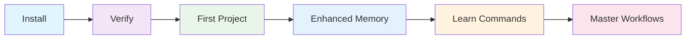

# Getting Started with BMad Method

Welcome to BMad Method! This section will guide you through everything needed to become productive with AI-assisted development using the BMad methodology.

## Your Journey to BMad Mastery

Follow this path to go from installation to your first successful project:

## Step 1: Installation

Get BMad Method installed and configured on your development machine.

**Time Required:** 5-10 minutes

[:octicons-arrow-right-24: **Start Installation**](installation.md){ .md-button .md-button--primary }

**What you'll learn:**
- How to clone and set up the BMad Method repository
- Required dependencies and configuration
- IDE setup for optimal BMad experience

---

## Step 2: Verification

Validate that your installation is correct and all components are working.

**Time Required:** 2-3 minutes

[:octicons-arrow-right-24: **Verify Setup**](verification.md){ .md-button .md-button--primary }

**What you'll learn:**
- How to run the verification script
- How to interpret validation results
- How to troubleshoot common setup issues

---

## Step 3: First Project

Build a complete project using BMad Method to experience the full workflow.

**Time Required:** 30-45 minutes

[:octicons-arrow-right-24: **Build Your First Project**](first-project.md){ .md-button .md-button--primary }

**What you'll learn:**
- How to initialize a BMad project
- Basic persona switching and task execution
- Quality gates and validation in practice
- End-to-end development workflow

---

## Step 4: Enhanced Memory (Optional)

Unlock advanced memory capabilities for persistent learning and context management.

**Time Required:** 10-15 minutes

[:octicons-arrow-right-24: **Setup OpenMemory MCP**](../setup-configuration/openmemory-setup.md){ .md-button }

**What you'll gain:**
- Persistent memory across sessions and projects
- Automatic pattern recognition and learning
- Enhanced context awareness in multi-session workflows
- Cross-project insight sharing

!!! tip "Recommended for Teams"
    OpenMemory MCP dramatically improves BMad Method effectiveness, especially for teams and long-running projects.

---

## Quick Reference

Once you've completed the getting started journey, these references will be invaluable:

-   :fontawesome-solid-terminal:{ .lg .middle } **[Commands](../commands/quick-reference.md)**

    ---

    Complete reference for all BMad Method commands and their usage.

-   :fontawesome-solid-diagram-project:{ .lg .middle } **[Workflows](first-project.md)**

    ---

    Proven workflows for different project types and development scenarios.

-   :fontawesome-solid-code:{ .lg .middle } **[Examples](first-project.md)**

    ---

    Real-world examples and common use cases with detailed walkthroughs.

-   :fontawesome-solid-book:{ .lg .middle } **[Reference](../reference/personas.md)**

    ---

    Technical reference for personas, tasks, and system components.

## Common Questions

??? question "How long does it take to learn BMad Method?"

    **Basic productivity**: 1-2 hours (complete this getting started guide)
    
    **Intermediate proficiency**: 1-2 weeks of regular use
    
    **Advanced mastery**: 1-2 months with multiple projects

??? question "What if I run into issues during setup?"

    1. Check the troubleshooting section in the first project guide
    2. Run the verification script to identify specific issues
    3. Review common setup problems in our examples
    4. Create an issue on GitHub if you need additional help

??? question "Can I use BMad Method with my existing projects?"

    Yes! BMad Method can be integrated into existing projects. See our first project guide for best practices.

??? question "Do I need special IDE extensions?"

    BMad Method works with any IDE, but we provide optimized configurations for:
    
    - VS Code (recommended)
    - Cursor
    - JetBrains IDEs
    
    See the [installation guide](installation.md) for setup instructions.

## Prerequisites

Before starting, ensure you have:

- [ ] **Git** installed and configured
- [ ] **Modern IDE** (VS Code, Cursor, or JetBrains recommended)
- [ ] **Terminal access** (bash, zsh, or equivalent)
- [ ] **Basic familiarity** with command line operations
- [ ] **AI coding assistant** (Cursor, GitHub Copilot, or similar)

!!! note "No Programming Language Required"
    BMad Method is language-agnostic. You can use it with Python, JavaScript, TypeScript, Java, or any other programming language. The methodology focuses on process and quality, not specific technologies.

---

**Ready to begin?** Start with the [Installation Guide](installation.md) and you'll be building better software with AI assistance in under an hour! 