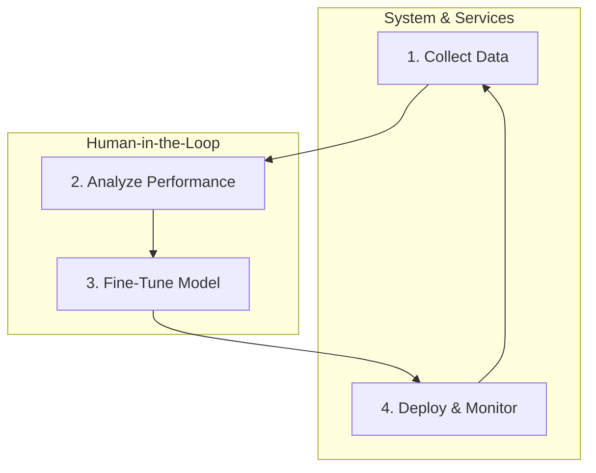

# Framework for Continuous Model Improvement

To ensure Stigmergy remains effective and adapts over time, a framework for continuous model improvement is essential. This document outlines a proposed feedback loop for monitoring, analyzing, and enhancing the performance of the AI agents.

The core principle is to treat the AI's performance as a product that can be measured and improved through data-driven iterations.

## The Feedback Loop

The proposed framework consists of four main stages, creating a virtuous cycle of improvement.

### 1. Collect Data: The Monitoring Service

The foundation of the framework is the **Model Monitoring Service** (`services/model_monitoring.js`). This service is designed to be integrated into the core engine to automatically capture critical performance data.

It exposes functions to track key events:

- `trackTaskSuccess`: Logs whether a high-level task assigned to an agent was completed successfully. This is the primary indicator of agent effectiveness.
- `trackToolUsage`: Logs every tool call, its outcome (success or failure), and execution time. This helps pinpoint specific weaknesses.
- `recordUserFeedback`: A placeholder for a future feature where users could explicitly rate an agent's response or output.

Currently, this service logs data to the console. In a production environment, this would be replaced with a robust database (e.g., PostgreSQL, a time-series database like InfluxDB, or a logging service like Datadog).

### 2. Analyze Performance: Identifying Weaknesses

This stage is currently a manual, human-driven process. An engineer or AI trainer would periodically analyze the collected data to identify patterns and areas for improvement.

**Example Questions to Ask:**

- "Which agent has the highest task failure rate?"
- "Is the `@debugger` agent frequently failing to fix bugs?"
- "Which tool causes the most errors for the `@dev` agent?"
- "Are there common failure reasons that point to a misunderstanding of the instructions or a flaw in the prompt?"

The insights from this analysis are used to create a targeted dataset for fine-tuning.

### 3. Fine-Tune Model: The Update Script

Once a weakness has been identified and a corresponding dataset has been prepared, the **Model Update Script** (`scripts/update_models.js`) comes into play.

This script (currently a placeholder) would automate the process of:

1.  Formatting the collected data (e.g., failed tool calls, incorrect reasoning steps) into the provider-specific format for fine-tuning (e.g., JSONL).
2.  Calling the fine-tuning API of the chosen provider (e.g., OpenAI, Anthropic, Google).
3.  Monitoring the status of the fine-tuning job.

The result of this process is a new, custom model ID that is specialized for the Stigmergy environment.

### 4. Deploy & Monitor: Closing the Loop

The final step is to deploy the new model. This is as simple as updating the `AI_MODEL` variable in the `.env` file to point to the new, fine-tuned model ID.

Once the new model is active, the system continues to collect performance data via the monitoring service. The engineer can then compare the performance of the new model to the old one to verify that the fine-tuning had the desired effect.

This completes the feedback loop, allowing for iterative, data-driven improvements to the entire AI system over time.
