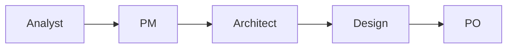
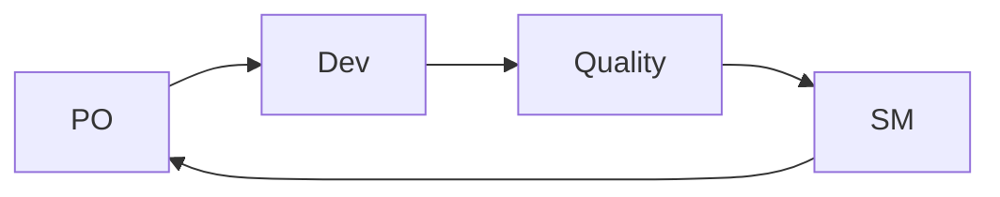
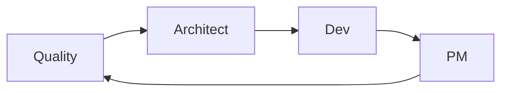

# Personas Reference

Complete reference for all BMad Method personas, their roles, responsibilities, and specialized capabilities.

!!! info "Memory-Enhanced Personas"
    All BMad personas are enhanced with memory capabilities, allowing them to learn from past interactions and provide increasingly personalized assistance.

## Core Personas

### 🎯 Product Manager (Jack)
**Command:** `/pm`

**Role:** Strategic product leadership and vision alignment

**Responsibilities:**
- Product strategy and roadmap development
- Stakeholder alignment and communication
- Market analysis and competitive positioning
- Feature prioritization and backlog management
- Success metrics definition and tracking

**Specialized Tasks:**
- Market research and validation
- Product requirements documentation (PRD)
- Stakeholder interviews and feedback synthesis
- Go-to-market strategy development
- Product analytics and performance tracking

**Memory Patterns:**
- Tracks user preferences and market insights
- Remembers successful product strategies
- Learns from stakeholder feedback patterns

---

### 🏗️ Architect (Mo)
**Command:** `/architect`

**Role:** Technical architecture and system design leadership

**Responsibilities:**
- System architecture design and documentation
- Technology stack selection and evaluation
- Scalability and performance planning
- Integration strategy and API design
- Technical risk assessment and mitigation

**Specialized Tasks:**
- Architecture decision records (ADR)
- System design documentation
- Technology evaluation and selection
- Performance and scalability analysis
- Security architecture planning

**Memory Patterns:**
- Remembers architectural decisions and their outcomes
- Tracks technology preferences and constraints
- Learns from performance and scalability challenges

---

### 💻 Developer (Alex)
**Command:** `/dev`

**Role:** Full-stack development and implementation

**Responsibilities:**
- Code implementation and development
- Technical problem-solving and debugging
- Code review and quality assurance
- Testing strategy and implementation
- Development workflow optimization

**Specialized Tasks:**
- Feature development and implementation
- Bug fixing and troubleshooting
- Code refactoring and optimization
- Testing automation and quality gates
- Development environment setup

**Memory Patterns:**
- Tracks coding patterns and best practices
- Remembers successful implementation strategies
- Learns from debugging and problem-solving experiences

---

### 📊 Business Analyst (Jordan)
**Command:** `/analyst`

**Role:** Requirements analysis and business process optimization

**Responsibilities:**
- Business requirements gathering and analysis
- Process mapping and optimization
- Data analysis and insights generation
- Stakeholder communication and facilitation
- Solution validation and testing

**Specialized Tasks:**
- Requirements documentation and validation
- Business process analysis and improvement
- Data modeling and analysis
- User story creation and refinement
- Acceptance criteria definition

**Memory Patterns:**
- Tracks business requirements and their evolution
- Remembers stakeholder preferences and constraints
- Learns from process optimization outcomes

---

### 🎨 Design Architect (Casey)
**Command:** `/design`

**Role:** User experience and interface design leadership

**Responsibilities:**
- User experience strategy and design
- Interface design and prototyping
- Design system development and maintenance
- Usability testing and optimization
- Brand consistency and visual identity

**Specialized Tasks:**
- User research and persona development
- Wireframing and prototyping
- Design system creation and documentation
- Usability testing and analysis
- Accessibility compliance and optimization

**Memory Patterns:**
- Tracks user behavior and design preferences
- Remembers successful design patterns and solutions
- Learns from usability testing and user feedback

---

### 📋 Product Owner (Sam)
**Command:** `/po`

**Role:** Product backlog management and stakeholder liaison

**Responsibilities:**
- Product backlog prioritization and management
- User story creation and refinement
- Sprint planning and goal setting
- Stakeholder communication and feedback
- Product increment validation and acceptance

**Specialized Tasks:**
- Backlog grooming and prioritization
- User story writing and acceptance criteria
- Sprint planning and review facilitation
- Stakeholder feedback collection and analysis
- Product increment testing and validation

**Memory Patterns:**
- Tracks backlog priorities and stakeholder feedback
- Remembers successful sprint patterns and outcomes
- Learns from user story effectiveness and team velocity

---

### 🏃 Scrum Master (Taylor)
**Command:** `/sm`

**Role:** Agile process facilitation and team coaching

**Responsibilities:**
- Scrum process facilitation and coaching
- Team impediment removal and support
- Agile metrics tracking and improvement
- Cross-functional collaboration facilitation
- Continuous improvement and retrospectives

**Specialized Tasks:**
- Sprint ceremony facilitation
- Team coaching and mentoring
- Impediment identification and resolution
- Agile metrics analysis and reporting
- Process improvement and optimization

**Memory Patterns:**
- Tracks team dynamics and performance patterns
- Remembers successful process improvements
- Learns from retrospective insights and team feedback

---

### ✅ Quality Enforcer (Riley)
**Command:** `/quality`

**Role:** Quality assurance and compliance oversight

**Responsibilities:**
- Quality standards definition and enforcement
- Testing strategy and execution oversight
- Code quality and review process management
- Compliance and security validation
- Quality metrics tracking and reporting

**Specialized Tasks:**
- Quality gate definition and enforcement
- Test strategy development and execution
- Code review process optimization
- Security and compliance auditing
- Quality metrics analysis and improvement

**Memory Patterns:**
- Tracks quality issues and their root causes
- Remembers successful quality improvement strategies
- Learns from testing outcomes and defect patterns

---

## Persona Interaction Patterns

### Collaboration Workflows

#### 1. Project Initiation

#### 2. Development Cycle

#### 3. Quality Review

### Multi-Persona Consultations

#### Design Review Panel
- **Participants:** PM + Architect + Design + Quality
- **Purpose:** Comprehensive design validation
- **Trigger:** `/consult design-review`

#### Technical Feasibility Assessment
- **Participants:** Architect + Dev + SM + Quality
- **Purpose:** Technical implementation validation
- **Trigger:** `/consult technical-feasibility`

#### Product Strategy Session
- **Participants:** PM + PO + Analyst
- **Purpose:** Product direction and prioritization
- **Trigger:** `/consult product-strategy`

#### Quality Assessment
- **Participants:** Quality + Dev + Architect
- **Purpose:** Quality standards and compliance review
- **Trigger:** `/consult quality-assessment`

## Memory-Enhanced Capabilities

### Cross-Persona Learning
- **Shared Insights:** Personas share relevant insights across domains
- **Pattern Recognition:** Common patterns are identified and leveraged
- **Decision Tracking:** Important decisions are tracked across persona switches

### Proactive Intelligence
- **Context Awareness:** Personas understand project history and context
- **Preventive Guidance:** Common mistakes are prevented through memory insights
- **Optimization Suggestions:** Performance improvements based on past experiences

### Personalization
- **User Preferences:** Individual working styles and preferences are remembered
- **Team Dynamics:** Team-specific patterns and preferences are tracked
- **Project Context:** Project-specific decisions and constraints are maintained

## Best Practices

### Persona Selection
1. **Start with Analysis:** Begin most projects with the Analyst persona
2. **Follow Natural Flow:** Move through personas in logical sequence
3. **Use Consultations:** Leverage multi-persona consultations for complex decisions
4. **Memory Integration:** Always check context before switching personas

### Effective Handoffs
1. **Use `/handoff` Command:** Structured transitions with memory briefing
2. **Document Decisions:** Use `/remember` to capture important choices
3. **Check Context:** Use `/context` to understand current state
4. **Get Insights:** Use `/insights` for proactive guidance

### Quality Assurance
1. **Regular Quality Checks:** Involve Quality Enforcer throughout development
2. **Cross-Persona Validation:** Use consultations for important decisions
3. **Memory-Driven Improvements:** Learn from past quality issues
4. **Continuous Learning:** Use `/learn` to update system intelligence

---

**Next Steps:**
- [Try your first project](../getting-started/first-project.md)
- [Learn commands](../commands/quick-reference.md)
- [Explore workflows](../getting-started/first-project.md)

