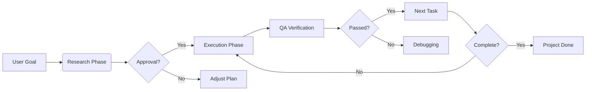
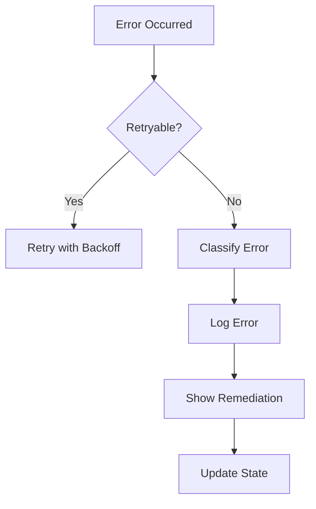

%% docs/workflow_diagrams.md

### Autonomous Workflow

```mermaid
graph LR
    A[User Goal] --> B(Research Phase)
    B --> C{Approval?}
    C -->|Yes| D[Execution Phase]
    C -->|No| E[Adjust Plan]
    D --> F[QA Verification]
    F --> G{Passed?}
    G -->|Yes| H[Next Task]
    G -->|No| I[Debugging]
    H --> J{Complete?}
    J -->|Yes| K[Project Done]
    J -->|No| D
```

### Error Handling Flow

```mermaid
graph TD
    A[Error Occurred] --> B{Retryable?}
    B -->|Yes| C[Retry with Backoff]
    B -->|No| D[Classify Error]
    D --> E[Log Error]
    E --> F[Show Remediation]
    F --> G[Update State]
```
