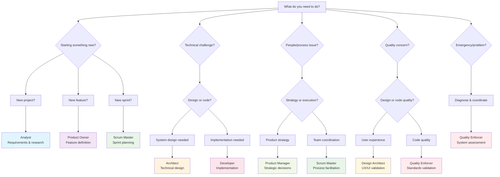

# Persona Selection Guide

Master the art of choosing the right BMad Method persona for any situation with decision trees, scenario mapping, and proven workflow patterns.

!!! tip "Smart Persona Selection"
    The right persona at the right time accelerates your project. Wrong persona choices create friction and waste time.

## Decision Tree: Which Persona Should I Use?

Use this decision tree to quickly identify the optimal persona for your current situation.



## Scenario-Based Persona Selection

### Project Initiation Scenarios

#### 🚀 **Scenario: Brand New Project**
**Context**: You have an idea but no clear requirements or plan.

**Recommended Sequence**:
```
1. /analyst     - Discover and document requirements
2. /pm          - Define product strategy and vision  
3. /architect   - Design technical approach
4. /design-architect - Create user experience design
5. /po          - Set up backlog and user stories
```

**Why This Sequence**:
- **Analyst first** ensures you understand the problem deeply
- **PM second** translates understanding into strategy
- **Architect third** creates technical foundation
- **Design parallel** ensures user-centric approach
- **PO last** organizes work for execution

#### 📋 **Scenario: Feature Addition to Existing Project**
**Context**: Adding new functionality to established codebase.

**Recommended Sequence**:
```
1. /po          - Define feature requirements and acceptance criteria
2. /architect   - Assess technical impact and design changes
3. /design-architect - Design user experience for new feature
4. /dev         - Implement the feature
5. /quality     - Validate before integration
```

**Why This Sequence**:
- **PO first** because requirements are more focused than full analysis
- **Architect second** to ensure technical compatibility
- **Design third** for user experience consistency
- **Dev fourth** for implementation
- **Quality last** for validation

#### 🔄 **Scenario: Sprint Planning Session**
**Context**: Planning work for upcoming development sprint.

**Recommended Sequence**:
```
1. /sm          - Facilitate planning process
2. /po          - Prioritize and refine backlog items
3. /dev         - Estimate effort and identify dependencies  
4. /quality     - Define acceptance criteria and testing approach
```

**Why This Sequence**:
- **SM first** to facilitate the planning process
- **PO second** for priority and requirement clarity
- **Dev third** for realistic effort estimation
- **Quality last** for clear success criteria

### Technical Development Scenarios

#### ⚡ **Scenario: Complex Technical Problem**
**Context**: Facing challenging technical decisions or architecture changes.

**Recommended Sequence**:
```
1. /architect   - Analyze technical options and constraints
2. /dev         - Validate implementation feasibility
3. /consult technical-feasibility  - Get multi-perspective input
4. /quality     - Ensure solution meets standards
```

**Why This Sequence**:
- **Architect first** for systematic technical analysis
- **Dev second** for implementation reality check
- **Consultation third** for comprehensive validation
- **Quality last** for standards compliance

#### 🐛 **Scenario: Bug Investigation and Fix**
**Context**: Production issue needs investigation and resolution.

**Recommended Sequence**:
```
1. /dev         - Investigate and reproduce the issue
2. /patterns    - Check for similar past issues
3. /architect   - Assess if architectural changes needed
4. /quality     - Validate fix and prevent regression
```

**Why This Sequence**:
- **Dev first** for immediate technical investigation
- **Patterns second** to leverage past experience
- **Architect third** if deeper changes required
- **Quality last** for comprehensive validation

#### 🔧 **Scenario: Code Refactoring Initiative**
**Context**: Improving code quality and maintainability.

**Recommended Sequence**:
```
1. /quality     - Assess current code quality and identify issues
2. /architect   - Plan refactoring approach and priorities
3. /dev         - Execute refactoring with quality checks
4. /quality     - Validate improvements and document patterns
```

**Why This Sequence**:
- **Quality first** for comprehensive assessment
- **Architect second** for strategic refactoring plan
- **Dev third** for careful implementation
- **Quality last** for validation and learning

### Business and Strategy Scenarios

#### 📊 **Scenario: Market Research and Validation**
**Context**: Need to understand market requirements or validate product direction.

**Recommended Sequence**:
```
1. /analyst     - Conduct research and gather data
2. /pm          - Analyze market implications and strategy
3. /design-architect - Understand user experience implications
4. /po          - Translate insights into backlog priorities
```

**Why This Sequence**:
- **Analyst first** for thorough research and data gathering
- **PM second** for strategic interpretation
- **Design third** for user experience insights
- **PO last** for actionable prioritization

#### 🎯 **Scenario: Product Strategy Decision**
**Context**: Major product direction or feature prioritization decision.

**Recommended Sequence**:
```
1. /pm          - Lead strategic analysis and decision-making
2. /analyst     - Provide supporting research and data
3. /consult product-strategy  - Multi-persona strategic review
4. /po          - Translate strategy into execution plan
```

**Why This Sequence**:
- **PM first** for strategic leadership
- **Analyst second** for data and research support
- **Consultation third** for comprehensive validation
- **PO last** for execution planning

### Quality and Process Scenarios

#### ✅ **Scenario: Quality Review Before Release**
**Context**: Final quality validation before production deployment.

**Recommended Sequence**:
```
1. /quality     - Comprehensive quality assessment
2. /consult quality-assessment  - Multi-persona review
3. /architect   - Validate technical architecture compliance
4. /dev         - Address any identified issues
```

**Why This Sequence**:
- **Quality first** for systematic assessment
- **Consultation second** for comprehensive review
- **Architect third** for technical validation
- **Dev last** for issue resolution

#### 🔄 **Scenario: Process Improvement Initiative**
**Context**: Optimizing team workflow and development processes.

**Recommended Sequence**:
```
1. /sm          - Facilitate process analysis and improvement
2. /patterns    - Identify current workflow patterns
3. /quality     - Assess quality impact of process changes
4. /consult     - Get team buy-in and validation
```

**Why This Sequence**:
- **SM first** for process facilitation expertise
- **Patterns second** for data-driven insights
- **Quality third** for impact assessment
- **Consultation last** for team alignment

## Persona Handoff Patterns

### Effective Transition Workflows

#### **Analysis → Strategy → Design Pattern**
```bash
/analyst → /remember "key requirements" → /handoff pm
/pm → /recall "requirements" → /handoff architect  
/architect → /remember "technical decisions" → /handoff design
```

**When to Use**: New projects or major feature development
**Benefits**: Ensures requirements flow smoothly into strategy and design

#### **Strategy → Implementation → Validation Pattern**
```bash
/pm → /remember "product decisions" → /handoff po
/po → /recall "strategy context" → /handoff dev
/dev → /remember "implementation details" → /handoff quality
```

**When to Use**: Moving from planning to execution
**Benefits**: Maintains strategic context through implementation

#### **Problem → Solution → Validation Pattern**
```bash
/diagnose → /consult emergency-response → /remember "solution approach"
/dev → /recall "solution context" → /handoff quality
/quality → /patterns → /learn
```

**When to Use**: Problem resolution and improvement
**Benefits**: Systematic problem-solving with learning integration

### Handoff Best Practices

#### **Before Switching Personas**
1. **Document current state**: Use `/remember` for key decisions
2. **Check context**: Run `/context` to review current situation  
3. **Get insights**: Use `/insights` for relevant recommendations
4. **Use structured handoff**: Always use `/handoff {persona}` not direct switching

#### **During Persona Transitions**
1. **Provide context**: Explain why you're switching personas
2. **Share key information**: Reference relevant past decisions with `/recall`
3. **Set clear expectations**: Define what the new persona should accomplish
4. **Maintain continuity**: Ensure important information carries forward

#### **After Switching Personas**
1. **Confirm understanding**: Verify the new persona has proper context
2. **Review relevant history**: Use `/recall` to understand past decisions
3. **Get targeted insights**: Use `/insights` for persona-specific recommendations
4. **Plan next steps**: Identify what needs to be accomplished in this persona

## Anti-Patterns and Common Mistakes

### 🚫 **Anti-Pattern 1: Persona Hopping**

**What It Looks Like**:
```bash
# BAD: Rapid switching without purpose
/pm → /dev → /architect → /quality → /pm
```

**Why It's Harmful**:
- Loses context and continuity
- Creates confusion and inefficiency
- Prevents deep thinking in any single perspective
- Wastes time on context switching

**Better Approach**:
```bash
# GOOD: Purposeful progression with handoffs
/pm → /remember "product strategy" → /handoff architect
/architect → /remember "technical decisions" → /handoff dev
```

### 🚫 **Anti-Pattern 2: Wrong Persona for the Job**

**What It Looks Like**:
```bash
# BAD: Using Developer for strategic decisions
/dev → "Should we prioritize mobile-first or desktop?"
```

**Why It's Harmful**:
- Personas have specialized expertise and perspectives
- Wrong persona lacks context for certain decisions
- Reduces quality of decision-making
- Misses important considerations

**Better Approach**:
```bash
# GOOD: Right persona for strategic decisions
/pm → "Should we prioritize mobile-first or desktop?"
# Then handoff to architect for technical implications
```

### 🚫 **Anti-Pattern 3: Skipping Quality Validation**

**What It Looks Like**:
```bash
# BAD: Direct development to deployment
/dev → implement feature → deploy
```

**Why It's Harmful**:
- No quality gates or validation
- High risk of bugs and technical debt
- Misses opportunity for improvement
- Violates BMad Method quality principles

**Better Approach**:
```bash
# GOOD: Quality validation integrated
/dev → /remember "implementation details" → /handoff quality
/quality → /patterns → validate and approve
```

### 🚫 **Anti-Pattern 4: Memory Neglect**

**What It Looks Like**:
```bash
# BAD: No documentation of decisions
/pm → make important decision → /handoff architect
# (No /remember used)
```

**Why It's Harmful**:
- Lost institutional knowledge
- Repeated mistakes and decisions
- Inconsistent approach across time
- Poor learning and improvement

**Better Approach**:
```bash
# GOOD: Document important decisions
/pm → /remember "Strategic decision: mobile-first approach due to user analytics"
/handoff architect
```

### 🚫 **Anti-Pattern 5: Consultation Avoidance**

**What It Looks Like**:
```bash
# BAD: Making complex decisions alone
/architect → make major architecture decision independently
```

**Why It's Harmful**:
- Misses important perspectives
- Reduces buy-in from other stakeholders
- Increases risk of suboptimal decisions
- Violates collaborative principles

**Better Approach**:
```bash
# GOOD: Collaborate on complex decisions
/architect → analyze options → /consult technical-feasibility
/consensus-check → /remember "Team decision with rationale"
```

## Advanced Persona Patterns

### **The Discovery Loop**
```bash
/analyst → /insights → /remember → /pm → /recall → /handoff architect
```
**Use Case**: When requirements are unclear or complex
**Benefits**: Thorough discovery before commitment

### **The Validation Spiral**
```bash
/dev → /quality → /patterns → /consult → /remember → /learn
```
**Use Case**: Continuous improvement and quality assurance
**Benefits**: Multiple validation points with learning

### **The Emergency Response**
```bash
/diagnose → /consult emergency-response → /dev → /quality → /learn
```
**Use Case**: Critical issues requiring rapid response
**Benefits**: Systematic approach to crisis management

### **The Strategic Review**
```bash
/pm → /analyst → /consult product-strategy → /po → /remember
```
**Use Case**: Major product or strategic decisions
**Benefits**: Comprehensive analysis with team alignment

## Persona Selection Checklist

### Before Choosing a Persona

- [ ] **What is the primary goal?** (requirements, strategy, design, development, quality)
- [ ] **What type of thinking is needed?** (analytical, strategic, creative, technical, systematic)
- [ ] **Who are the stakeholders?** (users, team, business, technical)
- [ ] **What's the current project phase?** (discovery, planning, development, validation)
- [ ] **What context is needed?** (requirements, decisions, constraints, history)

### During Persona Work

- [ ] **Am I using the right perspective?** (does this match the persona's expertise)
- [ ] **Do I have sufficient context?** (use `/recall` and `/context` as needed)
- [ ] **Should I consult others?** (complex decisions benefit from multiple perspectives)
- [ ] **What should I document?** (important decisions need `/remember`)
- [ ] **What's the next logical step?** (which persona should handle the next phase)

### After Persona Work

- [ ] **Did I accomplish the goal?** (verify the intended outcome was achieved)
- [ ] **What should carry forward?** (document with `/remember`)
- [ ] **Who should take over next?** (plan the handoff)
- [ ] **What did I learn?** (capture insights for future improvement)
- [ ] **Should this be a pattern?** (document successful approaches)

## Success Metrics for Persona Selection

### **Efficiency Indicators**
- **Reduced context switching**: Fewer than 3 persona changes per session
- **Clear handoffs**: Using `/handoff` instead of direct switching
- **Memory utilization**: Regular use of `/remember` and `/recall`
- **Pattern recognition**: Consistent workflows for similar scenarios

### **Quality Indicators**  
- **Appropriate expertise**: Right persona for the type of work
- **Comprehensive validation**: Quality checks integrated throughout
- **Collaborative decisions**: Using consultations for complex choices
- **Continuous improvement**: Learning captured with `/learn`

### **Team Alignment Indicators**
- **Consistent approaches**: Similar persona patterns across team members
- **Shared understanding**: Common language and workflows
- **Knowledge sharing**: Documented patterns and anti-patterns
- **Process optimization**: Evolving workflows based on experience

---

**Next Steps:**
- [Learn about quality standards](quality-framework.md)
- [Practice with your first project](../getting-started/first-project.md)
- [Master the command system](../commands/quick-reference.md) 