# BMad Method Quality Framework

Master the BMad Method's world-class quality standards with comprehensive gates, protocols, and continuous improvement processes.

!!! tip "Quality First Philosophy"
    BMad Method prioritizes building "something right that lasts" - quality is not optional, it's the foundation of everything we build.

## Quality Philosophy & Principles

### Core Quality Beliefs

**🎯 "Right First Time" Principle**
- Prevention over correction
- Quality gates prevent defects from advancing
- Every decision made with long-term sustainability in mind

**🔄 Continuous Validation**
- Quality checks integrated throughout development
- Multiple perspectives validate every major decision
- Learning from quality issues improves future work

**🤝 Collective Responsibility**
- Quality is everyone's responsibility, not just QA
- Peer review and collaboration strengthen outcomes
- Shared standards ensure consistency across team

**📈 Measurable Excellence**
- Quality metrics track improvement over time
- Clear criteria define what "good enough" means
- Evidence-based decisions about quality trade-offs

## Quality Gates Overview

BMad Method implements **5 Quality Gates** that ensure excellence at every stage of development.

### Quality Gate Framework

```mermaid
graph TD
    A[Requirements Gate] --> B[Design Gate]
    B --> C[Implementation Gate]
    C --> D[Integration Gate]
    D --> E[Deployment Gate]
    
    A --> A1[✓ Clear requirements<br/>✓ Stakeholder alignment<br/>✓ Success criteria defined]
    B --> B1[✓ Technical feasibility<br/>✓ UX validation<br/>✓ Architecture approved]
    C --> C1[✓ Code quality standards<br/>✓ Test coverage<br/>✓ Documentation complete]
    D --> D1[✓ System integration<br/>✓ Performance validation<br/>✓ Security review]
    E --> E1[✓ Production readiness<br/>✓ Rollback plan<br/>✓ Monitoring setup]
    
    style A fill:#e1f5fe
    style B fill:#f3e5f5
    style C fill:#e8f5e8
    style D fill:#fff3e0
    style E fill:#fce4ec
```


### Gate 1: Requirements Quality Gate

**Purpose**: Ensure clear, complete, and validated requirements before design begins.

**Entry Criteria**:
- Stakeholder needs identified and documented
- User research completed (if applicable)
- Business objectives clearly defined

**Quality Checks**:
```bash
/analyst    # Conduct thorough requirements analysis
/pm         # Validate business alignment and strategy
/consult product-strategy  # Multi-persona requirements review
```

**Exit Criteria**:
- [ ] **Clear Requirements**: Specific, measurable, achievable requirements documented
- [ ] **Stakeholder Sign-off**: Key stakeholders have reviewed and approved requirements
- [ ] **Success Criteria**: Clear definition of what "done" means for the project
- [ ] **Risk Assessment**: Potential risks identified with mitigation strategies
- [ ] **Scope Boundaries**: What's included and excluded is explicitly defined

**Quality Validation Process**:
1. **Requirements Completeness Check** - Verify all necessary requirements captured
2. **Stakeholder Alignment Validation** - Confirm all stakeholders understand and agree
3. **Feasibility Assessment** - Ensure requirements are technically and economically feasible
4. **Testability Review** - Verify requirements can be validated upon completion

**Common Quality Issues**:
- ❌ Vague or ambiguous requirements ("user-friendly", "fast", "scalable")
- ❌ Missing acceptance criteria
- ❌ Conflicting stakeholder needs not resolved
- ❌ Technical constraints not considered

**Quality Standards**:
- ✅ Each requirement follows "Given-When-Then" or similar specific format
- ✅ Requirements are independently testable
- ✅ Business value clearly articulated for each requirement
- ✅ Dependencies between requirements mapped and understood

### Gate 2: Design Quality Gate

**Purpose**: Validate technical and user experience design before implementation.

**Entry Criteria**:
- Requirements Quality Gate passed
- Technical constraints understood
- Design resources allocated

**Quality Checks**:
```bash
/architect  # Technical design and architecture validation
/design-architect # User experience and interface design
/consult design-review  # Comprehensive design validation
```

**Exit Criteria**:
- [ ] **Technical Architecture**: Scalable, maintainable system design approved
- [ ] **User Experience**: User flows and interfaces validated with stakeholders
- [ ] **Implementation Plan**: Clear roadmap from design to working system
- [ ] **Risk Mitigation**: Technical risks identified with mitigation strategies
- [ ] **Performance Targets**: Clear performance and scalability requirements

**Quality Validation Process**:
1. **Architecture Review** - Technical design validates requirements and constraints
2. **UX Validation** - User experience design tested with target users
3. **Feasibility Confirmation** - Design can be implemented within constraints
4. **Integration Planning** - Design considers system integration requirements

**Common Quality Issues**:
- ❌ Over-engineering or under-engineering solutions
- ❌ Poor user experience that doesn't match user needs
- ❌ Technical design that doesn't scale
- ❌ Missing consideration of non-functional requirements

**Quality Standards**:
- ✅ Architecture supports current and projected future needs
- ✅ User interface design validated with actual users
- ✅ Technical design follows established patterns and best practices
- ✅ Security and performance considerations integrated from start

### Gate 3: Implementation Quality Gate

**Purpose**: Ensure code quality, testing, and documentation meet BMad standards.

**Entry Criteria**:
- Design Quality Gate passed
- Development environment configured
- Implementation plan approved

**Quality Checks**:
```bash
/dev        # Implementation with quality focus
/quality    # Code quality validation and standards
/patterns   # Anti-pattern detection and improvement
```

**Exit Criteria**:
- [ ] **Code Quality**: Code meets styling, complexity, and maintainability standards
- [ ] **Test Coverage**: Comprehensive automated tests with >90% coverage
- [ ] **Documentation**: Code documented for future maintainers
- [ ] **Security**: Security best practices implemented and validated
- [ ] **Performance**: Code meets performance requirements under load

**Quality Validation Process**:
1. **Code Review** - Peer review of all code changes
2. **Automated Testing** - Unit, integration, and end-to-end tests pass
3. **Static Analysis** - Code quality tools validate standards compliance
4. **Security Scan** - Automated security analysis identifies vulnerabilities
5. **Performance Testing** - Code meets performance benchmarks

**Common Quality Issues**:
- ❌ Insufficient test coverage or poor test quality
- ❌ Code that's difficult to understand or maintain
- ❌ Security vulnerabilities in implementation
- ❌ Performance bottlenecks not identified

**Quality Standards**:
- ✅ All public interfaces documented with examples
- ✅ Error handling comprehensive and user-friendly
- ✅ Code follows team style guide and best practices
- ✅ Automated tests provide confidence in functionality

### Gate 4: Integration Quality Gate

**Purpose**: Validate system integration and end-to-end functionality.

**Entry Criteria**:
- Implementation Quality Gate passed
- Integration environment available
- End-to-end test scenarios defined

**Quality Checks**:
```bash
/quality    # System integration validation
/architect  # Architecture compliance verification
/consult quality-assessment  # Comprehensive system review
```

**Exit Criteria**:
- [ ] **System Integration**: All components work together as designed
- [ ] **Data Flow**: Data flows correctly between system components
- [ ] **API Compatibility**: External integrations function correctly
- [ ] **Error Handling**: System gracefully handles error conditions
- [ ] **Monitoring**: System health monitoring and alerting configured

**Quality Validation Process**:
1. **Integration Testing** - End-to-end scenarios validate complete workflows
2. **Data Validation** - Data integrity maintained across system boundaries
3. **Performance Testing** - System performs under realistic load conditions
4. **Failure Testing** - System handles failures gracefully
5. **Monitoring Validation** - Observability tools provide adequate insight

**Common Quality Issues**:
- ❌ Integration points not thoroughly tested
- ❌ Data corruption during system handoffs
- ❌ Poor error handling in integration scenarios
- ❌ Insufficient monitoring for production troubleshooting

**Quality Standards**:
- ✅ All integration points have automated tests
- ✅ System performance meets requirements under load
- ✅ Error conditions result in clear, actionable messages
- ✅ System observability enables rapid problem diagnosis

### Gate 5: Deployment Quality Gate

**Purpose**: Ensure production readiness and safe deployment.

**Entry Criteria**:
- Integration Quality Gate passed
- Production environment prepared
- Deployment plan and rollback procedures ready

**Quality Checks**:
```bash
/quality    # Production readiness validation
/sm         # Process and deployment validation
/consult quality-assessment  # Final pre-deployment review
```

**Exit Criteria**:
- [ ] **Production Readiness**: System ready for production workload
- [ ] **Deployment Plan**: Safe, repeatable deployment process
- [ ] **Rollback Capability**: Ability to quickly revert if issues arise
- [ ] **Monitoring**: Production monitoring and alerting active
- [ ] **Documentation**: Operations team has necessary documentation

**Quality Validation Process**:
1. **Production Environment Validation** - Production environment matches tested configuration
2. **Deployment Process Testing** - Deployment process tested in staging environment
3. **Rollback Testing** - Rollback procedures validated and documented
4. **Monitoring Setup** - Production monitoring configured and tested
5. **Team Readiness** - Operations team trained and ready to support

**Common Quality Issues**:
- ❌ Production environment differs from testing environment
- ❌ Deployment process not tested or automated
- ❌ No clear rollback plan or capability
- ❌ Insufficient monitoring for production issues

**Quality Standards**:
- ✅ Deployment process is automated and repeatable
- ✅ Rollback can be executed quickly with minimal impact
- ✅ Production monitoring provides early warning of issues
- ✅ Team has clear procedures for handling production issues

## UDTM Protocol: Ultra-Deep Thinking Mode

**UDTM** is BMad Method's systematic approach to comprehensive analysis and decision-making.

### When to Use UDTM

**Required for**:
- Major architectural decisions
- Strategic product direction changes
- Complex problem diagnosis
- Quality standard violations
- Emergency response situations

**Optional but Recommended for**:
- Feature design decisions
- Technology selection
- Process improvements
- Team workflow optimization

### UDTM Process Framework

#### Phase 1: Problem Definition & Scope
```bash
/analyst    # Deep problem analysis and research
/context    # Understand current state and constraints
/recall     # Leverage past experience and lessons learned
```

**Steps**:
1. **Define the problem clearly** - What exactly needs to be solved?
2. **Identify stakeholders** - Who is affected by this decision?
3. **Understand constraints** - What limitations must be considered?
4. **Gather relevant data** - What information is needed for good decision?

**Quality Checks**:
- [ ] Problem statement is specific and measurable
- [ ] All relevant stakeholders identified
- [ ] Constraints are realistic and well-understood
- [ ] Sufficient data available for informed decision

#### Phase 2: Multi-Perspective Analysis
```bash
/consult    # Bring together relevant personas for analysis
/insights   # Get AI-powered analysis and recommendations
/patterns   # Check for similar past situations and outcomes
```

**Steps**:
1. **Analyze from multiple perspectives** - Business, technical, user, operational
2. **Consider alternative approaches** - Generate multiple solution options
3. **Evaluate trade-offs** - Understand pros and cons of each approach
4. **Assess risks and mitigation** - What could go wrong and how to prevent it?

**Quality Checks**:
- [ ] Multiple valid perspectives considered
- [ ] At least 3 alternative approaches evaluated
- [ ] Trade-offs clearly understood and documented
- [ ] Risk mitigation strategies defined

#### Phase 3: Decision and Validation
```bash
/consensus-check    # Validate team agreement on decision
/remember          # Document decision rationale for future reference
/learn             # Update system intelligence with lessons learned
```

**Steps**:
1. **Make evidence-based decision** - Choose approach based on analysis
2. **Validate decision with stakeholders** - Ensure buy-in and understanding
3. **Document decision rationale** - Why this choice was made
4. **Plan implementation and monitoring** - How to execute and measure success

**Quality Checks**:
- [ ] Decision supported by evidence and analysis
- [ ] Stakeholder consensus achieved
- [ ] Decision rationale clearly documented
- [ ] Implementation plan includes success metrics

### UDTM Documentation Template

```markdown
# UDTM Analysis: [Decision Topic]

## Problem Definition
**Problem Statement**: [Clear, specific problem description]
**Stakeholders**: [List of affected parties]
**Constraints**: [Technical, business, time, resource constraints]
**Success Criteria**: [How we'll know this is resolved]

## Analysis Summary
**Perspectives Considered**: [Business, Technical, User, etc.]
**Alternatives Evaluated**: 
1. Option A: [Description, pros, cons]
2. Option B: [Description, pros, cons]
3. Option C: [Description, pros, cons]

## Decision
**Chosen Approach**: [Selected option]
**Rationale**: [Why this option was selected]
**Trade-offs Accepted**: [What we're giving up]
**Risk Mitigation**: [How we'll handle potential issues]

## Implementation Plan
**Next Steps**: [Immediate actions required]
**Success Metrics**: [How we'll measure success]
**Review Schedule**: [When to assess progress]
```

### UDTM Best Practices

**🎯 Do's**:
- ✅ Start with clear problem definition
- ✅ Include diverse perspectives in analysis
- ✅ Document assumptions and constraints
- ✅ Consider long-term implications
- ✅ Plan for measurement and learning

**🚫 Don'ts**:
- ❌ Rush to solutions without analysis
- ❌ Skip stakeholder validation
- ❌ Ignore implementation complexity
- ❌ Forget to document rationale
- ❌ Skip follow-up and learning

## Brotherhood Review Process

The **Brotherhood Review** is BMad Method's peer collaboration system for maintaining quality and shared learning.

### Brotherhood Review Principles

**🤝 Collective Excellence**
- Quality is improved through collaboration
- Diverse perspectives strengthen outcomes
- Knowledge sharing elevates entire team

**🔍 Constructive Validation**
- Focus on improvement, not criticism
- Specific, actionable feedback
- Support for continuous learning

**📈 Continuous Improvement**
- Learn from every review
- Adapt processes based on experience
- Share insights across projects

### Review Types and When to Use

#### **Code Review Brotherhood**
**When**: Every code change before integration
**Participants**: Developer + 1-2 peers
**Focus**: Code quality, maintainability, best practices

```bash
/dev        # Prepare code for review
/quality    # Self-review for quality standards
# Submit for peer review
# Address feedback and iterate
```

**Review Checklist**:
- [ ] Code follows team style guide
- [ ] Logic is clear and well-commented
- [ ] Error handling is comprehensive
- [ ] Tests cover new functionality
- [ ] Performance considerations addressed

#### **Design Review Brotherhood**
**When**: Major design decisions or architecture changes
**Participants**: Architect + Designer + Developer + PM
**Focus**: Technical feasibility, user experience, business alignment

```bash
/consult design-review    # Multi-persona design review
/consensus-check         # Validate agreement
/remember               # Document design decisions
```

**Review Checklist**:
- [ ] Design meets user needs
- [ ] Technical approach is sound
- [ ] Implementation is feasible
- [ ] Performance requirements can be met
- [ ] Security considerations addressed

#### **Strategy Review Brotherhood**
**When**: Product strategy or major business decisions
**Participants**: PM + Analyst + PO + relevant stakeholders
**Focus**: Business value, market fit, strategic alignment

```bash
/consult product-strategy    # Strategic review consultation
/patterns                   # Check past strategic decisions
/consensus-check           # Validate team alignment
```

**Review Checklist**:
- [ ] Business case is compelling
- [ ] Market research supports direction
- [ ] Resource requirements realistic
- [ ] Success metrics defined
- [ ] Risk assessment complete

#### **Quality Review Brotherhood**
**When**: Before major releases or after quality issues
**Participants**: Quality Enforcer + relevant personas
**Focus**: Quality standards, process improvement, learning

```bash
/consult quality-assessment    # Comprehensive quality review
/patterns                     # Identify quality patterns
/learn                       # Update quality processes
```

**Review Checklist**:
- [ ] Quality gates properly executed
- [ ] Standards compliance verified
- [ ] Process effectiveness assessed
- [ ] Improvement opportunities identified
- [ ] Lessons learned documented

### Brotherhood Review Best Practices

#### **For Review Authors**
1. **Prepare thoroughly** - Self-review before requesting peer review
2. **Provide context** - Explain what you're trying to accomplish
3. **Be specific** - Clear questions lead to better feedback
4. **Stay open** - Consider feedback objectively
5. **Follow up** - Address feedback and close the loop

#### **For Reviewers**
1. **Be constructive** - Focus on improvement, not criticism
2. **Be specific** - Vague feedback doesn't help
3. **Explain rationale** - Help others understand your perspective
4. **Ask questions** - Clarify understanding before suggesting changes
5. **Appreciate good work** - Acknowledge quality when you see it

#### **For Teams**
1. **Make it safe** - Create environment where feedback is welcome
2. **Learn together** - Treat reviews as learning opportunities
3. **Share insights** - Propagate learnings across team
4. **Iterate processes** - Improve review processes based on experience
5. **Celebrate quality** - Recognize excellent work and improvement

### Review Documentation Template

```markdown
# Brotherhood Review: [Topic/Component]

## Review Context
**Type**: [Code/Design/Strategy/Quality]
**Author**: [Person requesting review]
**Reviewers**: [People providing review]
**Date**: [Review date]

## Review Scope
**What's being reviewed**: [Clear description]
**Specific questions**: [What feedback is needed]
**Context**: [Background information reviewers need]

## Review Feedback
**Strengths identified**: [What's working well]
**Improvement opportunities**: [Specific suggestions]
**Questions raised**: [Things that need clarification]
**Decisions made**: [Agreements reached during review]

## Action Items
- [ ] [Specific action] - [Owner] - [Due date]
- [ ] [Specific action] - [Owner] - [Due date]

## Lessons Learned
**What worked well**: [Process and content insights]
**What could improve**: [Process improvements for next time]
**Knowledge gained**: [New insights for team]
```

## Daily Workflow Quality Integration

### Quality in Daily Development

#### **Morning Quality Setup**
```bash
/context              # Review yesterday's work and today's goals
/recall "quality issues"  # Check for known quality concerns
/patterns            # Review current quality trends
/quality             # Set quality intentions for the day
```

#### **During Development**
```bash
# Before starting work
/quality             # Quality mindset activation
/recall "standards"   # Review relevant quality standards

# During implementation
/patterns            # Check for anti-patterns as you work
/quality             # Regular quality self-checks

# Before finishing work
/quality             # Final quality validation
/remember "quality decisions"  # Document quality choices made
```

#### **End-of-Day Quality Review**
```bash
/quality             # Review day's work for quality
/patterns            # Identify any quality patterns
/learn               # Update quality understanding
/remember "lessons learned"  # Document insights for tomorrow
```

### Quality-Driven Decision Making

#### **Decision Quality Framework**
Every significant decision should consider:

1. **Quality Impact Assessment**
   - How does this decision affect code quality?
   - Will this make the system more or less maintainable?
   - Does this align with our quality standards?

2. **Long-term Quality Implications**
   - Will this decision create technical debt?
   - How will this affect future development velocity?
   - Does this support or hinder quality improvement?

3. **Quality Measurement Plan**
   - How will we measure the quality impact?
   - What metrics will tell us if this was a good decision?
   - When will we review the quality outcomes?

#### **Quality-First Development Process**


### Quality Metrics and Measurement

#### **Leading Quality Indicators**
- **Quality Gate Compliance**: % of work passing quality gates on first attempt
- **Review Effectiveness**: % of issues caught in reviews vs. production
- **Standard Adherence**: Compliance with coding standards and best practices
- **Test Coverage**: Automated test coverage across codebase
- **Documentation Quality**: Completeness and accuracy of documentation

#### **Lagging Quality Indicators**
- **Defect Density**: Number of bugs per unit of code
- **Technical Debt**: Accumulated technical debt over time
- **Maintenance Effort**: Time spent on maintenance vs. new features
- **Customer Satisfaction**: User satisfaction with quality of deliverables
- **Team Velocity**: Development speed with quality maintained

#### **Quality Improvement Tracking**
```bash
# Weekly quality review
/patterns            # Analyze quality trends
/quality             # Assess current quality state
/learn               # Update quality processes
/remember "quality insights"  # Document improvement opportunities

# Monthly quality retrospective
/consult quality-assessment  # Team quality review
/consensus-check           # Align on quality improvements
/learn                    # Systematic quality process improvement
```

### Integration with BMad Commands

#### **Quality-Enhanced Command Patterns**

**Quality-First Development**:
```bash
/quality → /dev → /patterns → /quality → /remember
```

**Quality-Validated Decision Making**:
```bash
/context → /quality → /consult → /consensus-check → /remember
```

**Quality-Driven Problem Solving**:
```bash
/diagnose → /patterns → /quality → /consult → /learn
```

**Quality Learning Loop**:
```bash
/patterns → /quality → /learn → /remember → /insights
```

#### **Quality Integration Checklist**

**Before Starting Work**:
- [ ] Quality standards reviewed for this type of work
- [ ] Quality concerns from similar past work considered
- [ ] Quality success criteria defined

**During Work**:
- [ ] Regular quality self-checks performed
- [ ] Quality patterns monitored
- [ ] Quality feedback incorporated immediately

**After Completing Work**:
- [ ] Quality validation performed
- [ ] Quality lessons learned documented
- [ ] Quality improvements identified for future work

## Quality Standards Quick Reference

### **Code Quality Standards**
- ✅ Code is readable and well-documented
- ✅ Functions have single responsibility
- ✅ Error handling is comprehensive
- ✅ Tests provide confidence in functionality
- ✅ Performance considerations addressed

### **Design Quality Standards**
- ✅ User needs clearly addressed
- ✅ Technical constraints considered
- ✅ Scalability and maintainability built-in
- ✅ Security considerations integrated
- ✅ Alternative approaches evaluated

### **Process Quality Standards**
- ✅ Requirements clearly understood
- ✅ Quality gates properly executed
- ✅ Peer review completed
- ✅ Documentation current and accurate
- ✅ Learning captured and shared

### **Decision Quality Standards**
- ✅ Multiple perspectives considered
- ✅ Evidence-based reasoning used
- ✅ Stakeholder alignment achieved
- ✅ Implementation plan defined
- ✅ Success metrics established

---

**Next Steps:**
- [Master persona selection](persona-selection.md)
- [Practice with your first project](../getting-started/first-project.md)
- [Explore command patterns](../commands/quick-reference.md) 