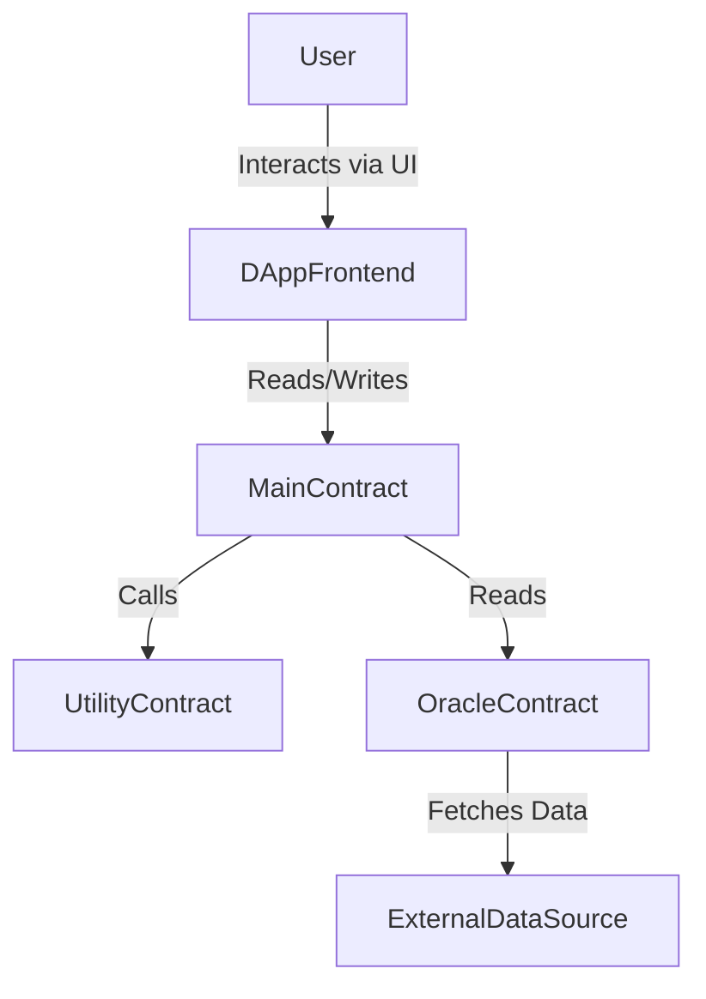
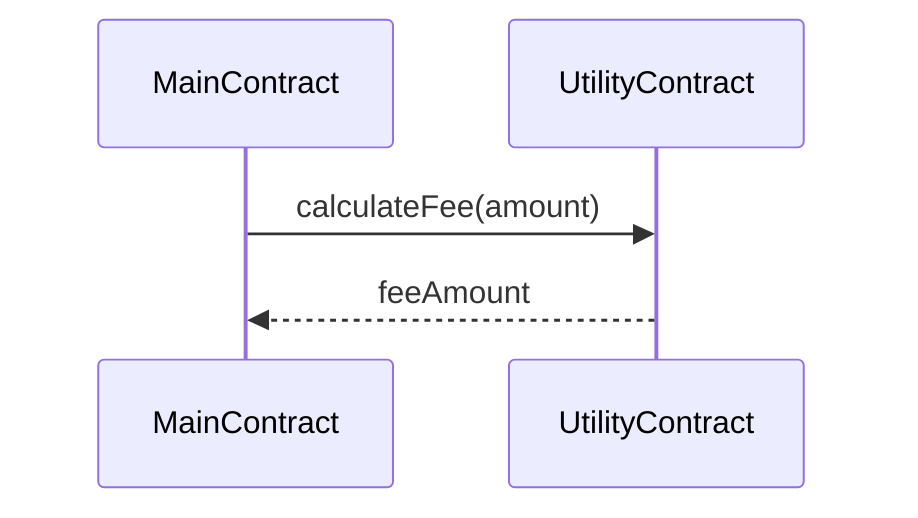

# Smart Contract Architecture Document: {{ProjectName}}

**Version:** {{Version}}
**Date:** {{Date}}
**Author:** {{Author}} (SmartContractArchitect Agent)

---

## 1. Introduction

### 1.1 Project Overview
Briefly describe the project and the role of the smart contract system within it. Reference the main PRD or project brief.
*(Based on PRD: {{PathToPRD}})*

### 1.2 Goals of this Document
Outline what this document aims to define regarding the smart contract architecture.

### 1.3 Target Blockchain Platform
Specify the blockchain platform (e.g., Ethereum Mainnet, Polygon, Binance Smart Chain, Arbitrum).
- **Platform:** {{BlockchainPlatform}}
- **Solidity Version:** {{SolidityVersion}}

---

## 2. System Architecture Overview

### 2.1 Component Diagram
*(Use Mermaid JS or similar to illustrate the main contracts and their interactions. Show external interactions like oracles or frontends if applicable.)*


### 2.2 Core Contracts & Responsibilities
List each smart contract that will be part of the system and briefly describe its primary responsibility.

- **`{{ContractName1}}`**:
  - *Responsibility:* {{Responsibility1}}
- **`{{ContractName2}}`**:
  - *Responsibility:* {{Responsibility2}}
- *(Add more as needed)*

---

## 3. Detailed Contract Design: `{{ContractName1}}`

### 3.1 Overview
Detailed description of `{{ContractName1}}`'s purpose and functionality.

### 3.2 State Variables
List and describe the key state variables.
- `{{variableName1}}` (`{{dataType1}}`): {{Description1}}
- `{{variableName2}}` (`{{mappingType}}`): {{Description2}}

### 3.3 Data Structures (Structs)
Define any custom structs used by this contract.
```solidity
struct {{StructName1}} {
    {{fieldType1}} {{fieldName1}};
    {{fieldType2}} {{fieldName2}};
}
```

### 3.4 Key Functions
Describe the important public and external functions. Include:
- **Function Signature:** (e.g., `function doSomething(uint256 _amount, address _recipient) external payable returns (bool)`)
- **Purpose:** What the function does.
- **Access Control:** Who can call this function (e.g., `onlyOwner`, specific role, public).
- **Key Logic / State Changes:** High-level description of operations.
- **Events Emitted:** List any events emitted.

**Example Function:**
- **`function {{functionName1}}({{params1}}) {{visibility1}} {{modifiers1}}`**
  - *Purpose:* {{Purpose of functionName1}}
  - *Access Control:* {{AccessControl for functionName1}}
  - *Key Logic:* {{Logic for functionName1}}
  - *Events Emitted:* `{{EventName1}}`

### 3.5 Events
List and describe the events emitted by this contract.
- `event {{EventName1}}({{indexedParam1}}, {{param2}});`
  - *Purpose:* {{Purpose of EventName1}}

### 3.6 Modifiers
Describe any custom modifiers used in this contract.
- `modifier {{modifierName1}}() { ... }`
  - *Purpose:* {{Purpose of modifierName1}}

---

## 4. Detailed Contract Design: `{{ContractName2}}`
*(Repeat section 3 for each additional contract)*

---

## 5. Cross-Contract Interactions

Describe how different contracts within the system will interact with each other.
- *Example: `MainContract` will call `UtilityContract.calculateFee()` before processing a transaction.*
- *(Use sequence diagrams if helpful)*


---

## 6. Access Control Strategy

Describe the overall access control strategy.
- **Admin Roles:** Define any administrative roles (e.g., Owner, Pauser, Upgrader).
- **User Roles:** (If applicable) Define different user roles and their permissions.
- **Mechanism:** Specify if using OpenZeppelin's `Ownable`, `AccessControl`, or a custom solution.

---

## 7. Upgradeability Strategy

- **Is Upgradeability Required?** (Yes/No)
- **Chosen Pattern:** If yes, specify the pattern (e.g., UUPS Proxies, TransparentUpgradeableProxy).
- **Rationale:** Briefly explain why this pattern was chosen.
- **Key Considerations:** Mention any implications (e.g., storage layout, initializer functions).

---

## 8. Security Considerations

### 8.1 Potential Risks & Mitigations (Architectural Level)
Identify potential security concerns at the design stage and how the architecture aims to mitigate them.
- **Reentrancy:** {{Mitigation for reentrancy, e.g., Checks-Effects-Interactions pattern will be enforced}}
- **Oracle Manipulation:** {{If using oracles, how will data be validated or multiple sources used?}}
- **Access Control Vulnerabilities:** {{How does the role design prevent unauthorized actions?}}
- **Gas Limit Issues:** {{Are there any known operations that might be very gas intensive?}}

### 8.2 Key Security Patterns to be Implemented
- Checks-Effects-Interactions
- Use of SafeMath (if Solidity <0.8.0) or built-in checks
- Reentrancy Guards (where applicable)
- Secure Oracle Usage (if applicable)

---

## 9. External Dependencies & Interfaces

- **Oracles:**
  - *Name/Type:* {{OracleName}}
  - *Data Provided:* {{OracleData}}
  - *Integration Points:* {{How contracts interact with it}}
- **Other External Contracts:**
  - *Name/Address (if known):* {{ExternalContractName}}
  - *Purpose of Interaction:* {{InteractionPurpose}}

---

## 10. Gas Cost Considerations (High-Level)

Briefly discuss any architectural decisions made to manage gas costs, or areas where gas efficiency will be a key focus during development.
- *Example: Avoiding loops over large arrays in storage, using structs to pack data, etc.*

---

## 11. Future Considerations & Scalability

- Potential future enhancements that might impact the architecture.
- How the current design allows for scalability.

---

## Appendix A: Glossary

- *(Define any project-specific terms or technical jargon used in this document)*

---

## Appendix B: Open Questions / Assumptions

- *(List any assumptions made during the architectural design or questions that need clarification)*

---
